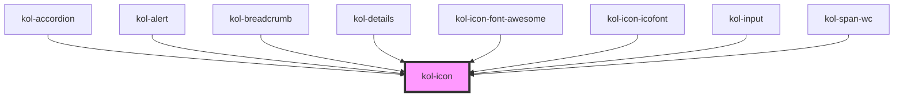

# Icon

Mit Hilfe der **Icon**-Komponente können Icons aus der Icon-Bibliothek an beliebigen Positionen erzeugt werden. Die Ausgabe des Icon kann über Attribute gesteuert werden und erfolgt barrierefrei. Die Ausgabe erfolgt standardmäßig als **_inline_**-Element.

## Konstruktion

Die Komponente **Icon** wird über das HTML-Element `<kol-icon></kol-icon>` erzeugt.

### Code

```tsx
<kol-icon _aria-label="" _icon="fa-solid fa-house"></kol-icon>
```

### Beispiel

<kol-icon _aria-label="" _icon="fa-solid fa-house"></kol-icon>

## Verwendung

### Icon

Verwenden Sie das Attribut `_icon` um das anzuzeigende Icon festzulegen.

### Best practices

## Barrierefreiheit

### Aria-Hidden

Die Auszeichnung `aria-hidden` ist eigentlich nicht erforderlich, da die aktuellen Screenreader, wie NVDA und JAWS, es auch ohne `aria-hidden` nicht vorlesen.

Referenz: <https://www.w3.org/TR/wai-aria/states_and_properties#aria-hidden>

## Links und Referenzen

<!-- Auto Generated Below -->

## Properties

| Property                  | Attribute     | Description                                                                                                                      | Type                  | Default     |
| ------------------------- | ------------- | -------------------------------------------------------------------------------------------------------------------------------- | --------------------- | ----------- |
| `_ariaLabel` _(required)_ | `_aria-label` | Gibt das Aria-Label am Icon an.                                                                                                  | `string`              | `undefined` |
| `_icon` _(required)_      | `_icon`       | Gibt einen Identifier eines Icons aus den Icon's an.                                                                             | `string`              | `undefined` |
| `_part`                   | `_part`       | Gibt den Identifier für den CSS-Part an, um das Icon von Außen ändern zu können. (https://meowni.ca/posts/part-theme-explainer/) | `string \| undefined` | `undefined` |

## Dependencies

### Used by

- [kol-accordion](../accordion)
- [kol-alert](../alert)
- [kol-breadcrumb](../breadcrumb)
- [kol-details](../details)
- [kol-icon-font-awesome](../icon-font-awesome)
- [kol-icon-icofont](../icon-icofont)
- kol-input
- kol-span-wc

### Graph



---
