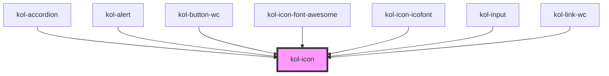

# Icofont

Mit Hilfe der **Icofont**-Komponente können Icons aus der Icofont-Bibliothek an beliebigen Positionen erzeugt werden. Die Ausgabe des Icon kann über Attribute gesteuert werden und erfolgt barrierefrei. Die Ausgabe erfolgt standardmäßig als **_inline_**-Element.

## Konstruktion

Die Komponente **Icofont** wird über das HTML-Element `<kol-icofont></kol-icofont>` erzeugt.

### Code

```tsx
<kol-icofont _aria-label="" _icon="home"></kol-icofont>
```

### Beispiel

<div style={{ fontSize: '48px' }}>
  <kol-icofont _aria-label="" _icon="home"></kol-icofont>
</div>

## Verwendung

### Icon

Verwenden Sie das Attribut `_icon` um das anzuzeigende Icon festzulegen.

### Best practices

### Anwendungsfälle

#### Ein Icon als Einleitung und innerhalb eines Fließtextes

<div>
    <kol-icofont
      _aria-label=""
      _icon="home"
      style={{
        color: '#a1a1a1',
        fontSize: '100%',
      }}
    ></kol-icofont>
    Lorem ipsum dolor sit amet, consetetur sadipscing elitr, sed diam nonumy eirmod tempor invidunt ut labore et dolore magna
    aliquyam erat, sed diam voluptua. At vero eos et accusam et justo duo dolores et ea rebum. Stet clita kasd gubergren,
    no sea takimata sanctus est Lorem ipsum. Es folgt ein Icon im Fließtext: <kol-icofont
      _aria-label=""
      _icon="arrow-right"
      style={{
        color: '#a1a1a1',
        fontSize: '100%',
      }}
    ></kol-icofont>
    dolor sit amet. Lorem ipsum dolor sit amet, consetetur sadipscing elitr, sed diam nonumy eirmod tempor.
  </div>

## Barrierefreiheit

### Aria-Hidden

Die Auszeichnung `aria-hidden` ist eigentlich nicht erforderlich, da die aktuellen Screenreader, wie NVDA und JAWS, es auch ohne `aria-hidden` nicht vorlesen.

Referenz: <https://www.w3.org/TR/wai-aria/states_and_properties#aria-hidden>

## Links und Referenzen

<!-- Auto Generated Below -->

## Properties

| Property                  | Attribute     | Description                                                                                                                      | Type                  | Default     |
| ------------------------- | ------------- | -------------------------------------------------------------------------------------------------------------------------------- | --------------------- | ----------- |
| `_ariaLabel` _(required)_ | `_aria-label` | Gibt das Aria-Label am Icon an.                                                                                                  | `string`              | `undefined` |
| `_icon` _(required)_      | `_icon`       | Gibt einen Identifier eines Icons aus den Icon's an.                                                                             | `string`              | `undefined` |
| `_part`                   | `_part`       | Gibt den Identifier für den CSS-Part an, um das Icon von Außen ändern zu können. (https://meowni.ca/posts/part-theme-explainer/) | `string \| undefined` | `undefined` |

## Dependencies

### Used by

- [kol-accordion](../accordion)
- [kol-alert](../alert)
- kol-button-wc
- [kol-icon-font-awesome](../icon-font-awesome)
- [kol-icon-icofont](../icon-icofont)
- kol-input
- kol-link-wc

### Graph



---
