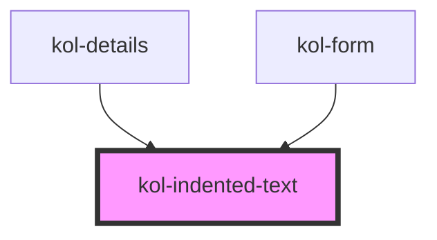

# IndentedText

Heben Sie einzelne Informationen auf Ihrer Webseite optisch mit der **IndentedText**-Komponente hervor. Die Komponente eignet sich nicht nur für besondere Abschnitte auf der Webseite, sondern auch beispielsweise für Zitate.

In der Komponente kann beliebiger HTML-Code verwendet werden.

## Konstruktion

### Code

```html
<kol-indented-text>
	Lorem ipsum dolor sit amet, consetetur sadipscing elitr, sed diam nonumy eirmod tempor invidunt ut labore et dolore magna aliquyam erat, sed diam voluptua. At
	vero eos et accusam et justo duo dolores et ea rebum. Stet clita kasd gubergren, no sea takimata sanctus est Lorem ipsum dolor sit amet. Lorem ipsum dolor sit
	amet, consetetur sadipscing elitr, sed diam nonumy eirmod tempor invidunt.
</kol-indented-text>
```

### Beispiel

<kol-indented-text>
  Lorem ipsum dolor sit amet, consetetur sadipscing elitr, sed diam nonumy eirmod tempor invidunt ut labore et dolore magna aliquyam erat, sed diam voluptua. At vero eos et accusam et justo duo dolores et ea rebum. Stet clita kasd gubergren, no sea takimata sanctus est Lorem ipsum dolor sit amet. Lorem ipsum dolor sit amet, consetetur sadipscing
  elitr, sed diam nonumy eirmod tempor invidunt.
</kol-indented-text>

## Verwendung

Die Komponente besitzt keine weiteren Attribute. Der hervorzuhebende Text wird zwischen das öffnende und das schließende Tag geschrieben.

### Best practices

- Verwenden Sie die **IndentedText**-Komponente, um ergänzende Informationen zu einem Hauptthema optisch hervorzuheben.
- Vermeiden Sie, wichtige Informationen in der Komponente auszugeben, die eine Aktion der Nutzer:innen erfordern.
- Vermeiden Sie, viele **IndentedText**-Komponenten auf einer Einzelseite zu integrieren, da hierdurch die Übersichtlichkeit sinkt.

### Anwendungsfälle

Verwenden Sie die **IndentedText**-Komponente, um Textpassagen oder Informationen optisch hervorzuheben.

## Barrierefreiheit

<!--## Links und Referenzen

<!-- Auto Generated Below -->

## CSS Custom Properties

| Name                        | Description                     |
| --------------------------- | ------------------------------- |
| `--kolibri-border-color`    | Default color of the border.    |
| `--kolibri-border-radius`   | Default radius of the border.   |
| `--kolibri-border-width`    | Default width of the border.    |
| `--kolibri-color-danger`    | Default color of the danger.    |
| `--kolibri-color-disabled`  | Default color of the disabled.  |
| `--kolibri-color-error`     | Default color of the error.     |
| `--kolibri-color-ghost`     | Default color of the ghost.     |
| `--kolibri-color-info`      | Default color of the info.      |
| `--kolibri-color-normal`    | Default color of the normal.    |
| `--kolibri-color-primary`   | Default color of the primary.   |
| `--kolibri-color-secondary` | Default color of the secondary. |
| `--kolibri-color-success`   | Default color of the success.   |
| `--kolibri-color-warning`   | Default color of the warning.   |

## Dependencies

### Used by

- [kol-details](../details)
- [kol-form](../form)

### Graph



---
