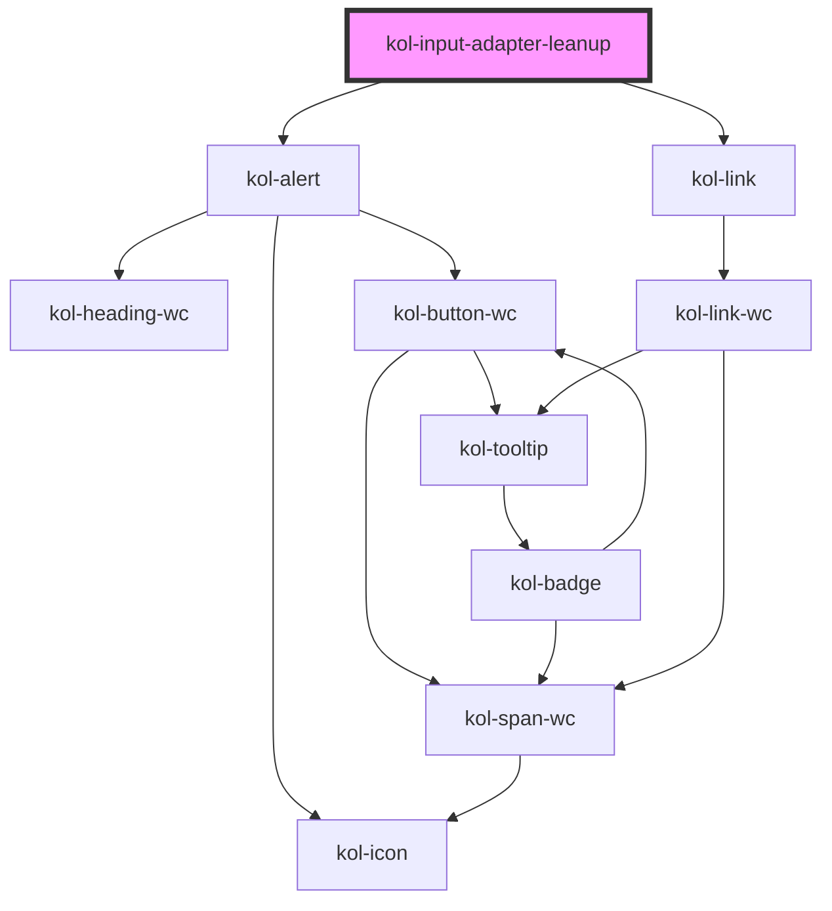

# InputAdapterLeanup

Die **InputAdapterLeanup**-Komponente wird im Zusammenhang mit der Nutzung von beliebigen Input-Komponenten innerhalb eines Formulars verwendet. Sie dient als technischer Container, der die jeweilige Input-Komponente als Control übergeben wird. Auf diese Weise wird die vollständige, datenseitige Steuerung der Input-Komponente über das **InputAdapterLeanup** gewährleistet. Die Input-Komponente dient allein der optischen bzw. layouttechnischen Ausgabe.

## 🔥 Refactoring

> Der Leanup-Adapter ermöglicht das Framework-agnostische Handlen von Formularen, deren Werte, Validatoren, Formattern, Parsern und vieles mehr. Initial wurde der Adapter innerhalb von KoliBri umgesetzt, da zunächst die Funktionalität im Fokus stand. Nun erfolgen Änderungen (Refactorings) alles in den richtigen Domänen zu verorten. Dazu muss die Komponente `KolInputAdapterLeanup` durch eine Leanup-Komponente (`LeanInputAdapter`) ersetzt und in die Verantwortung des Leanup-Teams gegeben werden. Dies ist mittlerweile geschehen und wie folgt nutzbar.

### Installation

`npm i @leanup/form @leanup/kolibri-components` und optional für React `npm i @leanup/kolibri-react`

### Integration

#### Statische Integration (HTML)

```html
...
<head>
	...
	<script type="module" src="assets/@public-ui/components/www/build/kolibri.esm.js"></script>
	<script type="module" src="assets/@leanup/kolibri-components/www/build/leanup.esm.js"></script>
	...
</head>
...
```

#### Dynamische Integration (JavaScript)

```tsx
import { defineCustomElements as kolElements } from '@public-ui/components/dist/loader';
import { defineCustomElements as leanElements } from '@leanup/kolibri-components/dist/loader';
import { BMF } from '@public-ui/themes';

register([BMF], [kolElements, leanElements])
	.then(() => {
		const htmlElement = document.querySelector<HTMLDivElement>('div#app');
		if (htmlElement instanceof HTMLElement) {
			const root = createRoot(htmlElement);
			root.render(
				<Router>
					<AppComponent />
				</Router>
			);
		}
	})
	.catch(console.warn);
```

### Verwendung

#### Statische Verwendung (HTML)

```html
<lean-input-adapter _control="...">
	<kol-input-text ... />
</lean-input-adapter>
```

#### Dynamische Verwendung (JavaScript)

```jsx
<LeanInputAdapter _control="...">
	<KolInputText ... />
</LeanInputAdapter>
```

## Konfiguration

Die **InputAdapterLeanup**-Komponente wird über das Hauptelement `<kol-input-adapter-leanup'></kol-input-adapter-leanup>` erzeugt. Ihm wird mit dem Attribut `_control` die gewünschte Input-Komponente übergeben. Innerhalb der **InputAdapterLeanup**-Komponente wird die eigentliche Input-Komponente geschrieben.

### Code

```tsx
<kol-input-adapter-leanup _control={this.ctrl.formLocation.getInput('location') as InputControl}>
	<kol-input-text _placeholder="Platzhaltertext" _type="text">
		Eingabefeld
	</kol-input-text>
</kol-input-adapter-leanup>
```

### Beispiel

<kol-input-text _placeholder="Platzhaltertext" _type="text">Eingabefeld</kol-input-text>

## Verwendung

### Verwaltete Properties

Die Adapter-Komponente verwaltet folgende Properties automatisch, **die dann nicht mehr direkt an der reinen KoliBri-Komponente gesetzt werden können**:

| Property     | Erläuterung                                                                                                                                            |
| ------------ | ------------------------------------------------------------------------------------------------------------------------------------------------------ |
| `_checked`   | Handelt es sich bei der Eingabekomponente um eine Checkbox und ist der `_value` gleich `true`, dann wird `_checked` `true` gesetzt, ansonsten `false`. |
| `_disabled`  | Über das `Form`- und `InputControl` kann können alle bzw. ein Eingabefeld aktiviert und deaktiviert werden.                                            |
| `_error`     | Das `Form-` und `InputControl` werten automatisch die relevanten Validatoren aus und setzt die Fehlermeldung entsprechend.                             |
| `_id`        | Die eindeutige ID eines Eingabefeldes kann aus der Formularstruktur des `FormControl`'s und des enthaltenen `InputControl`'s abgeleitet werden.        |
| `_name`      | Der Name des Eingabefeldes kann aus dem `InputControl`'s abgeleitet werden.                                                                            |
| `_on`        | Der Adapter hängt sich mit einem zusätzlichen Change-Listener in die Eingabekomponente ein, um Änderungen übernehmen zu können.                        |
| `_required`  | Über das `InputControl` kann ein Eingabefeld erforderlich oder nicht erforderlich gesetzt werden.                                                      |
| `_value`     | Der Wert eines Eingabefeldes entspricht dem sogenannten View-Value des `InputControl`'s.                                                               |
| `Label-Text` | Wenn ein Label im `InputControl` gesetzt ist, dann wird es beim Rendern im HTML übernommen.                                                            |

<!--### Best practices

### Anwendungsfälle

## Links und Referenzen

<!-- Auto Generated Below -->

> **[DEPRECATED]** Use the separated lean-input-adapter from the `@leanup/kolibri-components` package.

## Dependencies

### Depends on

- [kol-alert](../alert)
- [kol-link](../link)

### Graph



---
