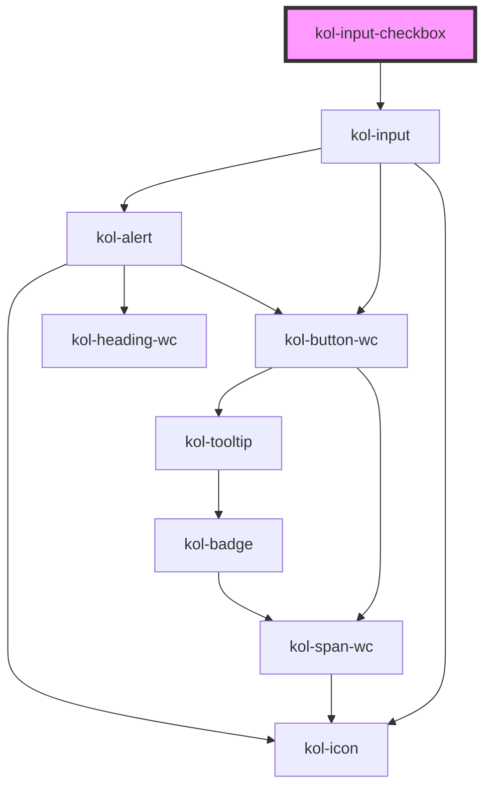

# Checkbox

Der Input-Typ **_Checkbox_** generiert eine rechteckige Box, die durch Anklicken aktiviert und wieder deaktiviert wird. In aktiviertem Zustand befindet sich ein farbiger Haken in der Box.

Eine optische Alternative zur Standard-Checkbox stellt die Ausgabe als **_Switch_** dar. Hierbei wird die Checkbox zu einem Schieberegler gewandelt, der bei Anklicken nach rechts (aktiv) bzw. nach links (inaktiv) verschoben wird.

## Konstruktion

### Code

```tsx
<kol-input-checkbox _id="meine_checkbox" _name="meine_checkbox">
	* Ich stimme der <kol-link>Datenschutzerklärung zu</kol-link>
</kol-input-checkbox>
```

### Beispiel

<kol-input-checkbox _id="meine_checkbox" _name="meine_checkbox">\* Ich stimme der <kol-link>Datenschutzerklärung zu</kol-link></kol-input-checkbox>

## Verwendung

Checkboxen werden als Einzelelement oder als Liste beliebig vieler Checkboxen verwendet. Sie ermöglichen den Nutzer:innen, aus einer vordefinierten Anzahl von Möglichkeiten eine oder mehrere auszuwählen.

### Best practices

- Verwenden Sie eine einzelne Checkbox, wenn Sie von den Nutzer:innen eine einfach Bestätigung wünschen, z.B. Akzeptieren der Datenschutzerklärung.
- Verwenden Sie eine Gruppe von Checkboxen, um den Nutzer:innen die Möglichkeit zu geben einen oder mehrere Werte auszuwählen.
- Vermeiden Sie zu viele Checkboxen, da hierdurch die Übersichtlichkeit verloren geht. Verwenden Sie in diesem Fall eine Select-Box.

## Barrierefreiheit

Vermeiden Sie die Verwendung von vielen Checkboxen auf einer Seite, da Ihre Inhalte hierdurch schnell unübersichtlich und lang werden. Prüfen Sie in solchen Anwendungsfällen die Verwendung einer <a href="?path=/story/react-select-beschreibung--page">Select-Box</a>.

Achten Sie darauf, jeder Checkbox ein Label zuzuweisen, da dieses von Screenreadern vorgelesen wird und so eine eindeutige Identifikation des Eingabefeldes ermöglicht.

### Tastatursteuerung

| Taste  | Funktion                                                                                                           |
| ------ | ------------------------------------------------------------------------------------------------------------------ |
| `Tab`  | Fokussiert die Checkbox bzw. ermöglicht den Wechsel zwischen Checkboxen einer Liste.                               |
| `Leer` | Aktiviert bzw. deaktiviert die Checkbox. Der Zustand **_Indeterminate_** ist über die Tastatur nicht herzustellen. |

## Links und Referenzen

- https://www.w3.org/TR/wai-aria-practices/#checkbox
- https://medium.com/@gavyn/til-autofocus-inputs-are-an-accessibility-problem-32ced60c3109

<!-- Auto Generated Below -->

## Properties

| Property           | Attribute        | Description                                                                                                                                        | Type                                                                                     | Default      |
| ------------------ | ---------------- | -------------------------------------------------------------------------------------------------------------------------------------------------- | ---------------------------------------------------------------------------------------- | ------------ |
| `_accessKey`       | `_access-key`    | Gibt an, mit welcher Tastenkombination man das Input auslösen oder fokussieren kann.                                                               | `string \| undefined`                                                                    | `undefined`  |
| `_alert`           | `_alert`         | Gibt an, ob die Fehlermeldung vorgelesen werden soll, wenn es eine gibt.                                                                           | `boolean \| undefined`                                                                   | `true`       |
| `_checked`         | `_checked`       | Gibt an, ob die Checkbox ausgewählt ist oder nicht.                                                                                                | `boolean \| undefined`                                                                   | `false`      |
| `_disabled`        | `_disabled`      | Gibt an, ob das Eingabefeld aktiviert oder deaktiviert ist.                                                                                        | `boolean \| undefined`                                                                   | `undefined`  |
| `_error`           | `_error`         | Gibt den Text für eine Fehlermeldung an.                                                                                                           | `string \| undefined`                                                                    | `undefined`  |
| `_hideLabel`       | `_hide-label`    | Gibt an, ob das Eingabefeld kein sichtbares Label haben soll.                                                                                      | `boolean \| undefined`                                                                   | `undefined`  |
| `_hint`            | `_hint`          | Gibt den Text für eine Hinweistext an.                                                                                                             | `string \| undefined`                                                                    | `''`         |
| `_id` _(required)_ | `_id`            | Gibt die technische ID des Eingabefeldes an.                                                                                                       | `string`                                                                                 | `undefined`  |
| `_indeterminate`   | `_indeterminate` | Gibt an, ob die Checkbox weder ausgewählt noch nicht ausgewählt ist.                                                                               | `boolean \| undefined`                                                                   | `undefined`  |
| `_name`            | `_name`          | Gibt den technischen Namen des Eingabefeldes an.                                                                                                   | `string \| undefined`                                                                    | `undefined`  |
| `_on`              | --               | Gibt die EventCallback-Funktionen für das Input-Event an.                                                                                          | `InputTypeOnBlur & InputTypeOnClick & InputTypeOnChange & InputTypeOnFocus \| undefined` | `undefined`  |
| `_required`        | `_required`      | Gibt an, ob die Checkbox ein Pflichtfeld ist.                                                                                                      | `boolean \| undefined`                                                                   | `undefined`  |
| `_tabIndex`        | `_tab-index`     | Gibt an, welchen Tab-Index dieses Input hat.                                                                                                       | `number \| undefined`                                                                    | `undefined`  |
| `_touched`         | `_touched`       | Gibt an, ob dieses Eingabefeld von Nutzer:innen einmal besucht/berührt wurde.                                                                      | `boolean \| undefined`                                                                   | `false`      |
| `_type`            | `_type`          | <span style="color:red">**[DEPRECATED]**</span> Verwende stattdessen das Attribute \_variant.<br/><br/>Gibt an, welchen Type das Input haben soll. | `"checkbox" \| "switch" \| undefined`                                                    | `undefined`  |
| `_value`           | `_value`         | Gibt den Wert der Checkbox an.                                                                                                                     | `string \| undefined`                                                                    | `undefined`  |
| `_variant`         | `_variant`       | Gibt an, welchen Type das Input haben soll.                                                                                                        | `"checkbox" \| "switch" \| undefined`                                                    | `'checkbox'` |

## Dependencies

### Depends on

- kol-input

### Graph



---
