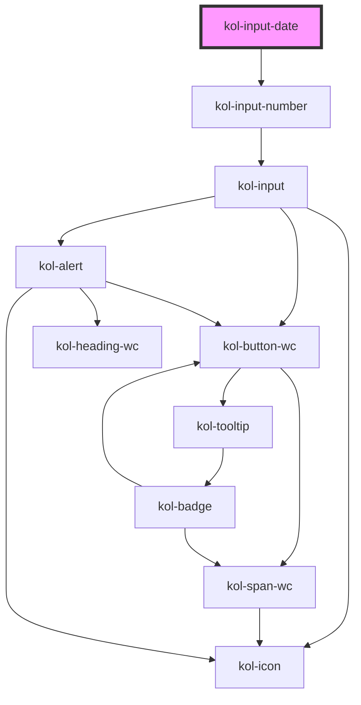

# InputDate

Der Input-Typ **Date** erzeugt ein Eingabefeld für Datumswerte. Diese können konkrete Daten sein, aber auch Wochen, Monate oder Zeitangaben.

## Konstruktion

### Code

```tsx
<kol-input-date _id="mein_datum" _name="mein_datum" _type="date">
	Erstellungsdatum
</kol-input-date>
```

### Beispiel

<kol-input-date _id="mein_datum" _name="mein_datum" _type="date">
  Erstellungsdatum
</kol-input-date>

## Verwendung

Die **InputDate**-Komponente kann für die Erfassung von Daten verwendet werden. Es verwendet intern die InputNumber-Komponente.

<kol-alert _type="info">Beachten Sie, dass im <b>Firefox</b> nicht alle <b>Typen</b> der **InputDate**-Komponente funktional sind. Es werden bei den Typen <b>Month</b>, <b>Week</b> und <b>Datum & Zeit</b> keine Auswahldialoge angezeigt.</kol-alert>

Die Komponente zeichnet sich dadurch aus, dass sie zahlreiche Ziffern-basierte Eingabemuster unterstützt. Hierbei ist es wichtig zu beachten, dass sich das Verhalten bei der Eingabe von Browser zu Browser und Geräte zu Gerät unterscheiden kann. Beispielsweise ist es möglich beim Datum, 01.01.999999 einzugeben, auch wenn max=2022-02-02 ist. Der Feldwert ist aber trotzdem 2022-02-02.

### Best practices

- Achten sie darauf, die Pflichtfelder `id` und `name` korrekt zu setzen.

## Barrierefreiheit

Die Icons in der Komponente sind per Tab-Taste nicht erreichbar. Die Auswahlhilfen der Komponente werden über die **Leertaste** geöffnet. So erhalten Sie beispielsweise beim Typ **date** ein Kalendermodul, über das per Maus oder über die Tastatur das gewünschte Datum ausgewählt werden kann. Die manuelle Eingabe der Werte ist alternativ möglich.

### Tastatursteuerung

| Taste                | Funktion                                                                                                                                                                                                                                     |
| -------------------- | -------------------------------------------------------------------------------------------------------------------------------------------------------------------------------------------------------------------------------------------- | --------------------------------------------------------------------------------------------------------------- |
| `Tab`                | Fokussiert das Eingabefeld. Nach erhalt des Fokus wechselt die Tab-Taste durch die Eingabebereiche. Danach erst wechselt die Tab-Taste zum nächsten Eingabefeld.                                                                             |
| `Pfeil-Tasten (links | rechts)`                                                                                                                                                                                                                                     | Wenn das Eingabefeld fokussiert ist, kann mit den Pfeil-Tasten zwischen den Eingabebereichen gewechselt werden. |
| `Pfeil-Tasten (oben  | unten)`                                                                                                                                                                                                                                      | Wenn ein Eingabebereich aktiviert ist können mit den Pfeil-Tasten oben und unten die Werte verändert werden.    |
| `Leer`               | Wenn das Eingabefeld fokussiert ist, kann in manchen Browsern mit der Leertaste ein Auswahldialog aufgerufen bzw. geschlossen werden. Die Navigation und Auswahl erfolgt hier mit Hilfe der Tab-Taste, der Pfeil-Tasten und der Enter-Taste. |
| `Esc`                | Ist ein Auswahldialog verfügbar, kann dieser alternativ zur Leertaste auch mit der Esc-Taste geschlossen werden.                                                                                                                             |

## Links und Referenzen

- https://medium.com/@gavyn/til-autofocus-inputs-are-an-accessibility-problem-32ced60c3109
- https://www.jotform.com/blog/html5-datalists-what-you-need-to-know-78024/

<!-- Auto Generated Below -->

## Properties

| Property           | Attribute        | Description                                                                                              | Type                                                                                                                                                                                                                                                                                                                                                                                                                                                                                                                                                                                                                                                                                                                                                                      | Default     |
| ------------------ | ---------------- | -------------------------------------------------------------------------------------------------------- | ------------------------------------------------------------------------------------------------------------------------------------------------------------------------------------------------------------------------------------------------------------------------------------------------------------------------------------------------------------------------------------------------------------------------------------------------------------------------------------------------------------------------------------------------------------------------------------------------------------------------------------------------------------------------------------------------------------------------------------------------------------------------- | ----------- |
| `_accessKey`       | `_access-key`    | Gibt an, mit welcher Tastenkombination man das Input auslösen oder fokussieren kann.                     | `string \| undefined`                                                                                                                                                                                                                                                                                                                                                                                                                                                                                                                                                                                                                                                                                                                                                     | `undefined` |
| `_alert`           | `_alert`         | Gibt an, ob die Fehlermeldung vorgelesen werden soll, wenn es eine gibt.                                 | `boolean \| undefined`                                                                                                                                                                                                                                                                                                                                                                                                                                                                                                                                                                                                                                                                                                                                                    | `true`      |
| `_autoComplete`    | `_auto-complete` | Gibt an, ob das Eingabefeld autovervollständigt werden kann.                                             | `"off" \| "on" \| undefined`                                                                                                                                                                                                                                                                                                                                                                                                                                                                                                                                                                                                                                                                                                                                              | `undefined` |
| `_disabled`        | `_disabled`      | Gibt an, ob das Eingabefeld aktiviert oder deaktiviert ist.                                              | `boolean \| undefined`                                                                                                                                                                                                                                                                                                                                                                                                                                                                                                                                                                                                                                                                                                                                                    | `undefined` |
| `_error`           | `_error`         | Gibt den Text für eine Fehlermeldung an.                                                                 | `string \| undefined`                                                                                                                                                                                                                                                                                                                                                                                                                                                                                                                                                                                                                                                                                                                                                     | `undefined` |
| `_hideLabel`       | `_hide-label`    | Gibt an, ob das Eingabefeld kein sichtbares Label haben soll.                                            | `boolean \| undefined`                                                                                                                                                                                                                                                                                                                                                                                                                                                                                                                                                                                                                                                                                                                                                    | `undefined` |
| `_hint`            | `_hint`          | Gibt den Text für eine Hinweistext an.                                                                   | `string \| undefined`                                                                                                                                                                                                                                                                                                                                                                                                                                                                                                                                                                                                                                                                                                                                                     | `''`        |
| `_icon`            | `_icon`          | Ermöglicht das Anzeigen von Icons links und/oder rechts am Rand des Eingabefeldes.                       | `string \| undefined \| { right: string \| KoliBriCustomIcon; left?: string \| KoliBriCustomIcon \| undefined; } \| { right?: string \| KoliBriCustomIcon \| undefined; left: string \| KoliBriCustomIcon; }`                                                                                                                                                                                                                                                                                                                                                                                                                                                                                                                                                             | `undefined` |
| `_id` _(required)_ | `_id`            | Gibt die technische ID des Eingabefeldes an.                                                             | `string`                                                                                                                                                                                                                                                                                                                                                                                                                                                                                                                                                                                                                                                                                                                                                                  | `undefined` |
| `_list`            | `_list`          | Gibt die Liste der Vorschlagszahlen an.                                                                  | `string \| string[] \| undefined`                                                                                                                                                                                                                                                                                                                                                                                                                                                                                                                                                                                                                                                                                                                                         | `undefined` |
| `_max`             | `_max`           | Gibt den größtmöglichen Datumswert an.                                                                   | `Date \| `${number}-${number}-${number}T${number}:${number}:${number}.${number}` \| `${number}-${number}-${number}T${number}:${number}:${number}` \| `${number}-${number}-${number}`\|`${number}-${number}`\|`${number}-W${number}`\|`${number}:${number}:${number}.${number}`\|`${number}:${number}:${number}` \| undefined`                                                                                                                                                                                                                                                                                                                                                                                                                                             | `undefined` |
| `_min`             | `_min`           | Gibt den kleinstmöglichen Datumswert an.                                                                 | `Date \| `${number}-${number}-${number}T${number}:${number}:${number}.${number}` \| `${number}-${number}-${number}T${number}:${number}:${number}` \| `${number}-${number}-${number}`\|`${number}-${number}`\|`${number}-W${number}`\|`${number}:${number}:${number}.${number}`\|`${number}:${number}:${number}` \| undefined`                                                                                                                                                                                                                                                                                                                                                                                                                                             | `undefined` |
| `_name`            | `_name`          | Gibt den technischen Namen des Eingabefeldes an.                                                         | `string \| undefined`                                                                                                                                                                                                                                                                                                                                                                                                                                                                                                                                                                                                                                                                                                                                                     | `undefined` |
| `_on`              | --               | Gibt die EventCallback-Funktionen für das Input-Event an.                                                | `InputTypeOnBlur & InputTypeOnClick & InputTypeOnChange & InputTypeOnFocus \| undefined`                                                                                                                                                                                                                                                                                                                                                                                                                                                                                                                                                                                                                                                                                  | `undefined` |
| `_readOnly`        | `_read-only`     | Gibt an, ob das Eingabefeld nur lesend ist.                                                              | `boolean \| undefined`                                                                                                                                                                                                                                                                                                                                                                                                                                                                                                                                                                                                                                                                                                                                                    | `undefined` |
| `_required`        | `_required`      | Gibt an, ob das Eingabefeld ein Pflichtfeld ist.                                                         | `boolean \| undefined`                                                                                                                                                                                                                                                                                                                                                                                                                                                                                                                                                                                                                                                                                                                                                    | `undefined` |
| `_smartButton`     | --               | Ermöglicht einen Schalter ins das Eingabefeld mit einer beliebigen Aktion zu einzufügen (nur Icon-Only). | `undefined \| { _label: string; } & { _ariaControls?: string \| undefined; _ariaCurrent?: AriaCurrent \| undefined; _ariaExpanded?: boolean \| undefined; _ariaLabel?: string \| undefined; _ariaSelected?: boolean \| undefined; _disabled?: boolean \| undefined; _icon?: Stringified<KoliBriIconProp> \| undefined; _iconAlign?: Alignment \| undefined; _iconOnly?: boolean \| undefined; _role?: "tab" \| undefined; _tabIndex?: number \| undefined; _tooltipAlign?: TooltipAlignment \| undefined; _accessKey?: string \| undefined; _id?: string \| undefined; _on?: KoliBriButtonCallbacks<unknown> \| undefined; _type?: KoliBriButtonType \| undefined; _value?: unknown; _customClass?: string \| undefined; _variant?: KoliBriButtonVariant \| undefined; }` | `undefined` |
| `_step`            | `_step`          | Gibt die Schrittweite der Wertveränderung an                                                             | `number \| undefined`                                                                                                                                                                                                                                                                                                                                                                                                                                                                                                                                                                                                                                                                                                                                                     | `undefined` |
| `_tabIndex`        | `_tab-index`     | Gibt an, welchen Tab-Index dieses Input hat.                                                             | `number \| undefined`                                                                                                                                                                                                                                                                                                                                                                                                                                                                                                                                                                                                                                                                                                                                                     | `undefined` |
| `_touched`         | `_touched`       | Gibt an, ob dieses Eingabefeld von Nutzer:innen einmal besucht/berührt wurde.                            | `boolean \| undefined`                                                                                                                                                                                                                                                                                                                                                                                                                                                                                                                                                                                                                                                                                                                                                    | `false`     |
| `_type`            | `_type`          | Gibt den Typ des Eingabefeldes an.                                                                       | `"date" \| "datetime-local" \| "month" \| "time" \| "week"`                                                                                                                                                                                                                                                                                                                                                                                                                                                                                                                                                                                                                                                                                                               | `'date'`    |
| `_value`           | `_value`         | Gibt den Wert des Eingabefeldes an.                                                                      | `Date \| `${number}-${number}-${number}T${number}:${number}:${number}.${number}` \| `${number}-${number}-${number}T${number}:${number}:${number}` \| `${number}-${number}-${number}`\|`${number}-${number}`\|`${number}-W${number}`\|`${number}:${number}:${number}.${number}`\|`${number}:${number}:${number}` \| undefined`                                                                                                                                                                                                                                                                                                                                                                                                                                             | `undefined` |

## Dependencies

### Depends on

- [kol-input-number](../input-number)

### Graph



---
