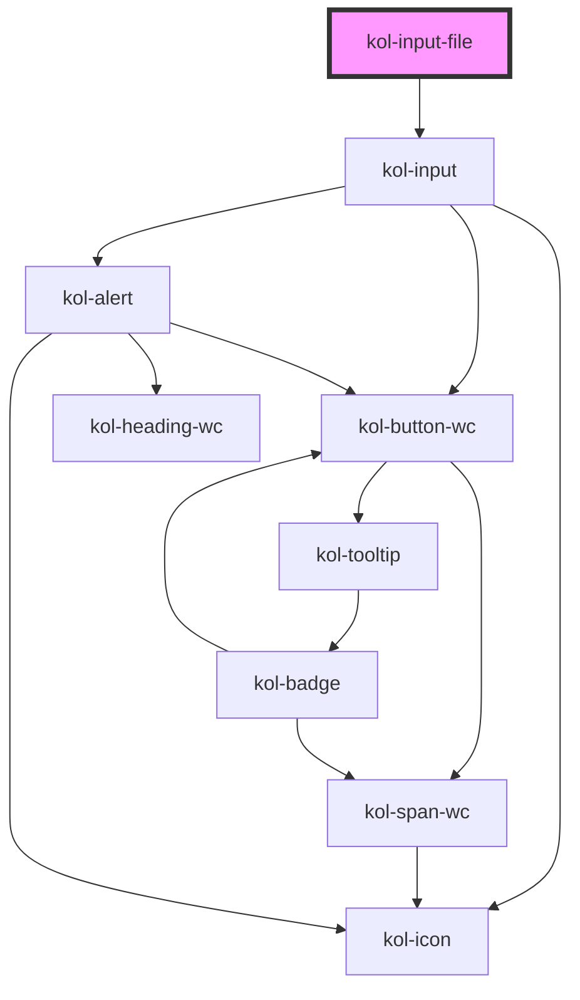

# InputFile

Der Input-Typ **File** erzeugt ein Eingabefeld für Uploads. Es können eine oder auch mehrere Dateien ausgewählt werden.

## Konstruktion

### Code

```html
<kol-input-file _id="mein_upload" _name="mein_upload" _accept="image/png, image/jpeg, application/pdf"> Bild hochladen </kol-input-file>
```

### Beispiel

<kol-input-file _id="mein_upload" _name="mein_upload" _accept="image/png">Bild hochladen</kol-input-file>

## Verwendung

Geben Sie über das Attribut **`_accept`** an, welche Dateitypen zur Auswahl erlaubt sind. Wird das Attribut nicht oder leer übergeben, sind alle Dateitypen erlaubt.

### Best practices

- Lassen Sie nur die Dateitypen zum Upload zu, die für die Programmausführung benötigt werden. Eine fehlende Einschränkung der hochladbaren Dateitypen kann ein erhebliches Sicherheitsrisiko sein.
- Begrenzen Sie die Größe der Dateien, die Sie zum Upload zulassen möchten.

## Barrierefreiheit

### Tastatursteuerung

| Taste | Funktion                                                        |
| ----- | --------------------------------------------------------------- |
| `Tab` | Fokussiert das Eingabefeld und ruft den Dateiauswahldialog auf. |

## Links und Referenzen

- https://medium.com/@gavyn/til-autofocus-inputs-are-an-accessibility-problem-32ced60c3109

<!-- Auto Generated Below -->

## Properties

| Property           | Attribute     | Description                                                                                              | Type                                                                                                                                                                                                                                                                                                                                                                                                                                                                                                                                                                                                                                                                                                                                                               | Default     |
| ------------------ | ------------- | -------------------------------------------------------------------------------------------------------- | ------------------------------------------------------------------------------------------------------------------------------------------------------------------------------------------------------------------------------------------------------------------------------------------------------------------------------------------------------------------------------------------------------------------------------------------------------------------------------------------------------------------------------------------------------------------------------------------------------------------------------------------------------------------------------------------------------------------------------------------------------------------ | ----------- |
| `_accept`          | `_accept`     | Gibt an, welche Dateiformate erlaubt sind.                                                               | `string \| undefined`                                                                                                                                                                                                                                                                                                                                                                                                                                                                                                                                                                                                                                                                                                                                              | `undefined` |
| `_accessKey`       | `_access-key` | Gibt an, mit welcher Tastenkombination man das Input auslösen oder fokussieren kann.                     | `string \| undefined`                                                                                                                                                                                                                                                                                                                                                                                                                                                                                                                                                                                                                                                                                                                                              | `undefined` |
| `_alert`           | `_alert`      | Gibt an, ob die Fehlermeldung vorgelesen werden soll, wenn es eine gibt.                                 | `boolean \| undefined`                                                                                                                                                                                                                                                                                                                                                                                                                                                                                                                                                                                                                                                                                                                                             | `true`      |
| `_disabled`        | `_disabled`   | Gibt an, ob das Eingabefeld aktiviert oder deaktiviert ist.                                              | `boolean \| undefined`                                                                                                                                                                                                                                                                                                                                                                                                                                                                                                                                                                                                                                                                                                                                             | `undefined` |
| `_error`           | `_error`      | Gibt den Text für eine Fehlermeldung an.                                                                 | `string \| undefined`                                                                                                                                                                                                                                                                                                                                                                                                                                                                                                                                                                                                                                                                                                                                              | `undefined` |
| `_hideLabel`       | `_hide-label` | Gibt an, ob das Eingabefeld kein sichtbares Label haben soll.                                            | `boolean \| undefined`                                                                                                                                                                                                                                                                                                                                                                                                                                                                                                                                                                                                                                                                                                                                             | `undefined` |
| `_hint`            | `_hint`       | Gibt den Text für eine Hinweistext an.                                                                   | `string \| undefined`                                                                                                                                                                                                                                                                                                                                                                                                                                                                                                                                                                                                                                                                                                                                              | `''`        |
| `_icon`            | `_icon`       | Ermöglicht das Anzeigen von Icons links und/oder rechts am Rand des Eingabefeldes.                       | `string \| undefined \| { right: string \| KoliBriCustomIcon; left?: string \| KoliBriCustomIcon \| undefined; } \| { right?: string \| KoliBriCustomIcon \| undefined; left: string \| KoliBriCustomIcon; }`                                                                                                                                                                                                                                                                                                                                                                                                                                                                                                                                                      | `undefined` |
| `_id` _(required)_ | `_id`         | Gibt die technische ID des Eingabefeldes an.                                                             | `string`                                                                                                                                                                                                                                                                                                                                                                                                                                                                                                                                                                                                                                                                                                                                                           | `undefined` |
| `_multiple`        | `_multiple`   | Gibt an, ob mehrere Werte eingegeben werden können.                                                      | `boolean \| undefined`                                                                                                                                                                                                                                                                                                                                                                                                                                                                                                                                                                                                                                                                                                                                             | `undefined` |
| `_name`            | `_name`       | Gibt den technischen Namen des Eingabefeldes an.                                                         | `string \| undefined`                                                                                                                                                                                                                                                                                                                                                                                                                                                                                                                                                                                                                                                                                                                                              | `undefined` |
| `_on`              | --            | Gibt die EventCallback-Funktionen für das Input-Event an.                                                | `InputTypeOnBlur & InputTypeOnClick & InputTypeOnChange & InputTypeOnFocus \| undefined`                                                                                                                                                                                                                                                                                                                                                                                                                                                                                                                                                                                                                                                                           | `undefined` |
| `_required`        | `_required`   | Gibt an, ob das Eingabefeld ein Pflichtfeld ist.                                                         | `boolean \| undefined`                                                                                                                                                                                                                                                                                                                                                                                                                                                                                                                                                                                                                                                                                                                                             | `undefined` |
| `_smartButton`     | --            | Ermöglicht einen Schalter ins das Eingabefeld mit einer beliebigen Aktion zu einzufügen (nur Icon-Only). | `undefined \| { _label: string; } & { _ariaControls?: string \| undefined; _ariaCurrent?: AriaCurrent \| undefined; _ariaExpanded?: boolean \| undefined; _ariaLabel?: string \| undefined; _ariaSelected?: boolean \| undefined; _disabled?: boolean \| undefined; _icon?: Stringified<KoliBriIconProp> \| undefined; _iconAlign?: Alignment \| undefined; _iconOnly?: boolean \| undefined; _role?: "tab" \| undefined; _tabIndex?: number \| undefined; _tooltipAlign?: Alignment \| undefined; _accessKey?: string \| undefined; _id?: string \| undefined; _on?: KoliBriButtonCallbacks<unknown> \| undefined; _type?: KoliBriButtonType \| undefined; _value?: unknown; _customClass?: string \| undefined; _variant?: KoliBriButtonVariant \| undefined; }` | `undefined` |
| `_tabIndex`        | `_tab-index`  | Gibt an, welchen Tab-Index dieses Input hat.                                                             | `number \| undefined`                                                                                                                                                                                                                                                                                                                                                                                                                                                                                                                                                                                                                                                                                                                                              | `undefined` |
| `_touched`         | `_touched`    | Gibt an, ob dieses Eingabefeld von Nutzer:innen einmal besucht/berührt wurde.                            | `boolean \| undefined`                                                                                                                                                                                                                                                                                                                                                                                                                                                                                                                                                                                                                                                                                                                                             | `false`     |
| `_value`           | `_value`      | Gibt den Wert des Eingabefeldes an.                                                                      | `string \| undefined`                                                                                                                                                                                                                                                                                                                                                                                                                                                                                                                                                                                                                                                                                                                                              | `undefined` |

## CSS Custom Properties

| Name                        | Description                     |
| --------------------------- | ------------------------------- |
| `--kolibri-border-color`    | Default color of the border.    |
| `--kolibri-border-radius`   | Default radius of the border.   |
| `--kolibri-border-width`    | Default width of the border.    |
| `--kolibri-color-danger`    | Default color of the danger.    |
| `--kolibri-color-disabled`  | Default color of the disabled.  |
| `--kolibri-color-error`     | Default color of the error.     |
| `--kolibri-color-ghost`     | Default color of the ghost.     |
| `--kolibri-color-info`      | Default color of the info.      |
| `--kolibri-color-normal`    | Default color of the normal.    |
| `--kolibri-color-primary`   | Default color of the primary.   |
| `--kolibri-color-secondary` | Default color of the secondary. |
| `--kolibri-color-success`   | Default color of the success.   |
| `--kolibri-color-warning`   | Default color of the warning.   |

## Dependencies

### Depends on

- kol-input

### Graph



---
