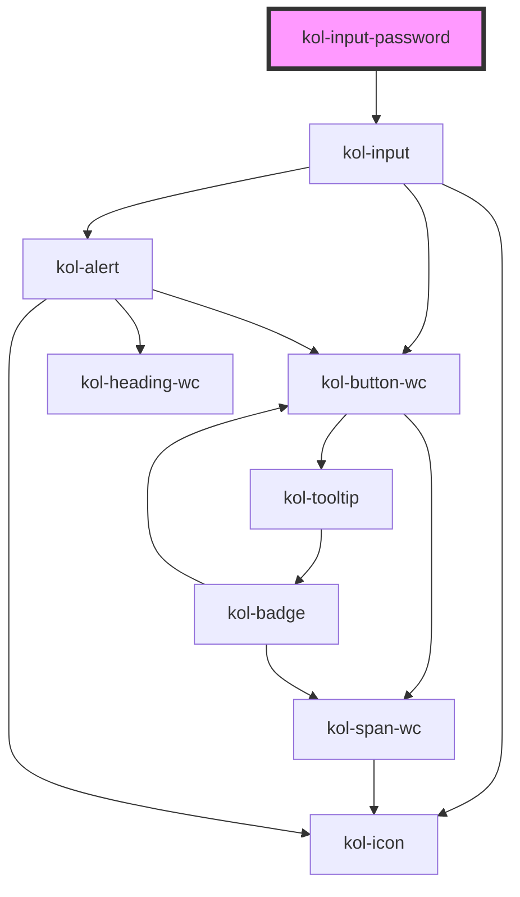

# InputPassword

Der Input-Typ **Password** erzeugt ein Eingabefeld für Passwörter. Die Eingabe wird über Punktsymbole maskiert.

## Konstruktion

### Code

```tsx
<kol-input-password _id="main_passwort" _name="main_passwort">
	Passwort
</kol-input-password>
```

### Beispiel

<kol-input-password _id="main_passwort" _name="main_passwort">
  Passwort
</kol-input-password>

## Verwendung

### Best practices

- Achten sie darauf, die Pflichtfelder `id` und `name` korrekt zu setzen.

## Barrierefreiheit

### Tastatursteuerung

| Taste | Funktion                    |
| ----- | --------------------------- |
| `Tab` | Fokussiert das Eingabefeld. |

## Links und Referenzen

- https://medium.com/@gavyn/til-autofocus-inputs-are-an-accessibility-problem-32ced60c3109

<!-- Auto Generated Below -->

## Properties

| Property           | Attribute        | Description                                                                                              | Type                                                                                                                                                                                                                                                                                                                                                                                                                                                                                                                                                                                                                                                                                                                                           | Default     |
| ------------------ | ---------------- | -------------------------------------------------------------------------------------------------------- | ---------------------------------------------------------------------------------------------------------------------------------------------------------------------------------------------------------------------------------------------------------------------------------------------------------------------------------------------------------------------------------------------------------------------------------------------------------------------------------------------------------------------------------------------------------------------------------------------------------------------------------------------------------------------------------------------------------------------------------------------- | ----------- |
| `_accessKey`       | `_access-key`    | Gibt an, mit welcher Tastenkombination man das Input auslösen oder fokussieren kann.                     | `string \| undefined`                                                                                                                                                                                                                                                                                                                                                                                                                                                                                                                                                                                                                                                                                                                          | `undefined` |
| `_alert`           | `_alert`         | Gibt an, ob die Fehlermeldung vorgelesen werden soll, wenn es eine gibt.                                 | `boolean \| undefined`                                                                                                                                                                                                                                                                                                                                                                                                                                                                                                                                                                                                                                                                                                                         | `true`      |
| `_autoComplete`    | `_auto-complete` | Gibt an, ob das Eingabefeld autovervollständigt werden kann.                                             | `"off" \| "on" \| undefined`                                                                                                                                                                                                                                                                                                                                                                                                                                                                                                                                                                                                                                                                                                                   | `undefined` |
| `_disabled`        | `_disabled`      | Gibt an, ob das Eingabefeld aktiviert oder deaktiviert ist.                                              | `boolean \| undefined`                                                                                                                                                                                                                                                                                                                                                                                                                                                                                                                                                                                                                                                                                                                         | `undefined` |
| `_error`           | `_error`         | Gibt den Text für eine Fehlermeldung an.                                                                 | `string \| undefined`                                                                                                                                                                                                                                                                                                                                                                                                                                                                                                                                                                                                                                                                                                                          | `undefined` |
| `_hideLabel`       | `_hide-label`    | Gibt an, ob das Eingabefeld kein sichtbares Label haben soll.                                            | `boolean \| undefined`                                                                                                                                                                                                                                                                                                                                                                                                                                                                                                                                                                                                                                                                                                                         | `undefined` |
| `_hint`            | `_hint`          | Gibt den Text für eine Hinweistext an.                                                                   | `string \| undefined`                                                                                                                                                                                                                                                                                                                                                                                                                                                                                                                                                                                                                                                                                                                          | `''`        |
| `_icon`            | `_icon`          | Ermöglicht das Anzeigen von Icons links und/oder rechts am Rand des Eingabefeldes.                       | `string \| undefined \| { right: string \| KoliBriCustomIcon; left?: string \| KoliBriCustomIcon \| undefined; } \| { right?: string \| KoliBriCustomIcon \| undefined; left: string \| KoliBriCustomIcon; }`                                                                                                                                                                                                                                                                                                                                                                                                                                                                                                                                  | `undefined` |
| `_id` _(required)_ | `_id`            | Gibt die technische ID des Eingabefeldes an.                                                             | `string`                                                                                                                                                                                                                                                                                                                                                                                                                                                                                                                                                                                                                                                                                                                                       | `undefined` |
| `_maxLength`       | `_max-length`    | Gibt an, wie viele Zeichen man maximal eingeben kann.                                                    | `number \| undefined`                                                                                                                                                                                                                                                                                                                                                                                                                                                                                                                                                                                                                                                                                                                          | `undefined` |
| `_name`            | `_name`          | Gibt den technischen Namen des Eingabefeldes an.                                                         | `string \| undefined`                                                                                                                                                                                                                                                                                                                                                                                                                                                                                                                                                                                                                                                                                                                          | `undefined` |
| `_on`              | --               | Gibt die EventCallback-Funktionen für das Input-Event an.                                                | `InputTypeOnBlur & InputTypeOnClick & InputTypeOnChange & InputTypeOnFocus \| undefined`                                                                                                                                                                                                                                                                                                                                                                                                                                                                                                                                                                                                                                                       | `undefined` |
| `_pattern`         | `_pattern`       | Gibt ein Prüfpattern für das Eingabefeld an.                                                             | `string \| undefined`                                                                                                                                                                                                                                                                                                                                                                                                                                                                                                                                                                                                                                                                                                                          | `undefined` |
| `_placeholder`     | `_placeholder`   | Gibt den Platzhalter des Eingabefeldes an, wenn es leer ist.                                             | `string \| undefined`                                                                                                                                                                                                                                                                                                                                                                                                                                                                                                                                                                                                                                                                                                                          | `undefined` |
| `_readOnly`        | `_read-only`     | Gibt an, ob die Eingabefeld nur lesend ist.                                                              | `boolean \| undefined`                                                                                                                                                                                                                                                                                                                                                                                                                                                                                                                                                                                                                                                                                                                         | `undefined` |
| `_required`        | `_required`      | Gibt an, ob das Eingabefeld ein Pflichtfeld ist.                                                         | `boolean \| undefined`                                                                                                                                                                                                                                                                                                                                                                                                                                                                                                                                                                                                                                                                                                                         | `undefined` |
| `_size`            | `_size`          | Gibt an, wie viele Zeichen man eingeben kann.                                                            | `number \| undefined`                                                                                                                                                                                                                                                                                                                                                                                                                                                                                                                                                                                                                                                                                                                          | `undefined` |
| `_smartButton`     | --               | Ermöglicht einen Schalter ins das Eingabefeld mit einer beliebigen Aktion zu einzufügen (nur Icon-Only). | `undefined \| { _label: string; } & { _ariaControls?: string \| undefined; _ariaCurrent?: AriaCurrent \| undefined; _ariaExpanded?: boolean \| undefined; _ariaLabel?: string \| undefined; _ariaSelected?: boolean \| undefined; _disabled?: boolean \| undefined; _icon?: Stringified<KoliBriIconProp> \| undefined; _iconAlign?: Alignment \| undefined; _iconOnly?: boolean \| undefined; _role?: "tab" \| undefined; _tabIndex?: number \| undefined; _tooltipAlign?: TooltipAlignment \| undefined; _accessKey?: string \| undefined; _id?: string \| undefined; _on?: KoliBriButtonCallbacks \| undefined; _type?: KoliBriButtonType \| undefined; _customClass?: string \| undefined; _variant?: KoliBriButtonVariant \| undefined; }` | `undefined` |
| `_tabIndex`        | `_tab-index`     | Gibt an, welchen Tab-Index dieses Input hat.                                                             | `number \| undefined`                                                                                                                                                                                                                                                                                                                                                                                                                                                                                                                                                                                                                                                                                                                          | `undefined` |
| `_touched`         | `_touched`       | Gibt an, ob dieses Eingabefeld von Nutzer:innen einmal besucht/berührt wurde.                            | `boolean \| undefined`                                                                                                                                                                                                                                                                                                                                                                                                                                                                                                                                                                                                                                                                                                                         | `false`     |
| `_value`           | `_value`         | Gibt den Wert des Eingabefeldes an.                                                                      | `string \| undefined`                                                                                                                                                                                                                                                                                                                                                                                                                                                                                                                                                                                                                                                                                                                          | `undefined` |

## Dependencies

### Depends on

- kol-input

### Graph



---
