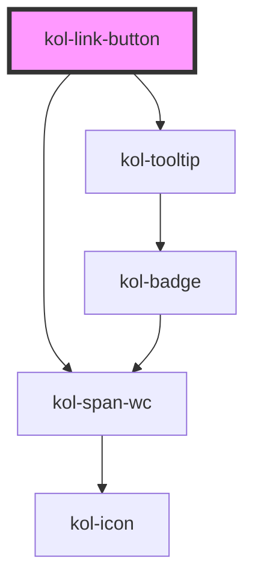

# kol-link-button

<!-- Auto Generated Below -->

## Properties

| Property              | Attribute             | Description                                                                                                                                                                                                                                                                          | Type                                                                                                                                                                                                                                                                                                                                                                                                                                                                                                                                                                                                                                                                                                                                                                                                              | Default                                        |
| --------------------- | --------------------- | ------------------------------------------------------------------------------------------------------------------------------------------------------------------------------------------------------------------------------------------------------------------------------------ | ----------------------------------------------------------------------------------------------------------------------------------------------------------------------------------------------------------------------------------------------------------------------------------------------------------------------------------------------------------------------------------------------------------------------------------------------------------------------------------------------------------------------------------------------------------------------------------------------------------------------------------------------------------------------------------------------------------------------------------------------------------------------------------------------------------------- | ---------------------------------------------- |
| `_ariaControls`       | `_aria-controls`      | Gibt an, welche Elemente kontrolliert werden. (https://developer.mozilla.org/en-US/docs/Web/Accessibility/ARIA/Attributes/aria-controls)                                                                                                                                             | `string \| undefined`                                                                                                                                                                                                                                                                                                                                                                                                                                                                                                                                                                                                                                                                                                                                                                                             | `undefined`                                    |
| `_ariaCurrent`        | `_aria-current`       | Gibt an, welchen aktuellen Auswahlstatus der Link hat. (https://developer.mozilla.org/en-US/docs/Web/Accessibility/ARIA/Attributes/aria-current)                                                                                                                                     | `"date" \| "location" \| "page" \| "step" \| "time" \| boolean \| undefined`                                                                                                                                                                                                                                                                                                                                                                                                                                                                                                                                                                                                                                                                                                                                      | `undefined`                                    |
| `_ariaExpanded`       | `_aria-expanded`      | Gibt an, ob durch den Link etwas aufgeklappt wurde. (https://developer.mozilla.org/en-US/docs/Web/Accessibility/ARIA/Attributes/aria-expanded)                                                                                                                                       | `boolean \| undefined`                                                                                                                                                                                                                                                                                                                                                                                                                                                                                                                                                                                                                                                                                                                                                                                            | `undefined`                                    |
| `_ariaLabel`          | `_aria-label`         | Gibt einen beschreibenden Text für den Screenreader an. Damit die Sprachsteuerung von interaktiven Elementen funktioniert, muss der Aria-Label-Text mit dem Label-Text des Buttons beginnen. - https://developer.mozilla.org/en-US/docs/Web/Accessibility/ARIA/Attributes/aria-label | `string \| undefined`                                                                                                                                                                                                                                                                                                                                                                                                                                                                                                                                                                                                                                                                                                                                                                                             | `undefined`                                    |
| `_ariaSelected`       | `_aria-selected`      | Gibt an, ob der Link gerade ausgewählt ist. (https://developer.mozilla.org/en-US/docs/Web/Accessibility/ARIA/Attributes/aria-selected)                                                                                                                                               | `boolean \| undefined`                                                                                                                                                                                                                                                                                                                                                                                                                                                                                                                                                                                                                                                                                                                                                                                            | `undefined`                                    |
| `_customClass`        | `_custom-class`       | Gibt an, welche Custom-Class übergeben werden soll, wenn \_variant="custom" gesetzt ist.                                                                                                                                                                                             | `string \| undefined`                                                                                                                                                                                                                                                                                                                                                                                                                                                                                                                                                                                                                                                                                                                                                                                             | `undefined`                                    |
| `_disabled`           | `_disabled`           | Gibt an, ob der Link deaktiviert ist.                                                                                                                                                                                                                                                | `boolean \| undefined`                                                                                                                                                                                                                                                                                                                                                                                                                                                                                                                                                                                                                                                                                                                                                                                            | `false`                                        |
| `_fill`               | `_fill`               | Gibt an, ob der Link die gesamte zur Verfügung stehende Breite ausfüllt.                                                                                                                                                                                                             | `boolean \| undefined`                                                                                                                                                                                                                                                                                                                                                                                                                                                                                                                                                                                                                                                                                                                                                                                            | `false`                                        |
| `_href`               | `_href`               | Gibt die Ziel-Url des Links an.                                                                                                                                                                                                                                                      | `string \| undefined`                                                                                                                                                                                                                                                                                                                                                                                                                                                                                                                                                                                                                                                                                                                                                                                             | `''`                                           |
| `_icon`               | `_icon`               | Gibt den Class-Identifier eines Icons eine eingebunden Icofont an. (z.B. https://icofont.com/)                                                                                                                                                                                       | `string \| undefined \| { top: string \| KoliBriCustomIcon; right?: string \| KoliBriCustomIcon \| undefined; bottom?: string \| KoliBriCustomIcon \| undefined; left?: string \| KoliBriCustomIcon \| undefined; } \| { top?: string \| KoliBriCustomIcon \| undefined; right: string \| KoliBriCustomIcon; bottom?: string \| KoliBriCustomIcon \| undefined; left?: string \| KoliBriCustomIcon \| undefined; } \| { top?: string \| KoliBriCustomIcon \| undefined; right?: string \| KoliBriCustomIcon \| undefined; bottom: string \| KoliBriCustomIcon; left?: string \| KoliBriCustomIcon \| undefined; } \| { top?: string \| KoliBriCustomIcon \| undefined; right?: string \| KoliBriCustomIcon \| undefined; bottom?: string \| KoliBriCustomIcon \| undefined; left: string \| KoliBriCustomIcon; }` | `undefined`                                    |
| `_iconAlign`          | `_icon-align`         | **[DEPRECATED]**   Gibt an, ob das Icon entweder links oder rechts dargestellt werden soll.                                                                                                                                                   | `"left" \| "right" \| undefined`                                                                                                                                                                                                                                                                                                                                                                                                                                                                                                                                                                                                                                                                                                                                                                                  | `'left'`                                       |
| `_iconOnly`           | `_icon-only`          | Gibt an, ob nur das Icon angezeigt wird.                                                                                                                                                                                                                                             | `boolean \| undefined`                                                                                                                                                                                                                                                                                                                                                                                                                                                                                                                                                                                                                                                                                                                                                                                            | `false`                                        |
| `_label` _(required)_ | `_label`              | Gibt einen beschreibenden Text für das Text-Element an.                                                                                                                                                                                                                              | `string`                                                                                                                                                                                                                                                                                                                                                                                                                                                                                                                                                                                                                                                                                                                                                                                                          | `undefined`                                    |
| `_on`                 | --                    | **[DEPRECATED]**   Gibt die EventCallback-Funktionen für den Link an.                                                                                                                                                                         | `undefined \| { onClick?: EventCallback<Event> \| undefined; }`                                                                                                                                                                                                                                                                                                                                                                                                                                                                                                                                                                                                                                                                                                                                                   | `undefined`                                    |
| `_part`               | `_part`               | Gibt den Identifier für den CSS-Part an, um das Icon von Außen ändern zu können. (https://meowni.ca/posts/part-theme-explainer/)                                                                                                                                                     | `string \| undefined`                                                                                                                                                                                                                                                                                                                                                                                                                                                                                                                                                                                                                                                                                                                                                                                             | `undefined`                                    |
| `_selector`           | `_selector`           | Gibt die ID eines DOM-Elements, zu dem gesprungen werden soll, aus.                                                                                                                                                                                                                  | `string \| undefined`                                                                                                                                                                                                                                                                                                                                                                                                                                                                                                                                                                                                                                                                                                                                                                                             | `undefined`                                    |
| `_stealth`            | `_stealth`            | Gibt an, ob der Link nur beim Fokus sichtbar ist.                                                                                                                                                                                                                                    | `boolean \| undefined`                                                                                                                                                                                                                                                                                                                                                                                                                                                                                                                                                                                                                                                                                                                                                                                            | `false`                                        |
| `_tabIndex`           | `_tab-index`          | Gibt an, welchen Tab-Index der Button hat. (https://developer.mozilla.org/en-US/docs/Web/HTML/Global_attributes/tabindex)                                                                                                                                                            | `number \| undefined`                                                                                                                                                                                                                                                                                                                                                                                                                                                                                                                                                                                                                                                                                                                                                                                             | `undefined`                                    |
| `_target`             | `_target`             | Definiert das Verhalten, bei dem der Link geöffnet werden soll.                                                                                                                                                                                                                      | `string \| undefined`                                                                                                                                                                                                                                                                                                                                                                                                                                                                                                                                                                                                                                                                                                                                                                                             | `undefined`                                    |
| `_targetDescription`  | `_target-description` | Gibt die Beschreibung an, wenn der Link in einem anderen Programm geöffnet wird.                                                                                                                                                                                                     | `string \| undefined`                                                                                                                                                                                                                                                                                                                                                                                                                                                                                                                                                                                                                                                                                                                                                                                             | `'Der Link wird in einem neuen Tab geöffnet.'` |
| `_tooltipAlign`       | `_tooltip-align`      | Gibt an, ob der Tooltip entweder oben, rechts, unten oder links angezeigt werden soll.                                                                                                                                                                                               | `"bottom" \| "left" \| "right" \| "top" \| undefined`                                                                                                                                                                                                                                                                                                                                                                                                                                                                                                                                                                                                                                                                                                                                                             | `'right'`                                      |
| `_underline`          | `_underline`          | Gibt an, ob die Links unterstrichen dargestellt werden.                                                                                                                                                                                                                              | `boolean \| undefined`                                                                                                                                                                                                                                                                                                                                                                                                                                                                                                                                                                                                                                                                                                                                                                                            | `true`                                         |
| `_useCase`            | `_use-case`           | Gibt den Verwendungsfall des Links an.                                                                                                                                                                                                                                               | `"image" \| "nav" \| "text" \| undefined`                                                                                                                                                                                                                                                                                                                                                                                                                                                                                                                                                                                                                                                                                                                                                                         | `'text'`                                       |
| `_variant`            | `_variant`            | Gibt an, welche Ausprägung der Button hat.                                                                                                                                                                                                                                           | `"custom" \| "danger" \| "ghost" \| "normal" \| "primary" \| "secondary" \| undefined`                                                                                                                                                                                                                                                                                                                                                                                                                                                                                                                                                                                                                                                                                                                            | `'normal'`                                     |

## Dependencies

### Depends on

- kol-span-wc
- [kol-tooltip](../tooltip)

### Graph

---
