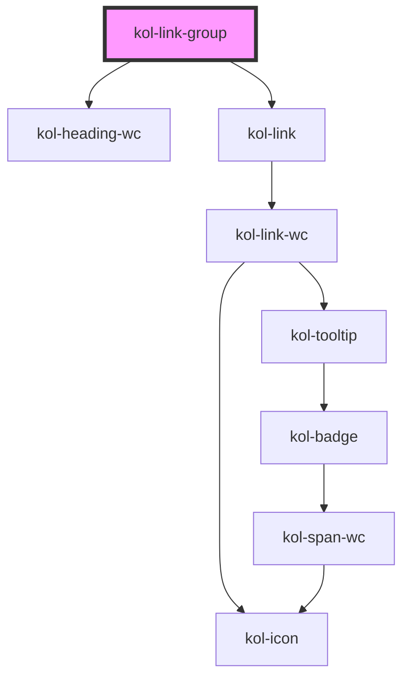

# LinkGroup

Die **LinkGroup**-Komponente bildet einen umfassenden Container für eine listenartige, vertikale oder horizontale Darstellung von Links. Sie rendert eine auf Barrierefreiheit optimierte Liste von Links, die als Text, als Icon oder auch in Kombination ausgegeben werden kann. Möglich ist auch die Ausgabe von versteckten Links.

## Konstruktion

### Code

```tsx
<kol-link-group
	_aria-label="Einfache LinkGroup"
	_caption="Überschrift der LinkGroup"
	_links="[{'_label':'Link 1','_href':'https://www.w3.org'},{'_label':'Link 2','_href':'https://www.w3.org'},{'_label':'Link 3','_href':'https://www.w3.org'}]"
	_list-style-type="disc"
	_orientation="'vertical"
></kol-link-group>
```

### Beispiel

<kol-link-group
\_aria-label="Einfache LinkGroup"
\_caption="Überschrift der LinkGroup"
\_links="[{'_label':'Link 1','_href':'https://www.w3.org'},{'_label':'Link 2','_href':'https://www.w3.org'},{'_label':'Link 3','_href':'https://www.w3.org'}]"
\_list-style-type="disc"
\_orientation="'vertical"

> </kol-link-group>

## Verwendung

### Links

Die auszugebenden Links werden als JSON-Objekt an das Attribut `_links` übergeben.

```tsx
[
	{ _label: 'Link 1', _href: 'https://www.w3.org' },
	{ _label: 'Link 2', _href: 'https://www.w3.org' },
	{ _label: 'Link 3', _href: 'https://www.w3.org' },
];
```

Die Konstruktion der einzelnen **Links**, die innerhalb der JSON-Struktur über das Attribut **\_links** übergeben wird, ist im Abschnitt **Links** beschrieben.

### Überschrift

Die Überschrift der LinkGroup wird über das Attribut `_caption` übergeben.

### Ausrichtung

Über das Attribut `_orientation` kann die Ausrichtung der LinkGroup bestimmt werden. Standardwert ist `_orientation="vertical"`. Für eine horizontale Anzeige den Wert `horizontal` verwenden.

### List-Style-Type

Über das Attribut `_list-style-type` kann bestimmt werden, mit welchem Symbol die einzelnen Zeilen der Group dargestellt werden sollen. Es stehen vier Möglichkeiten zur Auswahl.

- `disc`
- `circle`
- `square`
- `none`

<!--### Best practices-->

### Anwendungsfälle

#### LinkGroup innerhalb eines Fließtextes

<p>
  Lorem, ipsum dolor sit amet consectetur adipisicing elit. Ea optio deleniti fuga quos molestias, voluptate nobis
  nemo, incidunt excepturi facilis, amet ducimus minus quae corporis eligendi cum distinctio. Fugit, repellendus.

<kol-link-group
\_aria-label="LinkGroup innerhalb eines Fließtextes"
\_links="[{'_label':'Link 1'},{'_label':'Link 2'},{'_label':'Link 3'}]"

> </kol-link-group>

Lorem, ipsum dolor sit amet consectetur adipisicing elit. Ea optio deleniti fuga quos molestias, voluptate nobis
nemo, incidunt excepturi facilis, amet ducimus minus quae corporis eligendi cum distinctio. Fugit, repellendus.

</p>

## Barrierefreiheit

### Tastatursteuerung

| Taste   | Funktion                                    |
| ------- | ------------------------------------------- |
| `Tab`   | Fokussiert das erste Element der LinkGroup. |
| `Enter` | Ruft den hinterlegten Link auf.             |

<!--## Links und Referenzen

<!-- Auto Generated Below -->

## Properties

| Property                  | Attribute          | Description                                                                                                                                                                                            | Type                                                                                                                                                                                                                  | Default      |
| ------------------------- | ------------------ | ------------------------------------------------------------------------------------------------------------------------------------------------------------------------------------------------------ | --------------------------------------------------------------------------------------------------------------------------------------------------------------------------------------------------------------------- | ------------ |
| `_ariaLabel` _(required)_ | `_aria-label`      | Gibt den Text an, der die Navigation von anderen Navigationen differenziert.                                                                                                                           | `string`                                                                                                                                                                                                              | `undefined`  |
| `_heading`                | `_heading`         | Gibt die optionale Überschrift zur Link-Gruppe an.                                                                                                                                                     | `string \| undefined`                                                                                                                                                                                                 | `undefined`  |
| `_level`                  | `_level`           | Gibt die geordnete Liste der Seitenhierarchie in Links an.                                                                                                                                             | `1 \| 2 \| 3 \| 4 \| 5 \| 6 \| undefined`                                                                                                                                                                             | `undefined`  |
| `_links` _(required)_     | `_links`           | Gibt die geordnete Liste der Seitenhierarchie in Links an.                                                                                                                                             | `NavLinkProps[] \| string`                                                                                                                                                                                            | `undefined`  |
| `_listStyleType`          | `_list-style-type` | Gibt den List-Style-Typen für ungeordnete Listen aus. Wird bei horizontalen LinkGroups als Trenner verwendet                                                                                           | `"circle" \| "decimal" \| "decimal-leading-zero" \| "disc" \| "lower-alpha" \| "lower-greek" \| "lower-latin" \| "lower-roman" \| "none" \| "square" \| "upper-alpha" \| "upper-latin" \| "upper-roman" \| undefined` | `undefined`  |
| `_ordered`                | `_ordered`         | <span style="color:red">**[DEPRECATED]**</span> Wird mittels der Property \_list-style-type automatisch gesteuert. Gibt an, ob eine Ordered- oder eine Unordered-List verwendet werden soll.<br/><br/> | `boolean \| undefined`                                                                                                                                                                                                | `undefined`  |
| `_orientation`            | `_orientation`     | Gibt die Ausrichtung der LinkList an.                                                                                                                                                                  | `"horizontal" \| "vertical" \| undefined`                                                                                                                                                                             | `'vertical'` |

## Dependencies

### Depends on

- [kol-heading-wc](../heading)
- [kol-link](../link)

### Graph



---
