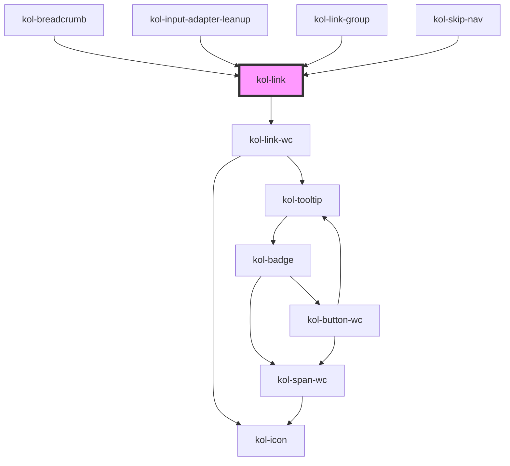

# Link

Die **Link**-Komponente rendert einen auf Barrierefreiheit optimierten Link, der als Text, als Icon oder auch in Kombination ausgegeben werden kann.
Möglich ist auch die Ausgabe eines versteckten Links.

Der Link wird standardmäßig in klassischer Form mit Unterstrich ausgegeben, der jedoch über ein Attribut auch ohne CSS entfernt werden kann. Weitere Informationen zu Custom Styles finden Sie weiter unten.

Beachten Sie, dass die Komponente automatisch ein Padding links und rechts zum umgebenden Text erzeugt. Sie kann daher im Fließtext ohne
Eingabe von Leerzeichen eingefügt werden. Zusätzliche Leerzeichen vergrößern den Abstand zum umgebenden Text.

## Konstruktion

### Code

```tsx
<kol-link _href="https://www.w3.org" _target="_self" _underline="false">
	Hier steht ein Link
</kol-link>
```

### Beispiel

<p>
   In diesem Absatz wird ein Link gesetzt, der keine weiteren Attribute enthält.
  <kol-link _href="https://www.w3.org">Hier steht ein Link</kol-link> Er wird standardmäßig als <i>
    <b>inline-Element</b>
    </i> ausgegeben.
</p>

## Verwendung

### Link innerhalb eines Fließtextes, mit unterschiedlichen **\_display**-Werten

 <p>
    In diesem Absatz wird ein Link gesetzt, der einmal als inline-block-Element ausgegeben wird.
    <kol-link _display="inline-block">
      Ich bin ein Link als <b>inline-block-Element</b>
    </kol-link>, damit kann man mir per CSS-Styles eine Breite, eine Höhe und andere Eigenschaften zuweisen.
    Danach folgt ein Link, der als block-Element ausgegeben wird.
  <kol-link _display="block">
      Ich bin ein Link als <b>block-Element</b>
    </kol-link>,
    daher gehe ich über die ganze Breite des Eltern-Elements erzeuge so einen Zeilenumbruch.
</p>

### Link innerhalb eines Fließtextes mit Icon und Text

  <p>
    <kol-link _icon="home">Ich bin ein Link mit Icon links</kol-link><br/>
    <kol-link _icon="home" _icon-align="right">
      Ich bin ein Link mit Icon rechts
    </kol-link>
    Lorem, ipsum dolor sit amet consectetur adipisicing elit. Ea optio deleniti fuga quos molestias, voluptate nobis
    nemo, incidunt excepturi facilis, amet ducimus minus quae corporis eligendi cum distinctio. Fugit, repellendus.
    <kol-link _icon="home">Ich bin ein Link mit Icon links</kol-link>. Lorem, ipsum dolor sit amet consectetur adipisicing
    elit. Ea optio deleniti fuga quos molestias, voluptate nobis nemo, incidunt excepturi <kol-link
      _icon="home"
      _icon-align="right"
    >
      Ich bin ein Link mit Icon rechts
    </kol-link>
    facilis, amet ducimus minus quae corporis eligendi cum distinctio. Fugit, repellendus.

  </p>

### Link mit und ohne Unterstrich

  <p>
    <kol-link _icon="home">Ich bin ein Link in Standardausgabe mit Unterstrich</kol-link><br/>
    <kol-link _icon="home" _underline="false">
      Ich bin ein Link in Standardausgabe ohne Unterstrich
    </kol-link>

  </p>

<!--### Best practices

### Anwendungsfälle-->

## Barrierefreiheit

### Tastatursteuerung

| Taste   | Funktion                        |
| ------- | ------------------------------- |
| `Tab`   | Fokussiert das Link-Element.    |
| `Enter` | Ruft den hinterlegten Link auf. |

<!--## Links und Referenzen

<!-- Auto Generated Below -->

## Properties

| Property             | Attribute             | Description                                                                                                                                                                           | Type                                                                                                                                                                                                                                                                                                                                                                                                                                                                                                                                                                                                                                                                                                                                                                                                              | Default                                        |
| -------------------- | --------------------- | ------------------------------------------------------------------------------------------------------------------------------------------------------------------------------------- | ----------------------------------------------------------------------------------------------------------------------------------------------------------------------------------------------------------------------------------------------------------------------------------------------------------------------------------------------------------------------------------------------------------------------------------------------------------------------------------------------------------------------------------------------------------------------------------------------------------------------------------------------------------------------------------------------------------------------------------------------------------------------------------------------------------------- | ---------------------------------------------- |
| `_ariaControls`      | `_aria-controls`      | Gibt an, welche Elemente kontrolliert werden. (https://developer.mozilla.org/en-US/docs/Web/Accessibility/ARIA/Attributes/aria-controls)                                              | `string \| undefined`                                                                                                                                                                                                                                                                                                                                                                                                                                                                                                                                                                                                                                                                                                                                                                                             | `undefined`                                    |
| `_ariaCurrent`       | `_aria-current`       | Gibt an, welchen aktuellen Auswahlstatus der Link hat. (https://developer.mozilla.org/en-US/docs/Web/Accessibility/ARIA/Attributes/aria-current)                                      | `"date" \| "location" \| "page" \| "step" \| "time" \| boolean \| undefined`                                                                                                                                                                                                                                                                                                                                                                                                                                                                                                                                                                                                                                                                                                                                      | `undefined`                                    |
| `_ariaExpanded`      | `_aria-expanded`      | Gibt an, ob durch den Link etwas aufgeklappt wurde. (https://developer.mozilla.org/en-US/docs/Web/Accessibility/ARIA/Attributes/aria-expanded)                                        | `boolean \| undefined`                                                                                                                                                                                                                                                                                                                                                                                                                                                                                                                                                                                                                                                                                                                                                                                            | `undefined`                                    |
| `_ariaLabel`         | `_aria-label`         | Gibt einen beschreibenden Text des Links an. (https://developer.mozilla.org/en-US/docs/Web/Accessibility/ARIA/Attributes/aria-label)                                                  | `string \| undefined`                                                                                                                                                                                                                                                                                                                                                                                                                                                                                                                                                                                                                                                                                                                                                                                             | `''`                                           |
| `_ariaSelected`      | `_aria-selected`      | Gibt an, ob der Link gerade ausgewählt ist. (https://developer.mozilla.org/en-US/docs/Web/Accessibility/ARIA/Attributes/aria-selected)                                                | `boolean \| undefined`                                                                                                                                                                                                                                                                                                                                                                                                                                                                                                                                                                                                                                                                                                                                                                                            | `undefined`                                    |
| `_disabled`          | `_disabled`           | Gibt an, ob der Link deaktiviert ist.                                                                                                                                                 | `boolean \| undefined`                                                                                                                                                                                                                                                                                                                                                                                                                                                                                                                                                                                                                                                                                                                                                                                            | `false`                                        |
| `_fill`              | `_fill`               | Gibt an, ob der Link die gesamte zur Verfügung stehende Breite ausfüllt.                                                                                                              | `boolean \| undefined`                                                                                                                                                                                                                                                                                                                                                                                                                                                                                                                                                                                                                                                                                                                                                                                            | `false`                                        |
| `_href`              | `_href`               | Gibt die Ziel-Url des Links an.                                                                                                                                                       | `string \| undefined`                                                                                                                                                                                                                                                                                                                                                                                                                                                                                                                                                                                                                                                                                                                                                                                             | `''`                                           |
| `_icon`              | `_icon`               | Gibt den Class-Identifier eines Icons eine eingebunden Icofont an. (z.B. https://icofont.com/)                                                                                        | `string \| undefined \| { top: string \| KoliBriCustomIcon; right?: string \| KoliBriCustomIcon \| undefined; bottom?: string \| KoliBriCustomIcon \| undefined; left?: string \| KoliBriCustomIcon \| undefined; } \| { top?: string \| KoliBriCustomIcon \| undefined; right: string \| KoliBriCustomIcon; bottom?: string \| KoliBriCustomIcon \| undefined; left?: string \| KoliBriCustomIcon \| undefined; } \| { top?: string \| KoliBriCustomIcon \| undefined; right?: string \| KoliBriCustomIcon \| undefined; bottom: string \| KoliBriCustomIcon; left?: string \| KoliBriCustomIcon \| undefined; } \| { top?: string \| KoliBriCustomIcon \| undefined; right?: string \| KoliBriCustomIcon \| undefined; bottom?: string \| KoliBriCustomIcon \| undefined; left: string \| KoliBriCustomIcon; }` | `undefined`                                    |
| `_iconAlign`         | `_icon-align`         | <span style="color:red">**[DEPRECATED]**</span> Wird durch das neue flexibleren Icon-Typ abgedeckt.<br/><br/>Gibt an, ob das Icon entweder links oder rechts dargestellt werden soll. | `"left" \| "right" \| undefined`                                                                                                                                                                                                                                                                                                                                                                                                                                                                                                                                                                                                                                                                                                                                                                                  | `'left'`                                       |
| `_iconOnly`          | `_icon-only`          | Gibt an, ob nur das Icon angezeigt wird.                                                                                                                                              | `boolean \| undefined`                                                                                                                                                                                                                                                                                                                                                                                                                                                                                                                                                                                                                                                                                                                                                                                            | `false`                                        |
| `_on`                | --                    | <span style="color:red">**[DEPRECATED]**</span> Hierzu sollte statt Link- die ButtonLink-Komponente verwendet werden.<br/><br/>Gibt die EventCallback-Funktionen für den Link an.     | `undefined \| { onClick?: EventCallback<Event> \| undefined; }`                                                                                                                                                                                                                                                                                                                                                                                                                                                                                                                                                                                                                                                                                                                                                   | `undefined`                                    |
| `_part`              | `_part`               | Gibt den Identifier für den CSS-Part an, um das Icon von Außen ändern zu können. (https://meowni.ca/posts/part-theme-explainer/)                                                      | `string \| undefined`                                                                                                                                                                                                                                                                                                                                                                                                                                                                                                                                                                                                                                                                                                                                                                                             | `undefined`                                    |
| `_role`              | `_role`               | Gibt an, welche Role der Schalter hat.                                                                                                                                                | `"tab" \| undefined`                                                                                                                                                                                                                                                                                                                                                                                                                                                                                                                                                                                                                                                                                                                                                                                              | `undefined`                                    |
| `_selector`          | `_selector`           | Gibt die ID eines DOM-Elements, zu dem gesprungen werden soll, aus.                                                                                                                   | `string \| undefined`                                                                                                                                                                                                                                                                                                                                                                                                                                                                                                                                                                                                                                                                                                                                                                                             | `undefined`                                    |
| `_stealth`           | `_stealth`            | Gibt an, ob der Link nur beim Fokus sichtbar ist.                                                                                                                                     | `boolean \| undefined`                                                                                                                                                                                                                                                                                                                                                                                                                                                                                                                                                                                                                                                                                                                                                                                            | `false`                                        |
| `_tabIndex`          | `_tab-index`          | Gibt an, welchen Tab-Index der Button hat. (https://developer.mozilla.org/en-US/docs/Web/HTML/Global_attributes/tabindex)                                                             | `number \| undefined`                                                                                                                                                                                                                                                                                                                                                                                                                                                                                                                                                                                                                                                                                                                                                                                             | `undefined`                                    |
| `_target`            | `_target`             | Definiert das Verhalten, bei dem der Link geöffnet werden soll.                                                                                                                       | `string \| undefined`                                                                                                                                                                                                                                                                                                                                                                                                                                                                                                                                                                                                                                                                                                                                                                                             | `undefined`                                    |
| `_targetDescription` | `_target-description` | Gibt die Beschreibung an, wenn der Link in einem anderen Programm geöffnet wird.                                                                                                      | `string \| undefined`                                                                                                                                                                                                                                                                                                                                                                                                                                                                                                                                                                                                                                                                                                                                                                                             | `'Der Link wird in einem neuen Tab geöffnet.'` |
| `_tooltipAlign`      | `_tooltip-align`      | Gibt an, ob der Tooltip entweder oben, rechts, unten oder links angezeigt werden soll.                                                                                                | `"bottom" \| "left" \| "right" \| "top" \| undefined`                                                                                                                                                                                                                                                                                                                                                                                                                                                                                                                                                                                                                                                                                                                                                             | `'right'`                                      |
| `_underline`         | `_underline`          | Gibt an, ob die Links unterstrichen dargestellt werden.                                                                                                                               | `boolean \| undefined`                                                                                                                                                                                                                                                                                                                                                                                                                                                                                                                                                                                                                                                                                                                                                                                            | `true`                                         |
| `_useCase`           | `_use-case`           | Gibt den Verwendungsfall des Links an.                                                                                                                                                | `"image" \| "nav" \| "text" \| undefined`                                                                                                                                                                                                                                                                                                                                                                                                                                                                                                                                                                                                                                                                                                                                                                         | `'text'`                                       |

## Shadow Parts

| Part       | Description                               |
| ---------- | ----------------------------------------- |
| `"hidden"` | Ermöglicht das Ausblenden des Linktextes. |
| `"link"`   | Ermöglicht das Stylen des Links.          |
| `"span"`   | Ermöglicht das Stylen des Linktextes.     |

## Dependencies

### Used by

- [kol-breadcrumb](../breadcrumb)
- [kol-input-adapter-leanup](../input-adapter-leanup)
- [kol-link-group](../link-group)
- [kol-skip-nav](../skip-nav)

### Depends on

- kol-link-wc

### Graph



---
