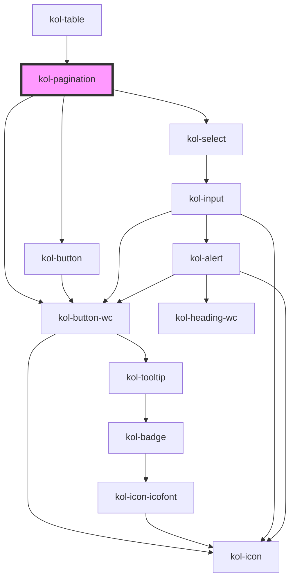

# Pagination

Mit Hilfe der <b>Paginierung-Komponente</b> lassen sich umfangreiche Inhalte auf der Seite
in handliche Abschnitte unterteilen. Diese können dann über die Paginierung der Reihe nach
durchlaufen werden.

## Konstruktion

### Code

```tsx
<div>
	<kol-pagination _total="100" _page="6"></kol-pagination>
	<kol-pagination _total="100" _page="6" _sibling-count="2"></kol-pagination>
	<kol-pagination _total="100" _page="6" _sibling-count="0" _boundary-count="2"></kol-pagination>
</div>
```

### Beispiel

<div style="display: grid;gap: 0.25em;">
  <kol-heading _level="3">Standardausgabe nur mit aktuellem Element</kol-heading>
  <kol-pagination _total="100" _page="6"></kol-pagination>
  <kol-heading _level="3">Ausgabe 2 Elemente links und rechts dem aktuellen Element (_sibling)</kol-heading>
  <kol-pagination _total="100" _page="6" _sibling-count="2"></kol-pagination>
  <kol-heading _level="3">Ausgabe 2 Elemente links und rechts (_boundary-count)</kol-heading>
  <kol-pagination _total="100" _page="6" _sibling-count="0" _boundary-count="2"></kol-pagination>
</div>

## Verwendung

Die Pagination-Komponente kann über Ihre Properties konfiguriert werden.

- Die Property `_total` bestimmt die Anzahl der Elemente.
  Ohne weitere Properties werden immer das erste und die letzte Element angezeigt, die dazwischen liegenden durch Punkte symbolisiert.<br/>
- Über die Property `boundary-count` wird die Anzahl von Elementen bestimmt, die in der Pagination-Komponente rechts und links angezeigt werden, während die übrigen Elemente durch Punkte symbolisiert werden. Die Einstellung `boundary-count` = 2 und `_count` = 10 hätte zur Folge, das links die Elemente 1 und 2 und rechts die Elemente 9 und 10 angezeigt werden, während die Elemente 3 bis 8 durch Punkte symbolisiert werden.<br/>
- Die Property `_page` legt das gerade aktive Element fest. Dieses wird farblich hervorgehoben dargestellt.
- Über die Property `_sibling-count` kann festgelegt werden, wie viele Elemente links und rechts des aktuellen Elements angezeigt werden sollen. Der Wert 2 hätte also zur Folge, daß zwei Elemente links und rechts des
  aktuellen Elements angezeigt werden.

<!-- ### Best practices -->

### Anwendungsfälle

Die **Pagination**-Komponente kann auf vielfältige Art eingesetzt werden. Insbesondere dort, wo
auf einer Inhaltsseite umfangreiche Inhalte dargestellt werden sollen, kann sie zur Verbesserung der Struktur und Übersichtlichkeit eingesetzt werden.<br/>
Klassische Anwendungsbereiche einer Paginierung sind z.B. Blog-ähnliche Inhalte oder auch listenartige Layouts, wie z.B. Tabellen. Auch für bestimmte Navigationsaufgaben innerhalb einer Seite kann die Paginierung gut verwendet werden.

## Barrierefreiheit

<!-- ## Links und Referenzen -->

<!-- Auto Generated Below -->

## Properties

| Property              | Attribute            | Description                                                                                    | Type                                                                                                                                                                                              | Default     |
| --------------------- | -------------------- | ---------------------------------------------------------------------------------------------- | ------------------------------------------------------------------------------------------------------------------------------------------------------------------------------------------------- | ----------- |
| `_boundaryCount`      | `_boundary-count`    | Gibt an, wie viele Seiten neben den am Rand liegenden Pfeil-Schaltern angezeigt werden sollen. | `number \| undefined`                                                                                                                                                                             | `1`         |
| `_customClass`        | `_custom-class`      | Gibt an, welche Custom-Class übergeben werden soll, wenn \_variant="custom" gesetzt ist.       | `string \| undefined`                                                                                                                                                                             | `undefined` |
| `_hasButtons`         | `_has-buttons`       | Gibt an, welche Sprung-Schalter sichtbar sein sollen.                                          | `boolean \| string \| undefined \| { first: boolean; last: boolean; next: boolean; previous: boolean; }`                                                                                          | `undefined` |
| `_on` _(required)_    | --                   | Gibt an, auf welche Callback-Events reagiert werden.                                           | `{ onChangePage?: EventValueCallback<Event, number> \| undefined; onChangePageSize?: EventValueCallback<Event, number> \| undefined; onClick?: EventValueCallback<Event, number> \| undefined; }` | `undefined` |
| `_page` _(required)_  | `_page`              | Gibt an, welche Seite aktuell ausgewählt ist.                                                  | `number`                                                                                                                                                                                          | `undefined` |
| `_pageSize`           | `_page-size`         | Gibt an, wie viele Einträge pro Seite angezeigt werden.                                        | `number`                                                                                                                                                                                          | `1`         |
| `_pageSizeOptions`    | `_page-size-options` | Gibt an, welche Optionen für die Seitenlänge angeboten werden.                                 | `number[] \| string`                                                                                                                                                                              | `[]`        |
| `_siblingCount`       | `_sibling-count`     | Gibt an, wie viele Seiten neben dem aktuell ausgewählten Seite angezeigt werden.               | `number \| undefined`                                                                                                                                                                             | `1`         |
| `_tooltipAlign`       | `_tooltip-align`     | Gibt an, ob der Tooltip oben, rechts, unten oder links angezeigt werden.                       | `"bottom" \| "left" \| "right" \| "top" \| undefined`                                                                                                                                             | `'top'`     |
| `_total` _(required)_ | `_total`             | Gibt an, wie viele Einträge mit der Pagination gehandelt werden.                               | `number`                                                                                                                                                                                          | `undefined` |
| `_variant`            | `_variant`           | Gibt an, welche Button-Variante verwendet werden soll.                                         | `"danger" \| "ghost" \| "normal" \| "primary" \| "secondary" \| undefined`                                                                                                                        | `'normal'`  |

## Dependencies

### Used by

- [kol-table](../table)

### Depends on

- [kol-button](../button)
- [kol-select](../select)
- kol-button-wc

### Graph



---
