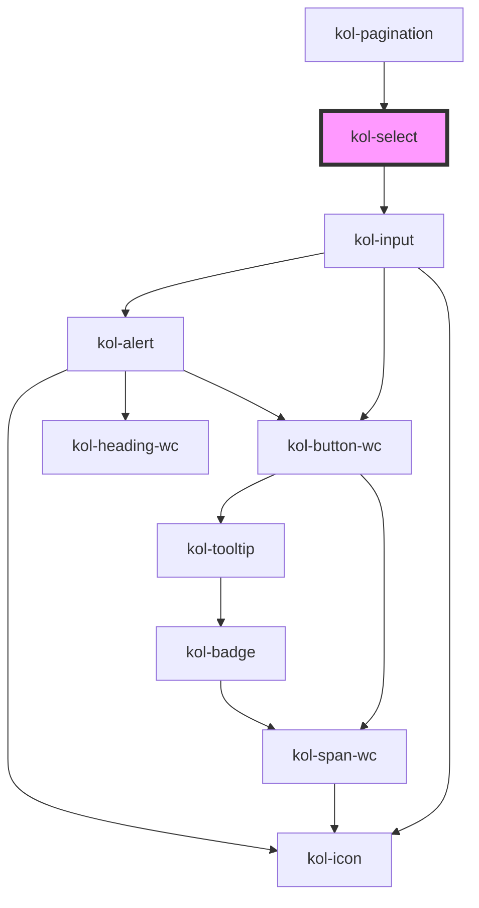

# Select

Die **Select**-Komponente erzeugt eine Auswahlliste, aus der eine oder mehrere vorgegebene Möglichkeiten ausgewählt werden können.

## Konstruktion

### Code

```tsx
<kol-select
  _list="[{'label':'Herr','value':'0'},{'label':'Frau','value':'1'},{'label':'Firma','value':'2'}]"
  _value="['1']"
>
  Auswahlfeld
</kol-select>
<kol-select
  _list="[{'label':'Herr','value':'0'},{'label':'Frau','value':'1'},{'label':'Firma','value':'2'}]"
  _multiple
  _value="['0','2']"
>
  Auswahlfeld (Mehrfachauswahl)
</kol-select>
```

### Beispiel

<kol-select _list="[{'label':'Herr','value':'0'},{'label':'Frau','value':'1'},{'label':'Firma','value':'2'}]" _value="['1']">Auswahlfeld</kol-select>

<kol-select _list="[{'label':'Herr','value':'0'},{'label':'Frau','value':'1'},{'label':'Firma','value':'2'}]" _multiple _value="['0','2']">Auswahlfeld (Mehrfachauswahl)</kol-select>

## Verwendung

Die Auswahlmöglichkeiten, **_Option-List_**, werden über das Attribut **_\_list_** als JSON-Objekt an die Komponente übergeben. Je Option müssen die Werte **`label`** und **`value`** angegeben werden.

Beispiel für die Konstruktion des JSON-Objektes:

```tsx
[
	{
		label: 'Herr',
		value: '0',
	},
	{
		label: 'Frau',
		value: '1',
	},
	{
		label: 'Firma',
		value: '2',
	},
];
```

### Individuelle Höhe angeben

Mit der Property **`_height`** kann eine individuelle Höhe der Selectbox mittels CSS bestimmt werden. Die property erwartet einen String als Übergabewert, der innerhalb des style-Attributes ausgegeben wird. Es ist daher erforderlich, auch die gewünschte Ausgabeeinheit, z.B. px oder em, mit zu übergeben.

```tsx
<kol-select _height="85px"></kol-select>
```

<!--### Best practices-->

## Barrierefreiheit

### Tastatursteuerung

| Taste               | Funktion                              |
| ------------------- | ------------------------------------- | ----------------------------------------------------------------------------------------------------------------------------------------------------------------------------------------------------------------------------- |
| `Tab`               | Fokussiert das Auswahlfeld.           |
| `Enter`             | Öffnet bzw.schließt die Auswahlliste. |
| `Pfeil-Tasten (oben | unten)`                               | Wechselt in der Auswahlliste das aktivierte Element. Diese Funktion ist auch bei eingeklappter Auswahlliste aktiv. Bei Mehrfachauswahl muss zur Auswahl mehrerer Einträge zusätzlich die Shift-Taste gedrück gehalten werden. |

### `Single-Select-Filter` für Select-Komponente

Die Select-Komponente liefert bei Auswahl eines Wertes eine Liste (Array) mit genau einem
Wert zurück (im Single-Modus). Das kann bei der weiteren Verarbeitung zu unnötigem Aufwand führen. Einfacher ist es hier, den Wert der Select-Komponente über einen <b>SingeSelectFormatter</b> zu Filtern. Fügen Sie hierzu im Formular nachfolgende Klasse ein:

```tsx
class SingleSelectFormatter extends AbstractFormatter {
	public format(value: unknown): unknown {
		return [value];
	}

	public parse(value: unknown): unknown {
		if (Array.isArray(value) && value.length > 0) {
			return value[0];
		}
		return value;
	}
}
```

Fügen Sie den Formatter anschließend der Select-Komponente hinzu:

```tsx
const singleSelectFormatHandler = new FormatHandler();
singleSelectFormatHandler.formatters.add([new SingleSelectFormatter()]);
(this.getInput('kategorie') as InputControl).setFormatHandler(singleSelectFormatHandler);
```

Beachten Sie, dass der FormatHandler zunächst in die Form importiert wird.

```tsx
import {
  xxx...,
  xxx...,
  FormatHandler,
} from '@leanup/form';
```

## Links und Referenzen

- https://medium.com/@gavyn/til-autofocus-inputs-are-an-accessibility-problem-32ced60c3109

<!-- Auto Generated Below -->

## Properties

| Property             | Attribute     | Description                                                                          | Type                                                                                                                                                                                                          | Default     |
| -------------------- | ------------- | ------------------------------------------------------------------------------------ | ------------------------------------------------------------------------------------------------------------------------------------------------------------------------------------------------------------- | ----------- |
| `_accessKey`         | `_access-key` | Gibt an, mit welcher Tastenkombination man das Input auslösen oder fokussieren kann. | `string \| undefined`                                                                                                                                                                                         | `undefined` |
| `_alert`             | `_alert`      | Gibt an, ob die Fehlermeldung vorgelesen werden soll, wenn es eine gibt.             | `boolean \| undefined`                                                                                                                                                                                        | `false`     |
| `_disabled`          | `_disabled`   | Gibt an, ob das Eingabefeld aktiviert oder deaktiviert ist.                          | `boolean \| undefined`                                                                                                                                                                                        | `undefined` |
| `_error`             | `_error`      | Gibt den Text für eine Fehlermeldung an.                                             | `string \| undefined`                                                                                                                                                                                         | `undefined` |
| `_height`            | `_height`     | Gibt an, ob eine individuelle Höhe übergeben werden soll.                            | `string \| undefined`                                                                                                                                                                                         | `undefined` |
| `_hideLabel`         | `_hide-label` | Gibt an, ob das Eingabefeld kein sichtbares Label haben soll.                        | `boolean \| undefined`                                                                                                                                                                                        | `undefined` |
| `_hint`              | `_hint`       | Gibt den Text für eine Hinweistext an.                                               | `string \| undefined`                                                                                                                                                                                         | `''`        |
| `_icon`              | `_icon`       | Ermöglicht das Anzeigen von Icons links und/oder rechts am Rand des Eingabefeldes.   | `string \| undefined \| { right: string \| KoliBriCustomIcon; left?: string \| KoliBriCustomIcon \| undefined; } \| { right?: string \| KoliBriCustomIcon \| undefined; left: string \| KoliBriCustomIcon; }` | `undefined` |
| `_id` _(required)_   | `_id`         | Gibt die technische ID des Eingabefeldes an.                                         | `string`                                                                                                                                                                                                      | `undefined` |
| `_list` _(required)_ | `_list`       | Gibt den technischen Namen des Eingabefeldes an.                                     | `SelectOption<unknown>[] \| string`                                                                                                                                                                           | `undefined` |
| `_multiple`          | `_multiple`   | Gibt an, ob mehrere Werte eingegeben werden können.                                  | `boolean \| undefined`                                                                                                                                                                                        | `undefined` |
| `_name`              | `_name`       | Gibt den technischen Namen des Eingabefeldes an.                                     | `string \| undefined`                                                                                                                                                                                         | `undefined` |
| `_on`                | --            | Gibt die EventCallback-Funktionen für das Input-Event an.                            | `InputTypeOnBlur & InputTypeOnClick & InputTypeOnChange & InputTypeOnFocus \| undefined`                                                                                                                      | `undefined` |
| `_required`          | `_required`   | Gibt an, ob die Selectbox ein Pflichtfeld ist.                                       | `boolean \| undefined`                                                                                                                                                                                        | `undefined` |
| `_size`              | `_size`       | Gibt an, wie viele Optionen im Drop-Down-Menü sichtbar sein sollen.                  | `number \| undefined`                                                                                                                                                                                         | `undefined` |
| `_tabIndex`          | `_tab-index`  | Gibt an, welchen Tab-Index dieses Input hat.                                         | `number \| undefined`                                                                                                                                                                                         | `undefined` |
| `_touched`           | `_touched`    | Gibt an, ob dieses Eingabefeld von Nutzer:innen einmal besucht/berührt wurde.        | `boolean \| undefined`                                                                                                                                                                                        | `false`     |
| `_value`             | `_value`      | Gibt den Wert des Eingabefeldes an.                                                  | `string \| undefined \| unknown[]`                                                                                                                                                                            | `undefined` |

## Shadow Parts

| Part       | Description                               |
| ---------- | ----------------------------------------- |
| `"select"` | Ermöglicht das Stylen des select-Knotens. |

## Dependencies

### Used by

- [kol-pagination](../pagination)

### Depends on

- kol-input

### Graph



---
