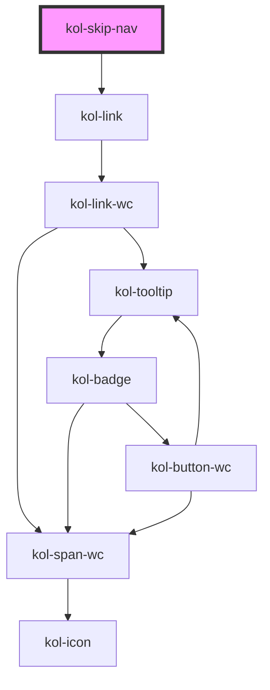

# SkipNav

Mit Hilfe der **SkipNav**-Komponente kann eine versteckte Navigation erzeugt werden. Sie dient dazu, Sehbehinderten das Überspringen von Seitenbereichen zu ermöglichen. Sie wird nur nach Anspringen durch die **Tab-Taste** sichtbar.

## Konstruktion

### Code

```tsx
<kol-skip-nav
	_aria-label="Ein versteckter Link"
	_links="[{'_label':'Navigation','_href':'#nav'},{'_label':'Inhalt','_href':'#main'},{'_label':'Kontakt','_href':'#kontakt'},{'_label':'Links','_href':'#links'}]"
></kol-skip-nav>
```

### Beispiel

Um die **SkipNav** sehen zu können, klicken Sie auf den Text **_Beispiel_** und gehen dann mit der Tab-Taste einen Schritt weiter.

<kol-skip-nav _aria-label="Ein versteckter Link" _links="[{'_label':'Navigation','_href':'#nav'},{'_label':'Inhalt','_href':'#main'},{'_label':'Kontakt','_href':'#kontakt'},{'_label':'Links','_href':'#links'}]"></kol-skip-nav>

## Verwendung

Die **SkipNav** wird durch Übergabe eines JSON-Objekts erzeugt, das für das Rendern der versteckten Links zuständig ist.

```tsx
[
	{
		_label: 'Navigation',
		_href: '#nav',
	},
	{
		_label: 'Inhalt',
		_href: '#main',
	},
];
```

<!--### Best practices

### Anwendungsfälle-->

## Barrierefreiheit

### Tastatursteuerung

| Taste   | Funktion                                                              |
| ------- | --------------------------------------------------------------------- |
| `Tab`   | Fokussiert die SkipNav und ermöglicht das Durchlaufen der Menüpunkte. |
| `Enter` | Ruft den Link des fokussierten Menüpunkts auf.                        |

## Links und Referenzen

- https://webaim.org/techniques/skipnav/

<!-- Auto Generated Below -->

## Properties

| Property                  | Attribute     | Description                                                                  | Type                       | Default     |
| ------------------------- | ------------- | ---------------------------------------------------------------------------- | -------------------------- | ----------- |
| `_ariaLabel` _(required)_ | `_aria-label` | Gibt den Text an, der die Navigation von anderen Navigationen differenziert. | `string`                   | `undefined` |
| `_links` _(required)_     | `_links`      | Ist die Liste der unsichtbaren Links.                                        | `NavLinkProps[] \| string` | `undefined` |

## Shadow Parts

| Part     | Description                      |
| -------- | -------------------------------- |
| `"link"` | Ermöglicht das Stylen der Links. |

## Dependencies

### Depends on

- [kol-link](../link)

### Graph



---
