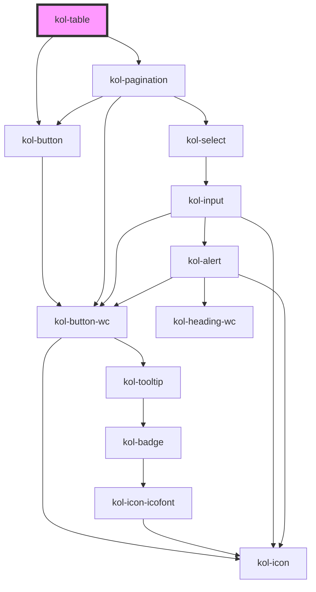

# Table

Die **Table**-Komponente dient primär der übersichtlichen Darstellung von Datenmengen. Dabei ist sie so ausgelegt, dass sie alle von den Daten abhängige Werte automatisch ermittelt und die Tabelle entsprechend darstellt. Hierzu gehören beispielsweise die optionalen Funktionalitäten Spaltensortierung oder Pagination.

<kol-indented-text _summary="Backend-seitige Pagination">
	Bei sehr großen Datenmengen ist auch eine manuelle Nutzung der Table-Komponente möglich. Das bedeutet, dass die Tabelle seitenweise "manuell" befüllt wird. Hierzu kann einfach anstatt der Table-Pagination eine "eigene" Pagination unter der Tabelle mittels der Pagination-Komponente verwendet werden.
</kol-indented-text>

## Konstruktion

Die Table-Komponente ist so konstruiert, dass nicht der gesamte Tabellenaufbau im Markup selbst beschrieben werden muss. Wie genau die Tabelle Markup-spezifisch aufgebaut werden muss, um barrierefrei zu sein, übernimmt die Komponente selbst.

**Beispiel**, wie es nicht gedacht ist:

```html
<kol-table>
	<kol-tr>
		<kol-th>…</kol-th>
		…
	</kol-tr>
	…
</kol-table>
```

**Beispiel**, wie es gedacht ist:

```html
<div>
	<kol-table _caption="…" _headers="…" _data="…" _pagination="…"></kol-table>
</div>
```

Dadurch, dass die Table-Komponente das valide und barrierefreie Markup dynamisch "zusammenbaut", kann die komplexe Auszeichnung für die assistive Systeme dem/der Entwickler:in abgenommen werden.

### Funktionalitäten

Die Table-Komponente unterstützt folgende Funktionalitäten:

- Tabellenbeschreibung durch ein `caption`-Attribut.
- Mehrzeilige Spaltenüberschriften in horizontaler oder vertikaler Richtung.
- Sortierfunktion für entweder horizontale und vertikale Ausrichtung.
- Unterschiedliche Render-Funktion für die Zellen.
- Pagination für die Tabelle.

Die Table-Komponente unterstützt folgende Funktionalitäten **nicht**:

- Das Filtern der Tabelle ist aktuell nicht innerhalb der Tabelle vorgesehen.
- Das Auswählen von Zeilen ist aktuell in der Tabelle nicht vorgesehen.

> Beides könnte jedoch mittels der Render-Funktion umgesetzt werden.

### Typen

### Pagination

Über die Property `_pagination` kann optional eine Vielzahl zusätzlicher Properties zur Steuerung der Pagination übergeben werden. Die genaue Beschreibung der Optionen ist in der Pagination-Spezifikation zu finden.

#### KoliBriTableHeaders

```ts
{
  horizontal: [
    [
      {
        label: string,
        key?: string,
        colsSpan?: number,
        rowSpan?: number,
        useTdInsteadOfTh?: boolean,
        render?: (data) => string,
        sort?: (data) => data,
      },
      …
    ],
    …
  ],
  vertical: [
    [
      {
        label: string,
        key?: string,
        colsSpan?: number,
        rowSpan?: number,
        useTdInsteadOfTh?: boolean,
        render?: (data) => string,
        sort?: (data) => data,
      },
      …
    ],
    …
  ],
};
```

#### KoliBriTablePaginationStates

Die Tabellen-Komponente verwendet intern die Pagination-Komponente die sich mit den gleichen Properties steuern lässt. Die Steuerung wird in der Beschreibung der Pagination-Komponente erläutert.

### Code

```html
<kol-table _caption="Tabellenbeschreibung" _headers="{'horizontal': [[{'label':'Montag','key':'montag'}]]}" _pagination="[{'page':2}]"></kol-table>
```

### Beispiel

<kol-table _caption="Nur Vertikal Header, Daten Vertikal, Pagination" _headers="{'horizontal':[[{'label':'Montag','key':'montag'}]]}" _data="[{'montag':'Zelle1'},{'montag':'Zelle2'}]" _pagination="{'page':2}"></kol-table>

## Verwendung

### Sortierung

- Zu jedem Header kann man eine Sortierfunktion definieren.
- Es ist maximal nur eine Sortierfunktion aktiviert oder keine.
- Bei dem Rendern der Daten in die Tabelle muss jetzt geprüft werden, ob eine Sortierung aktiv ist und vorher die Daten durch die Funktion sortiert werden.
- Aktuell wird nicht unterstützt, dass bei zweidimensionalen Headern, die Header der jeweils anderen Header-Seite mitsortiert werden. Bei der Anforderung der Sortierung empfehlen wir die Verwendung nur einer Header-Dimension (entweder horizontal oder vertikal).

<!--### Best practices

### Anwendungsfälle-->

## Barrierefreiheit

Bei der Table-Komponente werden zahlreiche Attribut-Definitionen dem Tabellen-Markup hinzugefügt, um die Screenreader bestmöglich zu unterstützen.

Aktuell werden folgende Attribute von der Komponente gemanaged: `role`, `scope` und `aria-\*`.

Das heißt beispielsweise, dass bei den Spaltenüberschriften automatisch entweder die Rolle `colheader` oder `rowheader` gesetzt wird. Darüber hinaus wird der Scope entweder auf `col`/`colgroup` oder `row`/`rowgroup` gesetzt. Ähnlich dieser Automatismen werden auch die `aria-\*`-Attribute je nach Relevanz gesetzt.

Warum die Tabelle einen **Tabindex** hat, wird auf der folgenden Webseite beschrieben: https://dequeuniversity.com/rules/axe/3.5/scrollable-region-focusable

### Pagination ohne/mit Label

Bei der Tabelle kann die Pagination optional hinzugefügt werden. Die Steuerelemente der Pagination haben hierbei keine sichtbaren Labels, weil das eine übliche Darstellung ist (State-of-the-art). Für den Screenreader-Nutzenden werden alle Steuerelemente genauso vorgelesen, als würde es ein sichtbares Label geben (KoliBri-Inputs).
Nun bleibt aus Sicht der Barrierefreiheit nur noch zu beurteilen, ob für sehende Nutzende die Steuerung auch barrierefrei ist.

Sichtweisen:

<ol type="a">
  <li>Dem sehenden Nutzenden erschließt sich durch die aussagekräftigen Beschriftungen der Optionen das Verhalten der Steuerelement, auch ohne zusätzliches Label. Die Steuerelemente der Pagination können optisch kompakter dargestellt werden.</li>
  <li>Dem sehenden Nutzenden werden Labels angezeigt, um auf das Verhalten der Steuerelement schließen zu können. Dadurch können die Beschriftungen der Optionen kürzer erfolgen. Die Steuerelemente der Pagination werden tendenziell durch das zusätzliche Label optisch mehr Platz benötigen.<br>
	Wenn die Select-Auswahl ein Label bekommt, dann muss konsequenterweise auch die Seitenauswahl ein Label erhalten.</li>
</ol>

**Betrachtung:** Der informelle Teil (Label) für das Verständnis muss in der Sichtweise **a** durch die Optionsbeschriftung und bei Sichtweise **b** durch das explizite Label abgebildet werden.<br>

> **Aus Sicht der Barrierefreiheit sind beide Sichtweise barrierefrei.** (?!)

**Lösungsentscheidung:** Es wäre möglich, die Pagination mit um einen `_labelled`-Modus zu erweitern, um somit den Projekten beide Sichtweisen anbieten zu können.

### Verwendung von Role

Die Auszeichnung der Rolle (`role`) führt bei manchen Screenreadern zu Problemen. Da der Fokus der Table-Komponente auf der Darstellung von Daten liegt und somit der semantische Aufbau auf der HTML-Table beruht, sollte das Vorlesen auch ohne zusätzliche Rollenauszeichnung gut funktionieren (Retest).

_Lediglich die Rollen `columnheader` und `rowheader` wird beibehalten, da die Tabellenköpfe (`th`) in entweder Spalten- oder Zeilen-orientiert sind._

## Links und Referenzen

- https://www.w3.org/WAI/tutorials/tables/
- https://www.barrierefreies-webdesign.de/knowhow/datentabellen/scope.html
- https://developer.mozilla.org/de/docs/Web/Accessibility/ARIA/ARIA_Live_Regions
- https://tollwerk.de/projekte/tipps-techniken-inklusiv-barrierefrei/aria-live-regionen
- https://www.barrierefreies-webdesign.de/knowhow/live-regions/attribute.html
- https://www.digitala11y.com/aria-sort-properties/
- https://dequeuniversity.com/library/aria/table-sortable
- https://www.maxability.co.in/2016/06/07/aria-sort-property/
- https://developer.mozilla.org/en-US/docs/Web/API/Element/ariaSort
- https://tollwerk.de/projekte/tipps-techniken-inklusiv-barrierefrei/aria-live-regionen
- https://stackoverflow.com/questions/1312236/
- https://dequeuniversity.com/rules/axe/3.5/scrollable-region-focusable

<!-- Auto Generated Below -->

## Properties

| Property                | Attribute     | Description                                                             | Type                                                                                                                                                                                                                                                                                                                                                                                                                                                                                                                                                     | Default     |
| ----------------------- | ------------- | ----------------------------------------------------------------------- | -------------------------------------------------------------------------------------------------------------------------------------------------------------------------------------------------------------------------------------------------------------------------------------------------------------------------------------------------------------------------------------------------------------------------------------------------------------------------------------------------------------------------------------------------------- | ----------- |
| `_caption` _(required)_ | `_caption`    | Gibt den Titel oder eine Legende mit Erklärungen zur Tabelle an.        | `string`                                                                                                                                                                                                                                                                                                                                                                                                                                                                                                                                                 | `undefined` |
| `_data` _(required)_    | `_data`       | Gibt die Daten an, die für die Erstellung der Tabelle verwendet werden. | `KoliBriDataType[] \| string`                                                                                                                                                                                                                                                                                                                                                                                                                                                                                                                            | `undefined` |
| `_headers` _(required)_ | `_headers`    | Gibt die horizontalen und vertikalen Header für die Tabelle an.         | `string \| { horizontal?: KoliBriTableHeaderCell[][] \| undefined; vertical?: KoliBriTableHeaderCell[][] \| undefined; }`                                                                                                                                                                                                                                                                                                                                                                                                                                | `undefined` |
| `_minWidth`             | `_min-width`  | Gibt an, die minimale Breite der Tabelle an.                            | `string \| undefined`                                                                                                                                                                                                                                                                                                                                                                                                                                                                                                                                    | `undefined` |
| `_pagination`           | `_pagination` | Gibt an, ob die Daten geteilt in Seiten angezeigt wird.                 | `boolean \| string \| undefined \| { _page: number; } & { _on?: KoliBriPaginationButtonCallbacks \| undefined; _page?: number \| undefined; _total?: number \| undefined; _customClass?: string \| undefined; _variant?: KoliBriButtonVariant \| undefined; _boundaryCount?: number \| undefined; _hasButtons?: boolean \| Stringified<PaginationHasButton> \| undefined; _pageSize?: number \| undefined; _pageSizeOptions?: Stringified<number[]> \| undefined; _siblingCount?: number \| undefined; _tooltipAlign?: TooltipAlignment \| undefined; }` | `undefined` |

## Dependencies

### Depends on

- [kol-button](../button)
- [kol-pagination](../pagination)

### Graph



---
