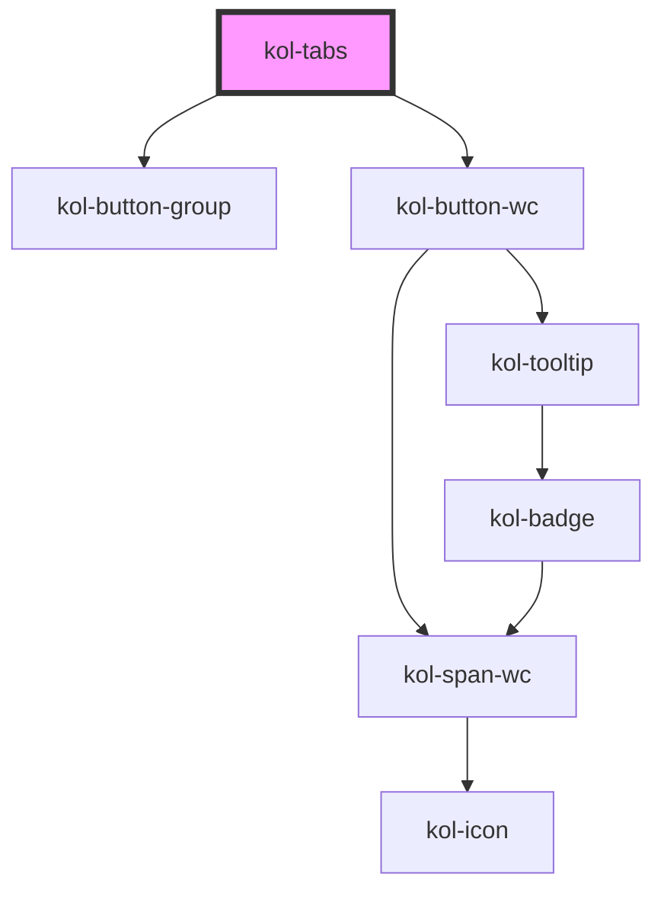

# Tabs

Die **Tabs**-Komponente wird verwendet, um verwandte Inhalte auf derselben Seite zu organisieren und zwischen ihnen zu navigieren. Tabs sorgen dafür, dass große Inhaltsmengen für Nutzer:innen leichter organisiert werden können. Tabs sind in Registerkartenleisten angeordnet, die als Registerkartengruppen bezeichnet werden, wobei die Registerkartenbeschriftung den Nutzer:innen einen Hinweis darauf gibt, welcher Inhalt angezeigt wird, wenn die Registerkarte ausgewählt wird.

## Konstruktion

Nach dem Laden der Komponente wird die erste Registerkarte links automatisch optisch als **_aktiv_** hervorgehoben. Jede Registerkarte übernimmt den Status **_aktiv_** nach dem Anklicken. Der Status **_aktiv_** kann mit dem Attribut `_selected (Index der Registerkarte)` auch manuell gesetzt werden,
um z.B. die dritte anstelle der ersten Registerkarte aktiv zu setzen.
Die einzelnen Inhalte der Registerkarte werden in einem eigenen `HTMLDivElement` als `<div>Inhalt der Registerkarte</div>` innerhalb von `<kol-tabs></kol-tabs>` notiert.

Die Zuordnung der JSON-Objekte im Attribut **\_tabs** zu den Div-Elementen erfolgt automatisch.

Typischer Aufbau einer **Tab**-Komponente:

### Code

```tsx
<kol-tabs _selected="0" _tabs='[{"_label":"Tab 1"},{"_label":"Tab 2", "_on": {"onClose": true}},{"_label":"Tab 3"}]'>
	<div>Inhalt von Tab 1</div>
	<div>Inhalt von Tab 2</div>
	<div>Inhalt von Tab 3</div>
</kol-tabs>
```

### Beispiel

<kol-tabs _selected="0" _tabs='[{"_label":"Tab 1","_icon":"home"},{"_label":"Tab 2", "_on": {"onClose": true}},{"_label":"Tab 3"}]'>
  <div>Inhalt von Tab 1</div>
  <div>Inhalt von Tab 2</div>
  <div>Inhalt von Tab 3</div>
</kol-tabs>

## Verwendung

### Definition der Registerkarten

Die Registerkarten werden als JSON-Struktur an das Attribut `_tabs` übergeben. Die Struktur ist als Wert-/Parameter-Paar aufgebaut:

```tsx
[
	{
		_label: 'Tab 1',
	},
	{
		_label: 'Tab 2',
		_disabled: true,
	},
	{
		_label: 'Tab 3',
		_icon: 'home',
		_on: { onClose: true },
	},
];
```

### Registerkarte auswählen

Standardmäßig wird die erste Registerkarte von links aus als **_ausgewählt_** angezeigt. Verwenden Sie das Attribut `_selected` und als Wert die **interne ID**, um eine andere Registerkarte als ausgewählt zu setzen. Besitzt die **Tabs**-Komponente beispielsweise drei Tabs und soll das zweite Tab ausgewählt werden, setzen Sie **1** als Wert für `_selected` ein, da die ID immer von 0 aus hochgezählt wird.

### Registerkarte deaktivieren

Um eine Registerkarte zu deaktivieren, verwenden Sie das Attribut `_disabled` und den Wert **true**.

### Close-Icon im Registekartenheader

Wenn Sie eine schließbare Registerkarte benötigen, können Sie dies über das Attribut `_on` und den Wert **"onClose":true** realisieren.

### Best practices

- Verwenden Sie Registerkarten, um verwandte Inhalte so zu organisieren und zu gruppieren, dass der Benutzer keine Seite verlassen muss.
- Registerkarten sollten in einer einzelnen, scrollbaren (falls erforderlich) Zeile über dem Inhalt positioniert werden, auf den sie sich beziehen.
- Verwenden Sie die Registerkartenbezeichnung, um den Inhalt dieser Registerkarte klar und prägnant zu beschreiben und zwischen den verschiedenen Abschnitten zu unterscheiden.
- Es sollte immer nur eine Registerkarte aktiv sein.
- Verwenden Sie keine Registerkarten, um eine Sequenz oder einen Verlauf von Inhalten zu erstellen, die der Benutzer in einer bestimmten Reihenfolge lesen soll.
- Verwenden Sie keine Registerkarten zum Vergleichen von Inhalten (z. B. unterschiedliche Spezifikationen).
- Verwenden Sie keine Registerkarten, um Benutzer zu einer anderen Seite zu navigieren.
- Berücksichtigen Sie die Anzahl der Registerkarten, die Sie in die Registerkartengruppe aufnehmen. Wenn Sie das Gefühl haben, dass die Zahl zu groß wird, sollten Sie den Inhalt weiter aufteilen oder ein anderes Navigationsmuster/eine andere Komponente verwenden.

### Anwendungsfälle

- Verwenden Sie Registerkarten, um verwandte Informationen auf einer Landingpage zu organisieren.
- Über Registerkarten können Sie z.B. Dienstleistungen oder Vorteile in verschiedene Kategorien einteilen.
- Verwenden Sie Registerkarten, um Benutzerprofile in verschiedene Abschnitte zu gliedern (z. B. persönliche Informationen, Termine, aktive Services).
- Verwenden Sie Registerkarten, um FAQs in verschiedene Kategorien zu unterteilen.

## Barrierefreiheit

Ausgewählte Tabs werden beim Anspringen mit der **Tab-Taste** mit einem deutlichen Focus-Rahmen umgeben. Die einzelnen Tabs können mit den Pfeiltasten **links** und **rechts** durchlaufen werden.

Nach Anspringen eines Tabs kann mit Hilfe der **Tab-Taste** vom Header in den Inhaltsbereich der Registerkarte gewechselt werden.

Unabhängig davon ob die Tab-Schalter oben, rechts, unten oder links angeordnet sind, bleibt die Tastatursteuerung gleich. Hintergrund ist, dass das Layout bei der Nutzung eines Screenreaders keine Rolle spielt. Eine unterschiedliche Pfeil-Tastensteuerung aufgrund der Layout-Anordnung würde daher nicht dem üblichen Bedienkonzept des W3C entsprechen.

### Tastatursteuerung

Bei der Umsetzung der Tastatursteuerung wurde sich an den Beispielen des W3C's orientiert.

Hier steht immer der beeinträchtige Nutzende im Vordergrund. Um möglichst effizient über die gesamte Seite/Anwendung zu navigieren, ist nur 1 Schalter aus der Tab-Serie fokussierbar. Sobald der Nutzende auf der Tab-Navigation selbst ist, werden die Pfeiltasten verwendet, um zwischen den Tabs selbst wechseln.

W3C-Samples:

- https://www.w3.org/WAI/ARIA/apg/example-index/tabs/tabs-manual.html
- https://developer.mozilla.org/en-US/docs/Web/Accessibility/ARIA/Roles/tab_role
- https://dequeuniversity.com/library/aria/tabpanel
- https://design-system.service.gov.uk/components/tabs/

| Taste                | Funktion                                                                                                |
| -------------------- | ------------------------------------------------------------------------------------------------------- | --------------------------- | --- |
| `Tab`                | Fokussiert den ersten aktiven Tab. Auf vorhandene Close-Icons können mit der Tab-Taste erreicht werden. |
| `Pfeil-Tasten (links | rechts)`                                                                                                | Wechselt zwischen den Tabs. |     |

<!--## Links und Referenzen

<!-- Auto Generated Below -->

## Properties

| Property                  | Attribute     | Description                                                                           | Type                                                                                                                                                                                                                                | Default     |
| ------------------------- | ------------- | ------------------------------------------------------------------------------------- | ----------------------------------------------------------------------------------------------------------------------------------------------------------------------------------------------------------------------------------- | ----------- |
| `_ariaLabel` _(required)_ | `_aria-label` | Gibt den Text an, der die Navigation von anderen Navigationen differenziert.          | `string`                                                                                                                                                                                                                            | `undefined` |
| `_on`                     | --            | Gibt die Liste der Callback-Funktionen an, die auf Events aufgerufen werden sollen.   | `undefined \| { onCreate?: EventCallback<Event> \| { label: string; callback: EventCallback<Event>; } \| undefined; } & { onSelect?: EventValueCallback<KeyboardEvent \| PointerEvent \| CustomEvent<any>, number> \| undefined; }` | `undefined` |
| `_selected`               | `_selected`   | Gibt an, welches Tab selektiert sein soll.                                            | `number \| undefined`                                                                                                                                                                                                               | `0`         |
| `_tabs` _(required)_      | `_tabs`       | Gibt die geordnete Liste der Seitenhierarchie in Links an.                            | `TabButtonProps[] \| string`                                                                                                                                                                                                        | `undefined` |
| `_tabsAlign`              | `_tabs-align` | Gibt an, ob die Tab-Schalter entweder oben, rechts, unten oder links angeordnet sind. | `"bottom" \| "left" \| "right" \| "top" \| undefined`                                                                                                                                                                               | `'top'`     |

## Dependencies

### Depends on

- [kol-button-group](../button-group)
- kol-button-wc

### Graph



---
