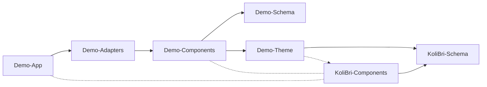

# Own library project

This is a library project to build your own component library for your company based on **_KoliBri_**.

## Owerview

The **_Demo_** application depends on the **_Demo_** components. The **_Demo_** components depend on the **_Demo_** theme that stylises the **_KoliBri_** components. The **_Demo_** theme has a peer dependency to the **_KoliBri_** components. This means that the **_Demo_** application must also install **_KoliBri_** components.

In effect, the app only needs to install two decoupled packages (**_Demo_** and **_KoliBri_** components or the adapters) to get everything it needs. The theme of the **_KoliBri_** components is implicitly included in the **_Demo_** components.
