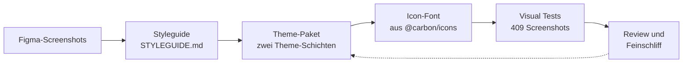
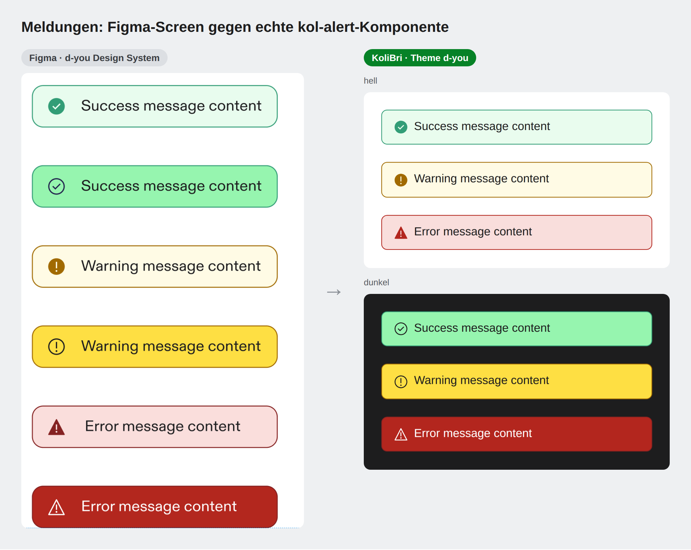
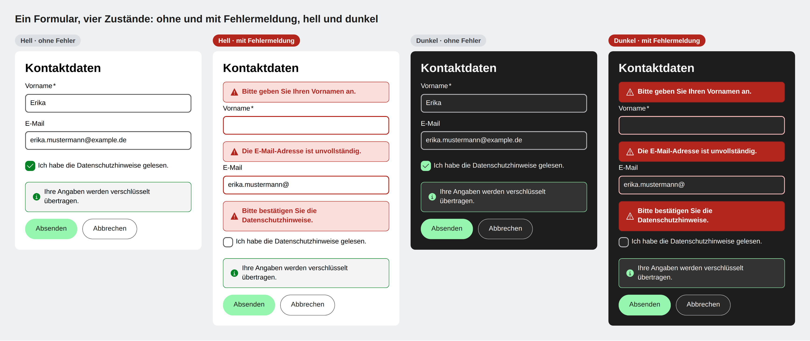

# Next KoliBri-Challenge – d-you-Theme in rund 3 Stunden

**Wie ich aus Figma-Screenshots in meiner Mittagspause und an einem Abend ein KoliBri-Theme gebaut habe**

23. September 2026

Meine Challenge: aus nichts als Screenshots der Figma-Datei des d-you Design Systems ein vollständiges KoliBri-Theme bauen. Mit Claude Opus 5 hat das geklappt. Vom ersten Screenshot bis zum heutigen Stand, einem grünen [Pull Request](https://github.com/public-ui/kolibri/pull/10970) mit 409 Referenz-Screenshots, habe ich dafür meine Mittagspause und einen Teil des Abends gebraucht.

Von Hand habe ich nur die Screenshots gemacht. Styleguide, Theme-Code, Icon-Paket, Messungen an echten Komponenten und die Fehlersuche in der CI hat Claude übernommen. Ich habe gezeigt, was ich sehen will, und markiert, was noch nicht passte.

Auf d-you bin ich gekommen, weil das Design-System der EUDI Wallet DE veröffentlicht ist und bisher kaum etwas darauf aufbaut. Gleichzeitig ist die EUDI Wallet gerade in aller Munde. An einem so aktuellen, echten Design-System lassen sich die Stärken von KoliBri gut zeigen, und genau das wollte ich.

Wie das Theme aussieht, zeigt die Vorschau des Pull Requests, zum Beispiel am [Button im Theme d-you](https://public-ui.github.io/kolibri/pr-10970/#/button/basic?theme=dyou). Über die Navigation der Vorschau lassen sich alle anderen Komponenten aufrufen.

Dass das so schnell ging, liegt aber vor allem an KoliBri selbst.

## Der Weg im Überblick



Für jede Station gibt KoliBri die Struktur schon vor. Das Theme musste sie nur ausfüllen.

## Die Ausgangslage: nur Screenshots

Es gab keinen Token-Export und keine Zeile Code, nur Screenshots aus der Figma-Datei des d-you Design Systems der EUDI Wallet DE. Daraus entstand zuerst eine Spezifikation: `STYLEGUIDE.md`, knapp 500 Zeilen, jede Angabe mit dem Zeitstempel des Screens, aus dem sie stammt. Der Kern: ein Mintgrün namens „Mint Beam“ auf neutraler Grauskala, ein 4-px-Raster mit 8-px-Rhythmus und durchgehend pillenförmige Schaltflächen.

Die erste Falle lag in den Farben. Die Screenshots stammen von einem Display-P3-Bildschirm, ihre Pixel sind bis zu 10 % gesättigter als die sRGB-Werte, die Figma anzeigt. Claude hat deshalb jede Farbe am Figma-Label abgelesen und gegen eine Umrechnung von P3 nach sRGB geprüft. Dabei fielen drei Widersprüche in der Figma-Datei selbst auf.



_Links der Figma-Screen, rechts sechs echte `kol-alert`-Komponenten im Theme d-you. Das Design-System kennt pro Meldung eine zarte und eine kräftige Stufe, gedacht für helle und dunkle Flächen. Das Theme zeigt die zarte Stufe auf heller Seite und die kräftige im Dark Mode, jeweils mit gefülltem oder umrandetem Icon wie in Figma._

Für ein KoliBri-Theme reichen Design-Entscheidungen: Farben, Schrift, Abstände, Formen. Die lassen sich aus Screenshots zuverlässig ablesen. Wie ein Akkordeon aufklappt oder welche ARIA-Rollen ein Tree trägt, musste ich nicht klären, das bringt die Bibliothek mit.

## Ein Theme ist bei KoliBri nur Design

KoliBri trennt Struktur und Aussehen in CSS-Kaskadenschichten mit fest vorgegebener Reihenfolge. Die Basis (Barrierefreiheit, globale Regeln, Komponenten-Layout) kennt keine Farben und kein Farbschema. Ein Theme füllt nur die zwei Schichten darüber.

```css
@layer kol-a11y, kol-global, kol-component,
       kol-theme-global, kol-theme-component,
       kol-forced-colors, kol-theme-forced-colors;
```

Weil die Theme-Schichten später kommen, gewinnen sie gegen jede Regel der Basis, ohne `!important` und ohne Wettrüsten um Spezifität. Das d-you-Theme besteht aus 76 SCSS-Dateien mit rund 4.000 Zeilen, eine pro Komponente plus gemeinsame Mixins. Registriert wird es mit einem einzigen Aufruf, eine Zeile pro Komponente:

```ts
export const D_YOU = KoliBri.createTheme('dyou', {
	GLOBAL: globalCss,
	'KOL-ALERT': alertCss,
	'KOL-BUTTON': buttonCss,
	// … 46 Komponenten
});
```

Die einzige Überraschung war der Name: KoliBri prüft Theme-Namen gegen ein Muster, das zwei Zeichen vor einem Bindestrich verlangt. Aus `d-you` wurde deshalb `dyou`, Paketname und Export behalten die Produktschreibweise.

Die Komponenten sind Web Components mit Shadow DOM. Das Theme wird in jeden Shadow Root adoptiert und läuft unverändert in React, Angular, Vue, Solid, Svelte und Preact. Klassen wie `kol-button__text` oder `kol-button--hide-label` sind dokumentiert und brechen nicht beim nächsten Release. Als Vorlage diente `theme-default`: Build-Stack, Stylelint-Regeln und Skripte sind in allen Themes gleich.

## Barrierefreiheit kommt mit

Die Figma-Datei zeigt, wie d-you aussieht. Sie sagt nichts darüber, wie groß ein Klickziel sein muss oder wie ein Fokusrahmen wirkt. Diese Fragen hat KoliBri schon beantwortet, bevor ich die erste Farbe gesetzt habe.

Die unterste Ebene heißt `kol-a11y`. Sie legt für jedes interaktive Element mindestens 44 × 44 Pixel fest. Sie startet jede Komponente mit Schwarz auf Weiß, also mit geprüftem Kontrast.

Diese Regeln erbt jedes Theme. Wer einen Schalter kleiner als 44 Pixel zeichnen will, muss das ausdrücklich tun.

### Wo ich vom Design abweiche

Beim Nachmessen der Screenshots fielen drei Farbpaare auf, die WCAG 2.2 nicht erfüllen. Für eine barrierefreie Bibliothek kann ich sie so nicht übernehmen. Das Theme weicht dort bewusst vom Design ab und dokumentiert die Abweichung im Styleguide.

| Stelle                          | Figma     | Kontrast | Theme                    | Kontrast |
| ------------------------------- | --------- | -------- | ------------------------ | -------- |
| Grüne Akzentfläche als Text     | `#96F5AF` | 1,31 : 1 | `primary-40` `#068227`   | 4,96 : 1 |
| Rahmen der Erfolgsmeldung       | `#329D77` | 3,37 : 1 | `primary-40` `#068227`   | 4,96 : 1 |
| Rahmen des sekundären Schalters | `#B9B9BD` | 1,96 : 1 | `secondary-40` `#5A5959` | 6,98 : 1 |

Die Markenfarbe bleibt als Fläche erhalten. Nur dort, wo sie Text oder eine Steuerungsgrenze tragen müsste, springt ein dunklerer Ton derselben Farbreihe ein.

## Dark Mode ohne zweites Theme

In der Figma-Datei steht bei Dark Mode nur „TBD“. Trotzdem hat d-you ab dem ersten Tag einen dunklen Modus. Der Aufwand dafür war kleiner, als ich erwartet hatte.

Jede Farbe, die sich zwischen hell und dunkel unterscheidet, ist ein Token im globalen Theme-Layer. Beide Werte stehen in einer einzigen Zeile, aufgelöst von der CSS-Funktion `light-dark()`.

```scss
:host {
	--color-text: var(--kolibri-color-text, light-dark(#202020, #{$dark-color-text}));
}
```

Die Komponenten-Styles kennen nur `var(--color-text)`. Sie wissen nicht, welcher Modus gerade aktiv ist, und brauchen keine eigenen Media Queries.

### Die Anwendung entscheidet

Das Theme setzt selbst kein `color-scheme`. Die Eigenschaft wird vererbt und reicht durch den Shadow DOM bis in jede Komponente. Seite und Komponenten haben deshalb immer dasselbe Farbschema.

> Rationale: Würde das Theme `color-scheme` selbst setzen, könnte die Seite hell und die Komponenten darin dunkel sein. KoliBri schließt diesen Widerspruch aus, indem allein die Anwendung entscheidet.

Eine Anwendung schaltet den dunklen Modus mit einer Zeile ein: `:root { color-scheme: light dark }`. Sie kann ihn auch nur für einen Bereich erzwingen. Wer nichts deklariert, bleibt hell.

Die dunkle Palette hat Claude aus den Farbreihen der hellen abgeleitet. Tiefe entsteht dort über hellere Oberflächen statt über Schatten. Sobald das Design-System einen echten Dark Mode liefert, ändern sich nur die zweiten Werte der Tokens.



_Dasselbe Formular mit echten KoliBri-Komponenten, ohne und mit Fehlermeldungen, hell und dunkel. Umgeschaltet hat allein die Seite, mit `color-scheme: dark`. Ein Fehler steckt nie nur in der Farbe: Icon, Text und roter Feldrahmen tragen ihn gemeinsam._

## Eigene Icons per npm

d-you nutzt die IBM-Carbon-Icons. KoliBri bringt eigene Icons mit, aber keine aus Carbon.

Den Austausch übernimmt ein kleines privates Paket unter dem Theme, `@public-ui/d-you-icons`. Es installiert `@carbon/icons` (Apache-2.0) per npm, wählt 31 der 2.620 SVGs aus und baut daraus eine Icon-Schrift von rund 7 KB.

### Feste Icon-Namen

KoliBri-Komponenten fragen ihre Icons über feste Namen an, etwa `kolicon-alert-error` oder `kolicon-chevron-down`. Eine Zuordnungsdatei legt fest, welches Carbon-Icon unter welchem Namen landet.

```json
{
	"alert-error": "warning--alt--filled",
	"alert-error-outline": "warning--alt",
	"alert-info": "information--filled",
	"alert-success": "checkmark--filled",
	"alert-warning": "warning--filled"
}
```

Die Komponenten merken vom Tausch nichts. Ich musste keine Zeile Komponenten-Code ändern.

### Schriften im Shadow DOM

> Hinweis: Browser ignorieren `@font-face` innerhalb eines Shadow Roots. Die Icon-Schrift muss deshalb auf Dokumentebene geladen werden.

Dafür gibt es im Theme eine CSS-Datei zum Einbinden, die Icon-Klassen für die Komponenten erzeugt das Theme automatisch.

Nebenbei flogen 12.214 Zeilen übernommener Font-Awesome- und Codicon-Styles aus dem Theme. Die Alert-Icons sehen jetzt in allen Varianten gleich aus.

Dank der pnpm-Workspaces im Monorepo war das Hilfspaket in wenigen Minuten angelegt.

## 409 Screenshots pro Theme

Ein neues Theme ist nur dann schnell fertig, wenn man sieht, was es tut. KoliBri rendert jede Beispielseite jeder Komponente in jedem Theme und fotografiert sie. Bei d-you sind das 409 Screenshots.

Das neue Theme musste dafür kaum angemeldet werden. Die Review-Skripte finden Theme-Pakete selbst. In den Workflows `ci.yml` und `visual-baseline.yml` kam je eine Zeile in der Matrix dazu.

### Review im Pull Request

Jede Änderung landet auf einer Review-Seite im [Pull Request](https://github.com/public-ui/kolibri/pull/10970). Dort steht jedes Bild neben seinem Vorgänger. Ein Mensch gibt die Unterschiede frei, bevor sie zur neuen Basis werden.

Der wichtigste Befund war ein negativer: In allen sieben anderen Theme-Paketen hat sich kein einziges Bild verändert. Das neue Theme hat nichts außerhalb seines eigenen Ordners berührt.

Unterwegs fiel ein Fehler im Review-Werkzeug selbst auf. Lange Screenshot-Namen wurden gekürzt und dadurch falsch zugeordnet. Der Fix ist Teil desselben Pull Requests und hilft allen Themes.

## Feinschliff

Nach dem ersten Durchlauf habe ich neue Screenshots aus Figma nachgereicht, diesmal mit roten Markierungen. Vier Stellen sollten näher ans Design rücken. Claude hat jede davon an den echten Komponenten nachgemessen.

| Stelle                        | Vorher                                     | Nachher                                                   |
| ----------------------------- | ------------------------------------------ | --------------------------------------------------------- |
| Schließen-Schalter im Alert   | 70 × 44 px, eine Pille                     | 44 × 44 px, ein Kreis am rechten Rand                     |
| Datei-Eingabefeld             | 52,4 px hoch                               | 44 px, wie die anderen 12 Feldtypen                       |
| Zeilen im Baum                | 52,4 px oder 46 px, je nach Knoten         | einheitlich 46 px, Fokusrahmen über die ganze Zeile       |
| Deaktivierter Primär-Schalter | Rahmen und Fläche gleich, halb transparent | blasse Fläche, kräftigerer grüner Rahmen, hell und dunkel |

Alle vier Änderungen blieben im Theme. An den Komponenten selbst musste ich nichts ändern.

### Tote Selektoren im Alert

Beim Alert waren die Icon-Schalter zu breit. Ursache war ein verschachteltes Sass-Muster, das in eingebetteten Komponenten tote Selektoren erzeugte. Eigentlich verbieten die KoliBri-Regeln genau dieses Muster. Es war trotzdem drin.

Nach dem Umbau auf flache BEM-Selektoren griff die Regel wieder, und zwar im Alert, im Split-Button und in Tabellen.

## Die Bilanz in Zahlen

| Kennzahl                                    | Wert                          |
| ------------------------------------------- | ----------------------------- |
| Arbeitszeit vom ersten Screenshot bis heute | rund 3 Stunden                |
| Manuelle Arbeit                             | nur die Screenshots aus Figma |
| Umsetzung                                   | Claude Opus 5                 |
| Gestaltete Komponenten                      | 46                            |
| Screenshots im visuellen Test               | 409 pro Theme                 |
| Änderungen an den Komponenten               | 0                             |
| Veränderte Bilder in anderen Themes         | 0                             |

Die letzten beiden Zeilen sind die wichtigsten. Ein komplettes neues Erscheinungsbild entstand, ohne die Komponenten-Bibliothek oder ein anderes Theme zu berühren.

## Was noch offen ist

Schnell heißt nicht fertig. Diese Punkte sind bekannt und im Styleguide vermerkt:

- Die dunkle Palette ist abgeleitet und nicht vom Design-System vorgegeben. Sie wird ersetzt, sobald Figma sie liefert.
- Einige Radien und Abstände stammen aus Messungen an Screenshots. Die Figma-Quelldaten können sie noch präzisieren.
- An drei Stellen zeigen verschiedene Figma-Seiten unterschiedliche Werte. Das Theme hat sich jeweils für eine Variante entschieden.
- Sekundäre und tertiäre Schalter nutzen im deaktivierten Zustand noch die allgemeine Transparenz.
- Die 409 Screenshots warten auf ihre erste Freigabe als Basis.

Jeder dieser Punkte ist eine Änderung im Theme. Keiner erfordert einen Eingriff in KoliBri selbst.

## So kommt ihr zu eurem eigenen KoliBri-Theme

Der Weg von d-you lässt sich auf jedes Design-System übertragen. Screenshots reichen für den Anfang.

1. Farben, Schrift, Radien und Abstände aus den Screenshots in einen Styleguide als Markdown-Datei übertragen. Er ist die Quelle für alle weiteren Entscheidungen.
2. Ein neues Paket unter `packages/themes/` anlegen und das Theme mit `KoliBri.createTheme()` unter einem eindeutigen Namen registrieren.
3. Alle Farben als Custom Properties im globalen Theme-Layer definieren, hell und dunkel per `light-dark()`.
4. Jedes Text- und Rahmenpaar gegen WCAG messen und Abweichungen vom Design dokumentieren.
5. Pro Komponente eine Datei im Komponenten-Layer anlegen, die nur Tokens und BEM-Klassen verwendet.
6. Die eigene Icon-Bibliothek per npm einbinden und auf die `kolicon-*`-Namen abbilden.
7. Das Theme mit einer Zeile in die Workflow-Matrix der visuellen Tests aufnehmen und die Screenshots auf der Review-Seite freigeben.

Wenn ihr mit einem KI-Agenten arbeitet, bleibt als Handarbeit vor allem das Zeigen: Screenshots liefern, Abweichungen markieren, Ergebnisse freigeben. Die Regeln gibt das Repository vor. Schichtenmodell, Farbschemata und BEM-Konventionen sind dort so genau beschrieben, dass Claude sie ohne Rückfragen einhalten konnte.

Die nächste Challenge suche ich schon: Welches Design-System soll ich als Nächstes in KoliBri umsetzen? Schreibt es mir in den [Discussions](https://github.com/public-ui/kolibri/discussions). Auf GitHub liegt auch der Quellcode von KoliBri und dem Theme d-you, und wenn euch das Projekt gefällt, freue ich mich über einen Stern für [public-ui/kolibri](https://github.com/public-ui/kolibri).
