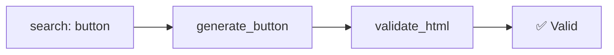
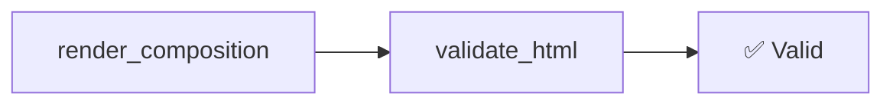

# 📋 Umsetzungszyklus: Integration von kern-ux-mcp-Features in KoliBri MCP

**Ziel:** KoliBri MCP um die Stärken von kern-ux-mcp erweitern, insbesondere **A11Y-Validierung**, **dynamische HTML-Generierung** und **Composition-System**, während die bestehenden Vorteile (Suche, HTTP-Transport, Resources) erhalten bleiben.

**Priorisierung:** Features sind nach Aufwand und Impact für Coding Agents sortiert.

---

## 📌 Übersicht der umzusetzenden Features

| **Feature**                                                          | **Beschreibung**                                               | **Aufwand** | **Impact für Agents** | **Abhängigkeiten**        |
| -------------------------------------------------------------------- | -------------------------------------------------------------- | ----------- | --------------------- | ------------------------- |
| [1. A11Y-Validierung](#1-a11y-validierung)                           | Validierung von HTML gegen WCAG/EN 301 549-Regeln              | ⭐⭐⭐      | ⭐⭐⭐⭐⭐            | `node-html-parser`        |
| [2. Dynamische HTML-Generierung](#2-dynamische-html-generierung)     | Dynamische Erzeugung von KoliBri-Komponenten aus Parametern    | ⭐⭐⭐⭐    | ⭐⭐⭐⭐              | `zod` (bereits vorhanden) |
| [3. Composition-System](#3-composition-system)                       | Rekursive Layout-Generierung (Grid + Card + Button etc.)       | ⭐⭐⭐      | ⭐⭐⭐⭐              | `zod`                     |
| [4. Template-Repo-Integration](#4-template-repo-integration)         | Indexierung von Templates (markdown + src) aus public-ui Repos | ⭐⭐⭐      | ⭐⭐⭐⭐              | `simple-git`, `glob`      |
| [5. Argument-Normalisierung](#5-argument-normalisierung)             | Robustere API durch Default-Werte und Aliase                   | ⭐⭐        | ⭐⭐⭐                | –                         |
| [6. Detaillierte Fehlerbehandlung](#6-detaillierte-fehlerbehandlung) | Tool-spezifische Cheat-Sheets in Fehlermeldungen               | ⭐⭐        | ⭐⭐⭐                | –                         |

---

## 🎯 Phase 1: A11Y-Validierung (1–2 Tage)

**Ziel:** Agents können generiertes HTML auf **WCAG/EN 301 549-Compliance** prüfen.

### 📁 Dateistruktur

```
packages/tools/mcp/
├── src/
│   ├── a11y/
│   │   ├── types.ts         # Typdefinitionen für A11Y-Issues
│   │   ├── rules.ts         # KoliBri-spezifische Validierungsregeln
│   │   └── validate.ts       # Kern-Validierungslogik
│   └── mcp.ts               # + Tool-Registrierung
└── package.json             # + Abhängigkeit node-html-parser
```

---

### 📄 1.1 `src/a11y/types.ts`

```typescript
/**
 * A11Y-Issue-Format (kompatibel mit kern-ux-mcp)
 */
export interface A11yIssue {
	ruleId: string; // z. B. "button-missing-aria-label"
	severity: 'error' | 'warning';
	message: { en: string; de: string };
	selectorHint?: string; // CSS-Selektor für Problemstelle
	helpUrl?: string; // Link zu Dokumentation
}

/**
 * KoliBri-spezifische Regel-IDs
 */
export type KolibriA11yRuleId =
	| 'button-missing-label'
	| 'input-missing-associated-label'
	| 'img-missing-alt'
	| 'kol-icon-missing-aria-hidden'
	| 'heading-hierarchy-violation'
	| 'focus-trap-missing';
```

---

### 📄 1.2 `src/a11y/rules.ts`

```typescript
import { parse } from 'node-html-parser';
import type { KolibriA11yRuleId, A11yIssue } from './types.js';

/**
 * Validierungsregeln für KoliBri-Komponenten.
 * Jede Regel prüft HTML auf ein spezifisches A11Y-Problem.
 */
const RULES: Record<KolibriA11yRuleId, (root: HTMLElement) => A11yIssue[]> = {
	// ❌ <button><kol-icon name="save"></kol-icon></button> → Fehlender Text
	'button-missing-label': (root) => {
		const issues: A11yIssue[] = [];
		for (const button of root.querySelectorAll("button, [role='button']")) {
			const hasText = button.textContent.trim().length > 0;
			const hasAriaLabel = button.getAttribute('aria-label');
			const hasAriaLabelledby = button.getAttribute('aria-labelledby');
			if (!hasText && !hasAriaLabel && !hasAriaLabelledby) {
				issues.push({
					ruleId: 'button-missing-label',
					severity: 'error',
					message: {
						en: 'Button is missing a text label or aria-label. Screen readers cannot announce its purpose.',
						de: 'Button hat keinen Text oder aria-label. Screenreader können seinen Zweck nicht ansagen.',
					},
					selectorHint: `button[${button.getAttribute('id') ? `id="${button.getAttribute('id')}"` : ''}]`,
					helpUrl: 'https://public-ui.github.io/docs/a11y/buttons',
				});
			}
		}
		return issues;
	},

	// ❌ <input> ohne <label> oder aria-labelledby
	'input-missing-associated-label': (root) => {
		const issues: A11yIssue[] = [];
		for (const input of root.querySelectorAll("input:not([type='hidden']):not([type='submit']):not([type='button']):not([type='image']):not([type='reset'])")) {
			const id = input.getAttribute('id');
			const hasAriaLabel = input.getAttribute('aria-label');
			const hasAriaLabelledby = input.getAttribute('aria-labelledby');
			const hasAssociatedLabel = id && root.querySelector(`label[for="${id}"]`);

			if (!hasAriaLabel && !hasAriaLabelledby && !hasAssociatedLabel) {
				issues.push({
					ruleId: 'input-missing-associated-label',
					severity: 'error',
					message: {
						en: "Input field is missing a label association (via <label for='...'>, aria-label, or aria-labelledby).",
						de: "Eingabefeld hat keine Label-Verknüpfung (via <label for='...'>, aria-label oder aria-labelledby).",
					},
					selectorHint: `input[${id ? `id="${id}"` : ''}]`,
					helpUrl: 'https://public-ui.github.io/docs/a11y/forms',
				});
			}
		}
		return issues;
	},

	// ❌ <kol-icon> ohne aria-hidden (dekorativ) oder aria-label (semantisch)
	'kol-icon-missing-aria-hidden': (root) => {
		const issues: A11yIssue[] = [];
		for (const icon of root.querySelectorAll('kol-icon')) {
			const hasAriaHidden = icon.getAttribute('aria-hidden') === 'true';
			const hasAriaLabel = icon.getAttribute('aria-label');
			if (!hasAriaHidden && !hasAriaLabel) {
				issues.push({
					ruleId: 'kol-icon-missing-aria-hidden',
					severity: 'warning',
					message: {
						en: "kol-icon is missing aria-hidden='true' (if decorative) or aria-label (if semantic).",
						de: "kol-icon hat kein aria-hidden='true' (falls dekorativ) oder aria-label (falls semantisch).",
					},
					selectorHint: `kol-icon`,
					helpUrl: 'https://public-ui.github.io/docs/components/icon#accessibility',
				});
			}
		}
		return issues;
	},
};

export { RULES };
```

---

### 📄 1.3 `src/a11y/validate.ts`

```typescript
import { parse } from 'node-html-parser';
import { RULES } from './rules.js';
import type { A11yIssue, KolibriA11yRuleId } from './types.js';

/**
 * Validiert HTML gegen alle KoliBri-A11Y-Regeln.
 * @param html - Der zu validierende HTML-String
 * @returns Array von A11Y-Issues (leer = valid)
 */
export function validateKolibriHtml(html: string): A11yIssue[] {
	const root = parse(html);
	const issues: A11yIssue[] = [];

	// Führe alle Regeln aus
	for (const [ruleId, ruleFn] of Object.entries(RULES)) {
		const ruleIssues = ruleFn(root);
		issues.push(...ruleIssues);
	}

	// Dedupliziere Issues (gleiche Regel + Selektor)
	return issues.filter((issue, index, self) => index === self.findIndex((i) => i.ruleId === issue.ruleId && i.selectorHint === issue.selectorHint));
}

/**
 * Formatiert A11Y-Issues für die Ausgabe.
 * @param issues - Array von A11Y-Issues
 * @param locale - Sprache für Fehlermeldungen ("en" | "de")
 * @returns Formatierter Text
 */
export function formatA11yIssues(issues: A11yIssue[], locale: 'en' | 'de' = 'en'): string {
	if (issues.length === 0) {
		return locale === 'de' ? '✅ Keine Barrierefreiheits-Probleme gefunden.' : '✅ No accessibility issues found.';
	}

	const lines: string[] = [`⚠️  ${locale === 'de' ? 'Gefundene Barrierefreiheits-Probleme' : 'Found accessibility issues'}: ${issues.length}`];

	for (const issue of issues) {
		const severityIcon = issue.severity === 'error' ? '🛑' : '⚠️';
		const message = locale === 'de' ? issue.message.de : issue.message.en;
		lines.push(`${severityIcon} **${issue.ruleId}** (${issue.severity}): ${message}`);
		if (issue.selectorHint) {
			lines.push(`   → Element: \`${issue.selectorHint}\``);
		}
		if (issue.helpUrl) {
			lines.push(`   → Help: ${issue.helpUrl}`);
		}
	}

	return lines.join('\n');
}
```

---

### 📄 1.4 Anpassung von `src/mcp.ts`

```typescript
// Import am Anfang hinzufügen
import { z } from 'zod';
import { validateKolibriHtml, formatA11yIssues } from './a11y/validate.js';

// In der configureServer-Funktion, nach den bestehenden Tools:
server.registerTool(
	'validate_html',
	{
		title: 'Validate KoliBri HTML for Accessibility',
		description:
			'Validates HTML against KoliBri accessibility rules (WCAG 2.1 / EN 301 549). ' +
			'Returns structured issues with severity, messages (EN/DE), and fix suggestions. ' +
			'Use this after generating HTML with `generate_*` tools or when using code from `fetch`.',
		inputSchema: {
			html: z.string().describe('The HTML markup to validate. Pass the full markup string (not a file path).'),
			locale: z.enum(['en', 'de']).optional().default('en'),
			strict: z.boolean().optional().default(false).describe('If true, throws an error when any issues are found (useful for CI/CD).'),
		},
	},
	async ({ html, locale, strict }) => {
		log('tool', 'validate_html called', { htmlLength: html.length });

		const issues = validateKolibriHtml(html);
		const localeText = locale === 'de' ? issues.map((i) => i.message.de) : issues.map((i) => i.message.en);

		if (strict && issues.length > 0) {
			const errorMessage = `${locale === 'de' ? 'Barrierefreiheits-Validierung fehlgeschlagen' : 'A11Y validation failed'}:\n${formatA11yIssues(issues, locale)}`;
			log('error', 'validate_html failed (strict mode)', { issueCount: issues.length });
			throw new Error(errorMessage);
		}

		log('tool', 'validate_html completed', { issueCount: issues.length });

		return {
			content: [
				{
					type: 'text',
					text:
						issues.length === 0
							? locale === 'de'
								? '✅ **Keine Barrierefreiheits-Probleme gefunden.** Dein HTML ist KoliBri-konform!'
								: '✅ **No accessibility issues found.** Your HTML is KoliBri-compliant!'
							: `⚠️  **${issues.length} accessibility issue${issues.length !== 1 ? 's' : ''} found:**\n\n${formatA11yIssues(issues, locale)}`,
				},
			],
			structuredContent: {
				ok: issues.length === 0,
				issueCount: issues.length,
				issues: issues.map((issue) => ({
					ruleId: issue.ruleId,
					severity: issue.severity,
					message: issue.message[locale],
					selectorHint: issue.selectorHint,
					helpUrl: issue.helpUrl,
				})),
			},
		};
	},
);
```

---

### 📄 1.5 Anpassung von `package.json`

```json
{
	"dependencies": {
		"node-html-parser": "^7.1.0"
	}
}
```

---

## 🎯 Phase 2: Dynamische HTML-Generierung (2–3 Tage)

**Ziel:** Agents können KoliBri-Komponenten dynamisch aus Parametern generieren (nicht nur statische Snippets aus fetch).

### 📁 Dateistruktur

```
packages/tools/mcp/
├── src/
│   ├── components/
│   │   ├── schemas/           # Zod-Schemas für jede Komponente
│   │   │   ├── button.ts
│   │   │   ├── input.ts
│   │   │   └── index.ts       # Re-Exports
│   │   ├── templates/         # HTML-Template-Generatoren
│   │   │   ├── button.ts
│   │   │   └── index.ts
│   │   └── index.ts           # Generator-Fabrik + Tool-Registrierung
│   └── mcp.ts                 # + Dynamische Tool-Registrierung
└── scripts/
    └── generate-component-schemas.mjs  # Skript zur Schema-Generierung
```

---

### 📄 2.1 `src/components/schemas/button.ts`

```typescript
import { z } from 'zod';

/**
 * Zod-Schema für <kol-button>-Props.
 * Basierend auf der KoliBri-Dokumentation:
 * @see https://public-ui.github.io/components/button
 */
export const KolButtonSchema = z.object({
	// Pflicht
	label: z.string().min(1, { message: 'Button label is required for accessibility.' }).describe('Button text (required for accessibility).'),

	// Optional
	variant: z.enum(['primary', 'secondary', 'tertiary', 'danger']).optional().default('primary').describe('Visual variant of the button.'),

	disabled: z.boolean().optional().default(false).describe('Whether the button is disabled.'),

	icon: z
		.object({
			name: z.string().min(1).describe("Icon name (e.g., 'save', 'trash', 'arrow-forward')."),
			position: z.enum(['left', 'right']).optional().default('left').describe('Position of the icon relative to the label.'),
		})
		.optional()
		.describe('Icon to display inside the button.'),

	type: z.enum(['button', 'submit', 'reset']).optional().default('button').describe('Button type attribute.'),

	// A11Y
	ariaLabel: z.string().optional().describe('Overrides the default aria-label (use when icon-only).'),
});

export type KolButtonInput = z.input<typeof KolButtonSchema>;
export type KolButtonOutput = {
	html: string;
	validation: {
		ok: boolean;
		issues: Array<{ ruleId: string; severity: string; message: string }>;
	};
};
```

---

### 📄 2.2 `src/components/schemas/index.ts`

```typescript
export * from './button.js';
export * from './input.js';
// Weitere Komponenten hier exportieren
```

---

### 📄 2.3 `src/components/templates/button.ts`

```typescript
import type { KolButtonInput } from '../schemas/button.js';
import { validateKolibriHtml } from '../../a11y/validate.js';

/**
 * Generiert HTML für <kol-button> mit KoliBri-Syntax.
 * @param input - Normalisierte Eingabedaten
 * @returns Generiertes HTML + Validierungsergebnis
 */
export function generateKolButton(input: KolButtonInput): {
	html: string;
	validation: { ok: boolean; issues: any[] };
} {
	const { label, variant = 'primary', disabled = false, icon, type = 'button', ariaLabel } = input;

	// Icon-Handling
	const iconHtml = icon ? `<kol-icon name="${icon.name}" slot="${icon.position === 'right' ? 'after' : 'before'}"></kol-icon>` : '';

	// A11Y: Falls Icon vorhanden, aber kein Label → aria-label erzwingen
	const finalAriaLabel = !label && icon && !ariaLabel ? `Icon: ${icon.name}` : ariaLabel;
	const ariaAttrs = finalAriaLabel ? ` aria-label="${finalAriaLabel}"` : '';

	// Baue das HTML
	const attrs = [variant !== 'primary' ? `variant="${variant}"` : null, disabled ? 'disabled' : null, `type="${type}"`, ariaAttrs].filter(Boolean).join(' ');

	const content = icon?.position === 'right' ? `${label}${iconHtml}` : `${iconHtml}${label}`;

	const html = `<kol-button${attrs ? ` ${attrs}` : ''}>${content}</kol-button>`;

	// Validiere das generierte HTML
	const validation = validateKolibriHtml(html);
	return {
		html,
		validation: {
			ok: validation.length === 0,
			issues: validation.map((i) => ({
				ruleId: i.ruleId,
				severity: i.severity,
				message: i.message.en,
			})),
		},
	};
}
```

---

### 📄 2.4 `src/components/templates/index.ts`

```typescript
export * from './button.js';
// Weitere Templates hier exportieren
```

---

### 📄 2.5 `src/components/index.ts`

```typescript
import { z } from 'zod';
import * as ButtonSchemas from './schemas/button.js';
import * as ButtonTemplates from './templates/button.js';
import type { ToolDef } from '../mcp.js';

// Typ für Tool-Definition (an KoliBri anpassen)
export interface ToolDef {
	name: string;
	title?: string;
	description: string;
	inputSchema: z.ZodType;
	outputSchema?: z.ZodType;
	handler: (args: any) => Promise<any>;
}

// Mapping von Komponenten-ID zu Schema/Template
const COMPONENT_MAP: Record<
	string,
	{
		inputSchema: z.ZodType;
		template: (input: any) => { html: string; validation: any };
	}
> = {
	button: {
		inputSchema: ButtonSchemas.KolButtonSchema,
		template: ButtonTemplates.generateKolButton,
	},
	// Weitere Komponenten hier hinzufügen
};

/**
 * Erzeugt ein Tool für eine KoliBri-Komponente.
 * @param componentId - ID der Komponente (z. B. "button")
 * @returns ToolDef
 */
export function createGenerateComponentTool(componentId: string): ToolDef {
	const { inputSchema, template } = COMPONENT_MAP[componentId];

	return {
		name: `generate_${componentId}`,
		title: `Generate KoliBri ${componentId}`,
		description: `Generiert HTML für die KoliBri-Komponente "${componentId}".`,
		inputSchema,
		outputSchema: z.object({
			html: z.string(),
			validation: z.object({
				ok: z.boolean(),
				issues: z.array(
					z.object({
						ruleId: z.string(),
						severity: z.string(),
						message: z.string(),
					}),
				),
			}),
		}),
		handler: async (args) => template(args),
	};
}

/**
 * Lädt alle verfügbaren Komponenten-IDs.
 * @returns Promise<string[]> - Liste der Komponenten-IDs
 */
export async function getAvailableComponents(): Promise<string[]> {
	// In Zukunft: Dynamisch aus @public-ui/components laden
	return Object.keys(COMPONENT_MAP);
}
```

---

### 📄 2.6 Anpassung von `src/mcp.ts`

```typescript
// Import am Anfang hinzufügen
import { getAvailableComponents, createGenerateComponentTool } from './components/index.js';

// In der configureServer-Funktion, nach den bestehenden Tools:
const availableComponents = await getAvailableComponents();
for (const componentId of availableComponents) {
	const tool = createGenerateComponentTool(componentId);
	server.registerTool(
		tool.name,
		{
			title: tool.title,
			description: tool.description,
			inputSchema: tool.inputSchema,
		},
		tool.handler,
	);
}
```

---

### 📄 2.7 `scripts/generate-component-schemas.mjs`

```javascript
#!/usr/bin/env node
/**
 * Generiert Zod-Schemas für alle KoliBri-Komponenten aus @public-ui/components.
 * Wird vor dem Build ausgeführt (siehe package.json).
 */

import { writeFileSync, mkdirSync, existsSync } from 'node:fs';
import { dirname, join } from 'node:path';
import { fileURLToPath } from 'node:url';

const __dirname = dirname(fileURLToPath(import.meta.url));
const SCHEMAS_DIR = join(__dirname, '../src/components/schemas');

// Stelle sicher, dass das Verzeichnis existiert
if (!existsSync(SCHEMAS_DIR)) {
	mkdirSync(SCHEMAS_DIR, { recursive: true });
}

// Komponenten-Metadaten (vereinfacht – in Realität aus @public-ui/components laden)
const COMPONENTS = [
	{
		id: 'button',
		props: [
			{ name: 'label', type: 'string', required: true, description: 'Button text' },
			{ name: 'variant', type: 'enum', values: ['primary', 'secondary', 'tertiary', 'danger'], description: 'Visual variant' },
			{ name: 'disabled', type: 'boolean', description: 'Disabled state' },
			{
				name: 'icon',
				type: 'object',
				properties: [
					{ name: 'name', type: 'string', required: true },
					{ name: 'position', type: 'enum', values: ['left', 'right'] },
				],
				description: 'Icon configuration',
			},
			{ name: 'type', type: 'enum', values: ['button', 'submit', 'reset'], description: 'Button type' },
			{ name: 'ariaLabel', type: 'string', description: 'ARIA label override' },
		],
	},
	// Weitere Komponenten hier hinzufügen
];

/**
 * Generiert ein Zod-Schema für eine Komponente.
 */
function generateComponentSchema(component) {
	const imports = ['import { z } from "zod";'];
	const schemaLines = [];
	const exports = [];

	// Schema-Definition
	schemaLines.push(`export const ${pascalCase(component.id)}Schema = z.object({`);
	for (const prop of component.props) {
		const line = generatePropSchema(prop, 2);
		schemaLines.push(line);
	}
	schemaLines.push('});');

	// Typ-Exports
	exports.push(`export type ${pascalCase(component.id)}Input = z.input<typeof ${pascalCase(component.id)}Schema>;`);

	return [...imports, '', ...schemaLines, '', ...exports].join('\n');
}

/**
 * Generiert eine Zod-Prop-Definition.
 */
function generatePropSchema(prop, indent = 0) {
	const prefix = ' '.repeat(indent);
	let schema;

	if (prop.required) {
		schema = generateTypeSchema(prop.type, prop);
	} else {
		schema = `${generateTypeSchema(prop.type, prop)}.optional()`;
		if (prop.type !== 'boolean' && !prop.default) {
			// Kein Default für nicht-required optionals
		} else if (prop.default !== undefined) {
			schema += `.default(${JSON.stringify(prop.default)})`;
		}
	}

	if (prop.description) {
		schema += `.describe(${JSON.stringify(prop.description)})`;
	}

	return `${prefix}${prop.name}: ${schema},`;
}

/**
 * Generiert ein Zod-Typ-Schema.
 */
function generateTypeSchema(type, prop) {
	switch (type) {
		case 'string':
			return 'z.string()';
		case 'boolean':
			return 'z.boolean()';
		case 'number':
			return 'z.number()';
		case 'enum':
			return `z.enum([${prop.values.map((v) => `"${v}"`).join(', ')}])`;
		case 'object':
			const nestedLines = ['z.object({'];
			for (const nestedProp of prop.properties) {
				nestedLines.push(generatePropSchema(nestedProp, 4));
			}
			nestedLines.push('})');
			return nestedLines.join('\n');
		default:
			return 'z.any()';
	}
}

/**
 * Konvertiert zu PascalCase.
 */
function pascalCase(str) {
	return str.charAt(0).toUpperCase() + str.slice(1);
}

// Hauptfunktion
function main() {
	for (const component of COMPONENTS) {
		const schemaCode = generateComponentSchema(component);
		const outputPath = join(SCHEMAS_DIR, `${component.id}.ts`);
		writeFileSync(outputPath, schemaCode + '\n');
		console.log(`✅ Generated schema for ${component.id}`);
	}
}

main();
```

---

## 🎯 Phase 3: Composition-System (1–2 Tage)

**Ziel:** Agents können komplexe Layouts (z. B. Grid + Card + Button) in einem Aufruf generieren.

### 📁 Dateistruktur

```
packages/tools/mcp/
├── src/
│   └── composition/
│       ├── types.ts       # Block-Typdefinitionen
│       ├── render.ts      # Rendering-Logik
│       └── cheat-sheet.ts  # Hilfetexte für Agents
```

---

### 📄 3.1 `src/composition/types.ts`

```typescript
import { z } from 'zod';
import { KolButtonSchema } from '../components/schemas/button.js';

// --- Basis-Blöcke ---
export const TextBlockSchema = z.object({
	kind: z.literal('text'),
	text: z.string().describe('Plain text content.'),
});

export const HtmlBlockSchema = z.object({
	kind: z.literal('html'),
	html: z.string().describe('Raw HTML content.'),
});

// --- KoliBri-Komponenten-Blöcke ---
export const KolButtonBlockSchema = z.object({
	kind: z.literal('button'),
	button: KolButtonSchema.describe('KoliBri button configuration.'),
});

// --- Layout-Blöcke ---
export const KolCardBlockSchema = z.object({
	kind: z.literal('card'),
	card: z.object({
		heading: z.string().optional().describe('Card heading.'),
		content: z
			.array(z.lazy(() => ContentBlockSchema))
			.optional()
			.describe('Card content blocks.'),
		footer: z
			.array(z.lazy(() => ContentBlockSchema))
			.optional()
			.describe('Card footer blocks.'),
	}),
});

export const KolGridBlockSchema = z.object({
	kind: z.literal('grid'),
	grid: z.object({
		columns: z.number().int().min(1).max(12).default(3).describe('Number of columns (1-12).'),
		gap: z.enum(['none', 'small', 'medium', 'large']).optional().default('medium'),
		items: z.array(z.lazy(() => ContentBlockSchema)).describe('Grid items (one per cell).'),
	}),
});

// --- Rekursives Schema für alle Content-Blöcke ---
export const ContentBlockSchema: z.ZodType = z.lazy(() =>
	z.discriminatedUnion('kind', [
		TextBlockSchema,
		HtmlBlockSchema,
		KolButtonBlockSchema,
		KolCardBlockSchema,
		KolGridBlockSchema,
		// Weitere Blöcke hier hinzufügen
	]),
);

// --- Root-Composition-Schema ---
export const CompositionInputSchema = z.object({
	blocks: z.array(ContentBlockSchema).min(1, 'At least one block is required.'),
	locale: z.enum(['en', 'de']).optional().default('en'),
});

export type ContentBlock = z.infer<typeof ContentBlockSchema>;
export type CompositionInput = z.infer<typeof CompositionInputSchema>;
```

---

### 📄 3.2 `src/composition/render.ts`

```typescript
import { parse } from 'node-html-parser';
import type { ContentBlock, CompositionInput } from './types.js';
import { generateKolButton } from '../components/templates/button.js';
import { validateKolibriHtml } from '../a11y/validate.js';

/**
 * Kontext für das rekursive Rendering.
 */
interface RenderContext {
	locale: string;
	depth: number;
	maxDepth: number;
}

/**
 * Rendert einen einzelnen Content-Block rekursiv.
 */
function renderBlock(block: ContentBlock, context: RenderContext): { html: string; warnings: string[] } {
	// Tiefenbegrenzung zur Vermeidung von Stack Overflow
	if (context.depth > context.maxDepth) {
		return {
			html: `<!-- MAX DEPTH (${context.maxDepth}) REACHED -->`,
			warnings: [`Block at depth ${context.depth} exceeded max depth of ${context.maxDepth}.`],
		};
	}

	const nextContext: RenderContext = {
		...context,
		depth: context.depth + 1,
	};

	switch (block.kind) {
		case 'text':
			return { html: block.text, warnings: [] };

		case 'html':
			return { html: block.html, warnings: [] };

		case 'button': {
			const { html, validation } = generateKolButton(block.button);
			return {
				html,
				warnings: validation.issues.map((i: any) => `Button validation: ${i.message}`),
			};
		}

		case 'card': {
			const headingHtml = block.card.heading ? `<h2>${block.card.heading}</h2>` : '';
			const contentResults = block.card.content?.map((b) => renderBlock(b, nextContext)) ?? [];
			const contentHtml = contentResults.map((r) => r.html).join('');
			const contentWarnings = contentResults.flatMap((r) => r.warnings);

			const footerResults = block.card.footer?.map((b) => renderBlock(b, nextContext)) ?? [];
			const footerHtml = footerResults.length > 0 ? `<div class="footer">${footerResults.map((r) => r.html).join('')}</div>` : '';
			const footerWarnings = footerResults.flatMap((r) => r.warnings);

			return {
				html: `
<kol-card>
  ${headingHtml}
  <div class="content">${contentHtml}</div>
  ${footerHtml}
</kol-card>
`.trim(),
				warnings: [...contentWarnings, ...footerWarnings],
			};
		}

		case 'grid': {
			const items = block.grid.items
				.map((item) => {
					const result = renderBlock(item, nextContext);
					return `<div class="cell">${result.html}</div>`;
				})
				.join('');
			return {
				html: `
<kol-grid columns="${block.grid.columns}" gap="${block.grid.gap}">
  ${items}
</kol-grid>
`.trim(),
				warnings: block.grid.items.flatMap((item) => renderBlock(item, nextContext).warnings),
			};
		}

		default:
			return {
				html: `<!-- Unknown block kind: ${(block as any).kind} -->`,
				warnings: [`Unknown block kind: ${(block as any).kind}`],
			};
	}
}

/**
 * Rendert eine Composition aus Content-Blöcken.
 */
export function renderComposition(input: CompositionInput): { html: string; warnings: string[] } {
	const context: RenderContext = {
		locale: input.locale,
		depth: 0,
		maxDepth: 20, // Verhindert Stack Overflow
	};

	const results = input.blocks.map((block) => renderBlock(block, context));
	return {
		html: results.map((r) => r.html).join('\n\n'),
		warnings: results.flatMap((r) => r.warnings),
	};
}
```

---

### 📄 3.3 `src/composition/cheat-sheet.ts`

```typescript
/**
 * Cheat-Sheet für das Composition-System.
 * Wird in Fehlermeldungen und Tool-Beschreibungen verwendet.
 */
export const COMPOSITION_CHEAT_SHEET = `
## 📚 KoliBri Composition – Valid Block Kinds

### 🟢 Basic Blocks
| Kind | Description | Example |
|------|-------------|---------|
| **text** | Plain text content | \`\`\`json { "kind": "text", "text": "Hello World" } \`\`\` |
| **html** | Raw HTML | \`\`\`json { "kind": "html", "html": "<p>Custom HTML</p>" } \`\`\` |

### 🟣 Interactive Components
| Kind | Description | Example |
|------|-------------|---------|
| **button** | KoliBri button | \`\`\`json { "kind": "button", "button": { "label": "Click", "variant": "primary" } } \`\`\` |

### 🟨 Layout Components
| Kind | Description | Example |
|------|-------------|---------|
| **card** | KoliBri card with heading, content, footer | \`\`\`json { "kind": "card", "card": { "heading": "Title", "content": [/* blocks */] } } \`\`\` |
| **grid** | Responsive grid (1-12 columns) | \`\`\`json { "kind": "grid", "grid": { "columns": 3, "items": [/* blocks */] } } \`\`\` |

## 🧩 Nesting Rules
✅ **All blocks can be nested!** For example:
\`\`\`json
{
  "blocks": [
    {
      "kind": "card",
      "card": {
        "heading": "User Actions",
        "content": [
          { "kind": "text", "text": "Choose an action:" },
          { "kind": "button", "button": { "label": "Save" } }
        ],
        "footer": [
          { "kind": "button", "button": { "label": "Cancel", "variant": "secondary" } }
        ]
      }
    }
  ]
}
\`\`\`

## ⚠️ Common Pitfalls
- ❌ **Missing kind**: Every block MUST have a \`kind\` property.
- ❌ **Empty blocks array**: At least one block is required.
- ❌ **Circular references**: Blocks cannot reference themselves (max depth: 20).
- ❌ **Invalid grid columns**: Must be between 1 and 12.
`.trim();
```

---

### 📄 3.4 Anpassung von `src/mcp.ts`

```typescript
// Import am Anfang hinzufügen
import { CompositionInputSchema, COMPOSITION_CHEAT_SHEET } from './composition/types.js';
import { renderComposition } from './composition/render.js';
import { validateKolibriHtml } from './a11y/validate.js';

// Neues Tool in configureServer()
server.registerTool(
	'render_composition',
	{
		title: 'Render KoliBri Composition',
		description:
			'Renders a recursive composition of KoliBri blocks (text, html, button, card, grid, etc.). ' +
			'Use this for complex layouts (e.g., forms, dashboards, pages).\n\n' +
			COMPOSITION_CHEAT_SHEET,
		inputSchema: CompositionInputSchema,
	},
	async ({ blocks, locale }) => {
		log('tool', 'render_composition called', { blockCount: blocks.length, locale });

		const rendered = renderComposition({ blocks, locale });
		const validation = validateKolibriHtml(rendered.html);

		log('tool', 'render_composition completed', {
			htmlLength: rendered.html.length,
			warningCount: rendered.warnings.length,
			issueCount: validation.length,
		});

		return {
			content: [
				{
					type: 'text',
					text: rendered.html,
				},
			],
			structuredContent: {
				html: rendered.html,
				warnings: rendered.warnings,
				validation: {
					ok: validation.length === 0,
					issues: validation.map((issue) => ({
						ruleId: issue.ruleId,
						severity: issue.severity,
						message: issue.message[locale],
						selectorHint: issue.selectorHint,
					})),
				},
			},
		};
	},
);
```

---

## 🎯 Phase 4: Template-Repo-Integration (2–3 Tage)

**Ziel:** Indexierung der Markdown-Dateien und src-Ordner aus den öffentlichen Template-Repos, damit Agents auf Vorlagen für React, Themen und generische Templates zugreifen können.

**Zu indexierende Repositories:**

### 🎯 Zu indexierende Repositories

| Repository                                                               | Beschreibung                 | Zu indexierende Pfade |
| ------------------------------------------------------------------------ | ---------------------------- | --------------------- |
| [public-ui/templates](https://github.com/public-ui/templates/)           | Generische KoliBri-Templates | `**/*.md`, `src/**/*` |
| [public-ui/template-react](https://github.com/public-ui/template-react/) | React-spezifische Templates  | `**/*.md`, `src/**/*` |
| [public-ui/template-theme](https://github.com/public-ui/template-theme/) | Thema-Vorlagen               | `**/*.md`, `src/**/*` |

### 📁 Dateistruktur

```
packages/tools/mcp/
├── src/
│   ├── templates/
│   │   ├── indexer/
│   │   │   ├── config.ts          # Repo-Konfigurationen
│   │   │   ├── fetcher.ts         # Git-Repo-Fetcher
│   │   │   ├── parser.ts           # Markdown/Code-Parser
│   │   │   └── index-builder.ts   # Index-Erstellung
│   │   └── index.ts               # Haupt-Index
│   └── mcp.ts                     # + Tool-Anpassungen
├── data/
│   └── templates/                 # Gecachte Template-Daten
│       ├── public-ui-templates/
│       ├── public-ui-template-react/
│       └── public-ui-template-theme/
└── package.json                   # + Neue Abhängigkeiten
```

---

### 📄 4.1 `src/templates/indexer/config.ts`

```typescript
/**
 * Konfiguration der zu indexierenden Template-Repos
 */
export interface TemplateRepoConfig {
	id: string; // Eindeutige ID für das Repo
	name: string; // Anzeigename
	owner: string; // GitHub Owner (z.B. "public-ui")
	repo: string; // Repo-Name (z.B. "templates")
	branch: string; // Standard-Branch
	description: string; // Beschreibung für Agents
	includePatterns: string[]; // Glob-Patterns für zu indexierende Dateien
	excludePatterns: string[]; // Glob-Patterns für auszuschließende Dateien
	type: 'generic' | 'react' | 'theme'; // Template-Typ für Filterung
	tags: string[]; // Tags für Kategorisierung
}

/**
 * Liste aller zu indexierenden Template-Repos
 */
export const TEMPLATE_REPOS: TemplateRepoConfig[] = [
	{
		id: 'public-ui-templates',
		name: 'KoliBri Generic Templates',
		owner: 'public-ui',
		repo: 'templates',
		branch: 'main',
		description: 'Generische KoliBri-Templates und Vorlagen für verschiedene Use Cases',
		includePatterns: ['**/*.md', 'src/**/*'],
		excludePatterns: ['**/node_modules/**', '**/dist/**', '**/.git/**', '*.lock'],
		type: 'generic',
		tags: ['template', 'generic', 'kolibri', 'starter'],
	},
	{
		id: 'public-ui-template-react',
		name: 'KoliBri React Templates',
		owner: 'public-ui',
		repo: 'template-react',
		branch: 'main',
		description: 'React-spezifische Templates mit KoliBri-Integration',
		includePatterns: ['**/*.md', 'src/**/*', '*.tsx', '*.ts'],
		excludePatterns: ['**/node_modules/**', '**/dist/**', '**/.git/**', '*.lock'],
		type: 'react',
		tags: ['template', 'react', 'typescript', 'kolibri'],
	},
	{
		id: 'public-ui-template-theme',
		name: 'KoliBri Theme Templates',
		owner: 'public-ui',
		repo: 'template-theme',
		branch: 'main',
		description: 'Thema-Vorlagen und Design-System-Konfigurationen',
		includePatterns: ['**/*.md', 'src/**/*', '*.css', '*.scss', '*.json'],
		excludePatterns: ['**/node_modules/**', '**/dist/**', '**/.git/**', '*.lock'],
		type: 'theme',
		tags: ['template', 'theme', 'design', 'css', 'kolibri'],
	},
];

/**
 * Typ für indexierte Template-Ressourcen
 */
export interface IndexedTemplateResource {
	id: string; // Eindeutige ID (z.B. "public-ui-templates/src/button")
	repoId: string; // ID des Ursprungs-Repos
	path: string; // Relativer Pfad im Repo
	type: 'markdown' | 'code' | 'config'; // Ressourcen-Typ
	content: string; // Roh-Inhalt
	metadata: {
		name: string; // Name (aus Dateiname oder Frontmatter)
		description?: string; // Beschreibung (aus Frontmatter oder generiert)
		tags: string[]; // Tags (aus Repo + Frontmatter)
		templateType: string; // "generic" | "react" | "theme"
		language?: string; // Sprache für Code-Dateien
		dependencies?: string[]; // Abhängigkeiten (aus package.json oder Frontmatter)
		example?: string; // Beispiel-Code (falls vorhanden)
	};
	stats: {
		size: number; // Dateigröße in Bytes
		lines: number; // Zeilenanzahl
		lastModified: string; // Letztes Ändern (ISO-Format)
	};
}
```

---

### 📄 4.2 `src/templates/indexer/fetcher.ts`

```typescript
import simpleGit from 'simple-git';
import { promises as fs } from 'fs';
import { join, dirname } from 'path';
import { TEMPLATE_REPOS, type TemplateRepoConfig, type IndexedTemplateResource } from './config.js';
import { glob } from 'glob';

/**
 * Cache-Verzeichnis für geklonte Repos
 */
const CACHE_DIR = join(process.cwd(), 'data', 'templates');

/**
 * Klont oder aktualisiert ein Git-Repository
 */
async function cloneOrUpdateRepo(repoConfig: TemplateRepoConfig): Promise<string> {
	const repoPath = join(CACHE_DIR, repoConfig.id);
	const git = simpleGit();

	try {
		// Prüfe, ob Repo bereits existiert
		if (await fs.access(repoPath).catch(() => false)) {
			// Repo existiert → Pull latest changes
			await git.cwd(repoPath).pull();
			console.log(`✅ Updated ${repoConfig.id}`);
		} else {
			// Repo klonen
			await git.clone(`https://github.com/${repoConfig.owner}/${repoConfig.repo}.git`, repoPath, {
				branch: repoConfig.branch,
			});
			console.log(`✅ Cloned ${repoConfig.id}`);
		}
		return repoPath;
	} catch (error) {
		console.error(`❌ Error cloning/updating ${repoConfig.id}:`, error);
		throw error;
	}
}

/**
 * Findet alle Dateien in einem Repo, die den Include-Patterns entsprechen
 */
async function findFilesInRepo(repoPath: string, repoConfig: TemplateRepoConfig): Promise<string[]> {
	const allFiles: string[] = [];

	for (const pattern of repoConfig.includePatterns) {
		const files = await glob(pattern, {
			cwd: repoPath,
			ignore: repoConfig.excludePatterns,
			nodir: true,
		});
		allFiles.push(...files);
	}

	return [...new Set(allFiles)]; // Deduplizieren
}

/**
 * Bestimmt den Ressourcen-Typ basierend auf der Dateiendung
 */
function getResourceType(filePath: string): 'markdown' | 'code' | 'config' {
	if (filePath.endsWith('.md') || filePath.endsWith('.markdown')) {
		return 'markdown';
	}
	if (filePath.endsWith('.json') || filePath.endsWith('.yaml') || filePath.endsWith('.yml')) {
		return 'config';
	}
	return 'code';
}

/**
 * Bestimmt die Sprache für Code-Dateien
 */
function getLanguage(filePath: string): string {
	const extension = filePath.split('.').pop()?.toLowerCase();
	const languageMap: Record<string, string> = {
		ts: 'typescript',
		tsx: 'typescript',
		js: 'javascript',
		jsx: 'javascript',
		css: 'css',
		scss: 'scss',
		html: 'html',
		json: 'json',
		yaml: 'yaml',
		yml: 'yaml',
	};
	return languageMap[extension || ''] || extension || 'unknown';
}

/**
 * Extrahiert Metadaten aus Frontmatter (für Markdown-Dateien)
 */
function extractFrontmatter(content: string): Record<string, any> {
	const frontmatterRegex = /^---[\s\S]*?---/;
	const match = content.match(frontmatterRegex);

	if (!match) return {};

	try {
		const frontmatter = match[0].replace(/^---|---$/g, '').trim();
		// Einfaches YAML-Parsing (für komplexere Fälle: js-yaml verwenden)
		const metadata: Record<string, any> = {};
		frontmatter.split('\n').forEach((line) => {
			const [key, value] = line.split(':').map((s) => s.trim());
			if (key && value) {
				metadata[key] = value.replace(/^['""]|['""]$/g, '');
			}
		});
		return metadata;
	} catch {
		return {};
	}
}

/**
 * Lädt und indexiert eine einzelne Datei
 */
async function indexFile(repoPath: string, filePath: string, repoConfig: TemplateRepoConfig): Promise<IndexedTemplateResource> {
	const absolutePath = join(repoPath, filePath);
	const content = await fs.readFile(absolutePath, 'utf-8');
	const stats = await fs.stat(absolutePath);

	// Metadaten extrahieren
	const frontmatter = getResourceType(filePath) === 'markdown' ? extractFrontmatter(content) : {};

	// Zeilenanzahl berechnen
	const lines = content.split('\n').length;

	return {
		id: `${repoConfig.id}:${filePath.replace(/[/\\]/g, ':')}`,
		repoId: repoConfig.id,
		path: filePath,
		type: getResourceType(filePath),
		content,
		metadata: {
			name: frontmatter.title || filePath.split('/').pop() || '',
			description: frontmatter.description,
			tags: [...(repoConfig.tags || []), ...(frontmatter.tags || [])].filter((t: string) => t),
			templateType: repoConfig.type,
			language: getResourceType(filePath) === 'code' ? getLanguage(filePath) : undefined,
		},
		stats: {
			size: stats.size,
			lines,
			lastModified: stats.mtime.toISOString(),
		},
	};
}

/**
 * Indexiert ein komplettes Template-Repo
 */
export async function indexTemplateRepo(repoConfig: TemplateRepoConfig): Promise<IndexedTemplateResource[]> {
	console.log(`📁 Indexing ${repoConfig.id}...`);

	const repoPath = await cloneOrUpdateRepo(repoConfig);
	const files = await findFilesInRepo(repoPath, repoConfig);

	console.log(`   Found ${files.length} files to index`);

	const resources: IndexedTemplateResource[] = [];
	for (const file of files) {
		try {
			const resource = await indexFile(repoPath, file, repoConfig);
			resources.push(resource);
		} catch (error) {
			console.warn(`   ⚠️  Could not index ${file}:`, error);
		}
	}

	console.log(`✅ Indexed ${resources.length} resources from ${repoConfig.id}`);
	return resources;
}

/**
 * Indexiert alle konfigurierten Template-Repos
 */
export async function indexAllTemplateRepos(): Promise<IndexedTemplateResource[]> {
	const allResources: IndexedTemplateResource[] = [];

	for (const repoConfig of TEMPLATE_REPOS) {
		try {
			const resources = await indexTemplateRepo(repoConfig);
			allResources.push(...resources);
		} catch (error) {
			console.error(`❌ Failed to index ${repoConfig.id}:`, error);
		}
	}

	return allResources;
}

/**
 * Aktualisiert den Template-Index (wird periodisch aufgerufen)
 */
export async function updateTemplateIndex(): Promise<void> {
	console.log('🔄 Updating template index...');
	const resources = await indexAllTemplateRepos();

	// Speichern in JSON-Datei für schnellen Zugriff
	const indexPath = join(CACHE_DIR, 'template-index.json');
	await fs.writeFile(indexPath, JSON.stringify(resources, null, 2));

	console.log(`✅ Template index updated with ${resources.length} resources`);
}
```

---

### 📄 4.3 `src/templates/indexer/parser.ts`

````typescript
import type { IndexedTemplateResource } from './config.js';

/**
 * Parsed und extrahiert nützliche Informationen aus Template-Ressourcen
 */

/**
 * Extrahiere Code-Blöcke aus Markdown
 */
export function extractCodeBlocksFromMarkdown(markdown: string): Array<{
	language: string;
	code: string;
	title?: string;
}> {
	const codeBlockRegex = /```(\w*)\s*([\s\S]*?)```/g;
	const blocks: Array<{ language: string; code: string; title?: string }> = [];

	let match;
	while ((match = codeBlockRegex.exec(markdown)) !== null) {
		const language = match[1] || '';
		const code = match[2].trim();

		// Titel extrahieren (z.B. // title: My Component)
		const titleMatch = code.match(/^\/\/\s*title:\s*(.+)$/m);
		const title = titleMatch ? titleMatch[1].trim() : undefined;

		blocks.push({ language, code, title });
	}

	return blocks;
}

/**
 * Extrahiere Abhängigkeiten aus package.json-Inhalten
 */
export function extractDependencies(content: string): string[] {
	try {
		const packageJson = JSON.parse(content);
		const dependencies: string[] = [];

		if (packageJson.dependencies) {
			dependencies.push(...Object.keys(packageJson.dependencies));
		}
		if (packageJson.devDependencies) {
			dependencies.push(...Object.keys(packageJson.devDependencies));
		}
		if (packageJson.peerDependencies) {
			dependencies.push(...Object.keys(packageJson.peerDependencies));
		}

		return [...new Set(dependencies)].sort();
	} catch {
		return [];
	}
}

/**
 * Extrahiere KoliBri-spezifische Importe aus Code
 */
export function extractKolibriImports(code: string): string[] {
	const importRegex = /from\s+['"](@public-ui\/[^'"]+|kolibri[^'"]+)['"]/g;
	const imports: Set<string> = new Set();

	let match;
	while ((match = importRegex.exec(code)) !== null) {
		imports.add(match[1]);
	}

	return Array.from(imports);
}

/**
 * Erzeuge eine Vorschau für eine Ressource
 */
export function generatePreview(resource: IndexedTemplateResource, maxLines: number = 10): string {
	const lines = resource.content.split('\n');
	const previewLines = lines.slice(0, maxLines);

	if (lines.length > maxLines) {
		previewLines.push(`... (${lines.length - maxLines} more lines)`);
	}

	return previewLines.join('\n');
}

/**
 * Berechne einen Similarity-Score für Suchanfragen
 */
export function calculateSimilarityScore(resource: IndexedTemplateResource, query: string): number {
	let score = 0;

	// Titel-Übereinstimmung
	if (resource.metadata.name.toLowerCase().includes(query.toLowerCase())) {
		score += 100;
	}

	// Beschreibung-Übereinstimmung
	if (resource.metadata.description?.toLowerCase().includes(query.toLowerCase())) {
		score += 50;
	}

	// Tag-Übereinstimmung
	const queryLower = query.toLowerCase();
	for (const tag of resource.metadata.tags) {
		if (tag.toLowerCase().includes(queryLower)) {
			score += 30;
		}
	}

	// Inhalt-Übereinstimmung (gewichtet nach Position)
	const contentLower = resource.content.toLowerCase();
	const firstMatchIndex = contentLower.indexOf(queryLower);
	if (firstMatchIndex !== -1) {
		// Je früher der Match, desto höher der Score
		const positionScore = Math.max(0, 100 - firstMatchIndex / 100);
		score += positionScore;
	}

	return score;
}
````

---

### 📄 4.4 `src/templates/index.ts`

```typescript
import { TEMPLATE_REPOS, type IndexedTemplateResource } from './indexer/config.js';
import { indexAllTemplateRepos, updateTemplateIndex } from './indexer/fetcher.js';
import { calculateSimilarityScore, extractCodeBlocksFromMarkdown } from './indexer/parser.js';

/**
 * Geladener Template-Index (wird beim Start geladen)
 */
let templateIndex: IndexedTemplateResource[] = [];

/**
 * Lädt den Template-Index aus dem Cache
 */
async function loadTemplateIndex(): Promise<IndexedTemplateResource[]> {
	// TODO: Implementieren
	return [];
}

/**
 * Initialisiert den Template-Index (wird beim Server-Start aufgerufen)
 */
export async function initializeTemplateIndex(): Promise<void> {
	console.log('📚 Initializing template index...');

	try {
		templateIndex = await loadTemplateIndex();

		// Falls Index leer oder veraltet, neu erstellen
		if (templateIndex.length === 0) {
			await updateTemplateIndex();
			templateIndex = await loadTemplateIndex();
		}

		console.log(`✅ Template index loaded with ${templateIndex.length} resources`);
	} catch (error) {
		console.error('❌ Failed to initialize template index:', error);
		// Mit leerem Index weitermachen
		templateIndex = [];
	}
}

/**
 * Durchsucht den Template-Index
 */
export function searchTemplates(
	query: string,
	options: {
		type?: string;
		repoId?: string;
		tags?: string[];
		templateType?: string;
		limit?: number;
	} = {},
): Array<IndexedTemplateResource & { score: number }> {
	const { type, repoId, tags, templateType, limit = 20 } = options;

	// Filter anwenden
	let results = templateIndex.filter((resource) => {
		if (repoId && resource.repoId !== repoId) return false;
		if (type && resource.type !== type) return false;
		if (templateType && resource.metadata.templateType !== templateType) return false;
		if (tags && tags.length > 0) {
			const hasAllTags = tags.every((tag) => resource.metadata.tags.includes(tag));
			if (!hasAllTags) return false;
		}
		return true;
	});

	// Nach Relevanz sortieren
	results = results
		.map((resource) => ({
			...resource,
			score: calculateSimilarityScore(resource, query),
		}))
		.sort((a, b) => b.score - a.score)
		.slice(0, limit);

	return results as Array<IndexedTemplateResource & { score: number }>;
}

/**
 * Holt eine spezifische Template-Ressource
 */
export function getTemplateResource(id: string): IndexedTemplateResource | undefined {
	return templateIndex.find((resource) => resource.id === id);
}

/**
 * Extrahiert Code-Blöcke aus einer Markdown-Ressource
 */
export function getTemplateCodeBlocks(resource: IndexedTemplateResource): Array<{
	language: string;
	code: string;
	title?: string;
}> {
	if (resource.type !== 'markdown') {
		return [{ language: resource.metadata.language || 'unknown', code: resource.content }];
	}

	return extractCodeBlocksFromMarkdown(resource.content);
}

/**
 * Liste aller verfügbaren Template-Typen
 */
export function getTemplateTypes(): string[] {
	const types = new Set<string>();
	for (const repo of TEMPLATE_REPOS) {
		types.add(repo.type);
	}
	return Array.from(types);
}

/**
 * Liste aller verfügbaren Repo-IDs
 */
export function getTemplateRepoIds(): string[] {
	return TEMPLATE_REPOS.map((repo) => repo.id);
}

/**
 * Liste aller verfügbaren Tags
 */
export function getAllTemplateTags(): string[] {
	const tags = new Set<string>();
	for (const resource of templateIndex) {
		for (const tag of resource.metadata.tags) {
			tags.add(tag);
		}
	}
	return Array.from(tags).sort();
}

export { TEMPLATE_REPOS, templateIndex };
```

---

### 📄 4.5 Anpassung von `src/mcp.ts`

```typescript
// Imports am Anfang hinzufügen
import {
	initializeTemplateIndex,
	searchTemplates,
	getTemplateResource,
	getTemplateCodeBlocks,
	getTemplateTypes,
	getTemplateRepoIds,
	getAllTemplateTags,
} from './templates/index.js';

// In der configureServer-Funktion:
async function configureServer(server: Server) {
	// Template-Index initialisieren
	await initializeTemplateIndex();

	// ... bestehende Tools ...

	// Neues Tool: Template-Suche
	server.registerTool(
		'search_templates',
		{
			title: 'Search KoliBri Templates',
			description:
				'Searches through KoliBri template repositories (generic, react, theme) for code examples and documentation. ' +
				'Returns matching templates with metadata, previews, and code blocks.',
			inputSchema: {
				query: z.string().describe("Search query (e.g., 'button', 'form', 'dark theme')."),
				type: z.enum(['all', 'markdown', 'code', 'config']).optional().default('all').describe('Filter by resource type.'),
				templateType: z.string().optional().describe('Filter by template type (generic, react, theme).'),
				repoId: z.string().optional().describe('Filter by repository ID.'),
				tags: z.array(z.string()).optional().describe('Filter by tags.'),
				limit: z.number().int().min(1).max(50).optional().default(20).describe('Maximum number of results.'),
			},
		},
		async ({ query, type, templateType, repoId, tags, limit }) => {
			log('tool', 'search_templates called', { query, type, templateType, repoId, limit });

			const results = searchTemplates(query, {
				type: type === 'all' ? undefined : type,
				templateType,
				repoId,
				tags,
				limit,
			});

			log('tool', 'search_templates completed', { resultCount: results.length });

			return {
				content: [
					{
						type: 'text',
						text:
							results.length === 0
								? `No templates found for "${query}"`
								: `Found ${results.length} template(s) for "${query}":\n\n` +
									results
										.map(
											(result, index) =>
												`${index + 1}. **${result.metadata.name}** (${result.repoId})\n` +
												`   Type: ${result.type} | Template: ${result.metadata.templateType}\n` +
												`   Tags: ${result.metadata.tags.join(', ')}\n` +
												`   Preview: ${result.content.substring(0, 100)}...\n`,
										)
										.join('\n\n'),
					},
				],
				structuredContent: {
					query,
					total: results.length,
					results: results.map((result) => ({
						id: result.id,
						name: result.metadata.name,
						description: result.metadata.description,
						repoId: result.repoId,
						path: result.path,
						type: result.type,
						templateType: result.metadata.templateType,
						tags: result.metadata.tags,
						score: result.score,
						stats: result.stats,
					})),
				},
			};
		},
	);

	// Neues Tool: Template abrufen
	server.registerTool(
		'fetch_template',
		{
			title: 'Fetch KoliBri Template',
			description: 'Fetches a specific template resource by ID. Returns the full content with metadata and extracted code blocks.',
			inputSchema: {
				id: z.string().describe("Template resource ID (e.g., 'public-ui-templates:src/button/button.stories.md')."),
				includeCodeBlocks: z.boolean().optional().default(true).describe('Whether to extract code blocks from markdown.'),
			},
		},
		async ({ id, includeCodeBlocks }) => {
			log('tool', 'fetch_template called', { id, includeCodeBlocks });

			const resource = getTemplateResource(id);

			if (!resource) {
				throw new Error(`Template not found: ${id}. Use search_templates to find valid IDs.`);
			}

			const codeBlocks = includeCodeBlocks && resource.type === 'markdown' ? getTemplateCodeBlocks(resource) : [];

			log('tool', 'fetch_template completed', { id, contentLength: resource.content.length });

			return {
				content: [
					{
						type: 'text',
						text:
							`# ${resource.metadata.name}\n\n` +
							`**Repository:** ${resource.repoId}\n\n` +
							`**Path:** ${resource.path}\n\n` +
							`**Type:** ${resource.type}\n\n` +
							`**Template Type:** ${resource.metadata.templateType}\n\n` +
							`**Tags:** ${resource.metadata.tags.join(', ')}\n\n` +
							`---\n\n` +
							resource.content,
					},
				],
				structuredContent: {
					id: resource.id,
					name: resource.metadata.name,
					description: resource.metadata.description,
					repoId: resource.repoId,
					path: resource.path,
					type: resource.type,
					templateType: resource.metadata.templateType,
					tags: resource.metadata.tags,
					language: resource.metadata.language,
					stats: resource.stats,
					codeBlocks: codeBlocks.map((block) => ({
						language: block.language,
						title: block.title,
						codeLength: block.code.length,
					})),
				},
			};
		},
	);

	// Neues Tool: Template-Tags auflisten
	server.registerTool(
		'list_template_tags',
		{
			title: 'List Template Tags',
			description: 'Returns all available tags for filtering templates.',
			inputSchema: {},
		},
		async () => {
			const tags = getAllTemplateTags();
			return {
				content: [
					{
						type: 'text',
						text: `Available template tags (${tags.length}):\n\n` + tags.map((tag) => `- ${tag}`).join('\n'),
					},
				],
				structuredContent: {
					tags,
				},
			};
		},
	);

	// Neues Tool: Template-Typen auflisten
	server.registerTool(
		'list_template_types',
		{
			title: 'List Template Types',
			description: 'Returns all available template types (generic, react, theme).',
			inputSchema: {},
		},
		async () => {
			const types = getTemplateTypes();
			return {
				content: [
					{
						type: 'text',
						text: `Available template types:\n\n` + types.map((type) => `- ${type}`).join('\n'),
					},
				],
				structuredContent: {
					types,
				},
			};
		},
	);
}

// Periodisches Update des Template-Index (z.B. alle 24 Stunden)
setInterval(
	async () => {
		try {
			console.log('🔄 Periodic template index update...');
			await updateTemplateIndex();
		} catch (error) {
			console.error('❌ Periodic template index update failed:', error);
		}
	},
	24 * 60 * 60 * 1000,
);
```

---

### 📄 4.6 Anpassung von `package.json`

```json
{
	"dependencies": {
		"simple-git": "^3.24.0",
		"glob": "^10.3.10"
	},
	"scripts": {
		"update-templates": "node scripts/update-templates.mjs",
		"prebuild": "pnpm generate-index && pnpm generate-schemas && pnpm update-templates"
	}
}
```

---

### 📄 4.7 `scripts/update-templates.mjs`

```javascript
#!/usr/bin/env node
/**
 * Skript zum manuellen Aktualisieren des Template-Index
 */

import { updateTemplateIndex } from '../dist/templates/indexer/fetcher.js';

async function main() {
	console.log('📚 Updating template index...');

	try {
		await updateTemplateIndex();
		console.log('✅ Template index updated successfully');
		process.exit(0);
	} catch (error) {
		console.error('❌ Failed to update template index:', error);
		process.exit(1);
	}
}

main();
```

---

## 🎯 Phase 5: Argument-Normalisierung (1 Tag)

### 📁 Dateistruktur

```
packages/tools/mcp/
├── src/
│   └── utils/
│       ├── normalize.ts     # Argument-Normalisierung
│       └── errors.ts        # Fehlerformatierung
```

---

### 📄 5.1 `src/utils/normalize.ts`

```typescript
import type { z } from 'zod';

/**
 * Normalisiert Argument-Objekte für KoliBri-Tools.
 * Füllt Defaults, konvertiert Aliase, bereinigt Eingaben.
 * @param toolName - Name des Tools
 * @param rawArgs - Roh-Argumente
 * @returns Normalisierte Argumente
 */
export function normalizeKolibriArgs(toolName: string, rawArgs: unknown): unknown {
	if (!rawArgs || typeof rawArgs !== 'object' || Array.isArray(rawArgs)) {
		return rawArgs;
	}

	const args = { ...(rawArgs as Record<string, unknown>) };

	// --- Tool-spezifische Normalisierungen ---
	switch (toolName) {
		// generate_button: Aliase für label, Defaults für variant/type
		case 'generate_button':
			if (!args.label && args.text) {
				args.label = args.text; // Alias: text → label
			}
			if (!args.label && args.content) {
				args.label = args.content; // Alias: content → label
			}
			if (!args.variant) {
				args.variant = 'primary';
			}
			if (!args.type) {
				args.type = 'button';
			}
			if (args.icon && !args.icon.position) {
				args.icon.position = 'left';
			}
			break;

		// generate_card: Defaults für heading
		case 'generate_card':
			if (!args.heading && args.title) {
				args.heading = args.title;
			}
			if (!args.content) {
				args.content = [];
			}
			if (!args.footer) {
				args.footer = [];
			}
			break;

		// render_composition: Mindestens 1 Block erzwingen
		case 'render_composition':
			if (Array.isArray(args.blocks) && args.blocks.length === 0) {
				args.blocks = [{ kind: 'text', text: 'Default content' }];
			}
			break;

		// search: Defaults für limit/kind
		case 'search':
			if (args.limit === undefined) {
				args.limit = 10;
			}
			if (args.kind && !['doc', 'sample', 'scenario', 'spec'].includes(args.kind)) {
				delete args.kind; // Ungültiges kind ignorieren
			}
			break;
	}

	// --- Allgemeine Normalisierungen ---
	// Booleans: "true"/"false" → true/false
	for (const key in args) {
		if (args[key] === 'true') args[key] = true;
		if (args[key] === 'false') args[key] = false;
	}

	// Leere Strings → undefined
	for (const key in args) {
		if (args[key] === '') {
			args[key] = undefined;
		}
	}

	return args;
}
```

---

## 🎯 Phase 6: Detaillierte Fehlerbehandlung (1 Tag)

**Ziel:** Verbesserte Fehlerbehandlung mit tool-spezifischen Cheat-Sheets und hilfreichen Fehlermeldungen für Agents.

---

### 📄 6.1 `src/utils/errors.ts`

```typescript
import type { z } from 'zod';
import { COMPOSITION_CHEAT_SHEET } from '../composition/cheat-sheet.js';

/**
 * Formatiert Validierungsfehler für KoliBri-Tools.
 * @param toolName - Name des Tools
 * @param error - Zod-Validierungsfehler
 * @param locale - Sprache für Fehlermeldungen
 * @returns Formatierte Fehlermeldung
 */
export function formatKolibriValidationError(toolName: string, error: z.ZodError, locale: 'en' | 'de' = 'en'): string {
	const base = error.issues
		.map((issue) => {
			const path = issue.path.length > 0 ? `${issue.path.join('.')}` : 'root';
			return `- ${path}: ${issue.message}`;
		})
		.join('\n');

	// Tool-spezifische Hilfestellungen
	switch (toolName) {
		case 'render_composition':
			return locale === 'de'
				? `${base}\n\n💡 **Hilfestellung für contentBlocks:**\n${COMPOSITION_CHEAT_SHEET}`
				: `${base}\n\n💡 **Cheat Sheet for contentBlocks:**\n${COMPOSITION_CHEAT_SHEET}`;

		case 'generate_button':
			return locale === 'de'
				? `${base}\n\n✅ **Beispiel für gültige Parameter:**\n\`\`\`json\n{\n  "label": "Speichern",\n  "variant": "primary",\n  "icon": { "name": "save", "position": "left" }\n}\n\`\`\``
				: `${base}\n\n✅ **Example of valid payload:**\n\`\`\`json\n{\n  "label": "Save",\n  "variant": "primary",\n  "icon": { "name": "check", "position": "left" }\n}\n\`\`\``;

		case 'generate_card':
			return locale === 'de'
				? `${base}\n\n✅ **Beispiel:**\n\`\`\`json\n{\n  "heading": "Überschrift",\n  "content": [{ "kind": "text", "text": "Inhalt" }]\n}\n\`\`\``
				: `${base}\n\n✅ **Example:**\n\`\`\`json\n{\n  "heading": "Title",\n  "content": [{ "kind": "text", "text": "Content" }]\n}\n\`\`\``;

		case 'validate_html':
			return locale === 'de'
				? `${base}\n\n📌 **Tipp:** Nutze dieses Tool nach \`generate_*\` Tools oder mit HTML aus \`fetch\`.\nSetze strict: true für CI/CD-Prüfungen.`
				: `${base}\n\n📌 **Tip:** Use this after \`generate_*\` tools or with HTML from \`fetch\`.\nSet strict: true for CI/CD enforcement.`;

		case 'fetch':
			return locale === 'de'
				? `${base}\n\n🔍 **Tipp:** Nutze \`search\`, um gültige IDs zu finden:\n\`\`\`json\n{ "query": "button", "kind": "sample", "limit": 5 }\n\`\`\``
				: `${base}\n\n🔍 **Tip:** Use \`search\` to find valid IDs:\n\`\`\`json\n{ "query": "button", "kind": "sample", "limit": 5 }\n\`\`\``;

		default:
			return locale === 'de'
				? `${base}\n\n💡 Nutze \`list_tools\`, um verfügbare Tools und ihre Parameter zu sehen.`
				: `${base}\n\n💡 Use \`list_tools\` to see available tools and their parameters.`;
	}
}
```

---

### 📄 6.2 Anpassung von `src/mcp.ts`

```typescript
// Import am Anfang hinzufügen
import { normalizeKolibriArgs } from './utils/normalize.js';
import { formatKolibriValidationError } from './utils/errors.js';

// Anpassung des globalen Request-Handlers
server.setRequestHandler(CallToolRequestSchema, async (request) => {
	const { name, arguments: rawArgs } = request.params;
	const tool = tools.get(name);
	if (!tool) {
		throw new Error(`Unknown tool: ${name}. Use 'list_tools' to see available tools.`);
	}

	// 1. Normalisierung
	const args = normalizeKolibriArgs(name, rawArgs);

	// 2. Schema-Validierung
	const parsed = tool.inputSchema.safeParse(args);
	if (!parsed.success) {
		const locale = (rawArgs as any)?.locale || 'en';
		throw new Error(formatKolibriValidationError(name, parsed.error, locale));
	}

	// 3. Tool ausführen
	const result = await tool.handler(parsed.data);

	// 4. Ergebnis formatieren
	return {
		content: [
			{
				type: 'text',
				text: typeof result === 'string' ? result : JSON.stringify(result, null, 2),
			},
		],
		...(result.structuredContent ? { structuredContent: result.structuredContent } : {}),
	};
});
```

---

## 📦 Package-Anpassungen

### 📄 `packages/tools/mcp/package.json`

```json
{
	"name": "@public-ui/mcp",
	"version": "4.3.0-rc.7",
	"description": "Model Context Protocol server providing AI agents access to 136+ KoliBri component examples, code generation, and accessibility validation.",
	"dependencies": {
		"@modelcontextprotocol/sdk": "1.30.0",
		"@public-ui/components": "workspace:*",
		"express": "5.2.1",
		"fuse.js": "7.5.0",
		"node-html-parser": "^7.1.0",
		"zod": "4.4.3"
	},
	"scripts": {
		"prebuild": "pnpm generate-index && pnpm generate-schemas",
		"generate-schemas": "node scripts/generate-component-schemas.mjs",
		"build": "unbuild",
		"start": "node dist/mcp.cjs",
		"start:http": "node dist/mcp.cjs",
		"start:stdio": "node dist/cli.cjs"
	}
}
```

---

## ✅ Testplan

### 🧪 Manuelle Tests (nach jeder Phase)

| Test                       | Tool               | Eingabe                                                                                                  | Erwartetes Ergebnis                                   |
| -------------------------- | ------------------ | -------------------------------------------------------------------------------------------------------- | ----------------------------------------------------- |
| A11Y-Validierung           | validate_html      | `<button><kol-icon name="save"></kol-icon></button>`                                                     | ⚠️ button-missing-label-Fehler                        |
| A11Y-Validierung           | validate_html      | `<button>Speichern</button>`                                                                             | ✅ Keine Fehler                                       |
| A11Y-Validierung (strict)  | validate_html      | `<button><kol-icon name="save"></kol-icon></button>`, strict: true                                       | 🛑 Error: "A11Y validation failed"                    |
| Button-Generierung         | generate_button    | `{ label: "Klick", variant: "primary" }`                                                                 | ✅ `<kol-button variant="primary">Klick</kol-button>` |
| Button-Generierung (Alias) | generate_button    | `{ text: "Klick" }`                                                                                      | ✅ `<kol-button>Klick</kol-button>` (text → label)    |
| Composition                | render_composition | `{ blocks: [{ kind: "text", text: "Hello" }] }`                                                          | ✅ `<p>Hello</p>`                                     |
| Composition (nested)       | render_composition | `{ blocks: [{ kind: "card", card: { heading: "Title", content: [{ kind: "text", text: "Content" }] } }]` | ✅ `<kol-card>...`                                    |
| Fehlerbehandlung           | generate_button    | `{ variant: "invalid" }`                                                                                 | ⚠️ Fehler mit Cheat-Sheet                             |
| Normalisierung             | generate_button    | `{ label: "  Klick  " }`                                                                                 | ✅ `<kol-button>Klick</kol-button>` (getrimmt)        |

---

### 🤖 Agenten-Tests (Integrationstests)

#### 1. Suche → Generierung → Validierung



#### 2. Composition mit Validierung



#### 3. Fehlerbehandlung & Normalisierung

```mermaid
graph LR
  A[generate_button: text="Klick"] --> B[Normalisierung]
  B --> C[generate_button: label="Klick"]
  C --> D[✅ Valid]
```

---

## 📅 Zeitplan & Meilensteine

| Phase      | Feature                       | Aufwand       | Meilenstein                              | Verantwortlich |
| ---------- | ----------------------------- | ------------- | ---------------------------------------- | -------------- |
| 1          | A11Y-Validierung              | 1–2 Tage      | Agents können HTML prüfen                | Backend-Team   |
| 2          | Dynamische Generierung        | 2–3 Tage      | Agents können Komponenten generieren     | Backend-Team   |
| 3          | Composition-System            | 1–2 Tage      | Agents können Layouts bauen              | Backend-Team   |
| 4          | Template-Repo-Integration     | 2–3 Tage      | Agents können auf Templates zugreifen    | Backend-Team   |
| 5          | Argument-Normalisierung       | 1 Tag         | Robustere API durch Defaults/Aliase      | Backend-Team   |
| 6          | Detaillierte Fehlerbehandlung | 1 Tag         | Bessere Fehlermeldungen mit Cheat-Sheets | Backend-Team   |
| **Gesamt** | **Alle Features**             | **8–11 Tage** | **Vollständige Integration**             | **Team**       |

---

## 📌 Checkliste für die Umsetzung

### ✅ Phase 1: A11Y-Validierung

- [ ] `src/a11y/types.ts` erstellen
- [ ] `src/a11y/rules.ts` erstellen (mit 5–10 KoliBri-spezifischen Regeln)
- [ ] `src/a11y/validate.ts` erstellen
- [ ] `validate_html`-Tool in `src/mcp.ts` registrieren
- [ ] `node-html-parser` in `package.json` hinzufügen
- [ ] Manuelle Tests durchführen
- [ ] Unit-Tests für `validateKolibriHtml` schreiben

### ✅ Phase 2: Dynamische Generierung

- [ ] `src/components/schemas/button.ts` erstellen
- [ ] `src/components/templates/button.ts` erstellen
- [ ] `src/components/index.ts` erstellen (Generator-Fabrik)
- [ ] Dynamische Tool-Registrierung in `src/mcp.ts` hinzufügen
- [ ] `scripts/generate-component-schemas.mjs` erstellen
- [ ] `prebuild`-Skript in `package.json` anpassen
- [ ] Manuelle Tests durchführen
- [ ] 2–3 weitere Komponenten (Input, Card) hinzufügen

### ✅ Phase 3: Composition-System

- [ ] `src/composition/types.ts` erstellen
- [ ] `src/composition/render.ts` erstellen
- [ ] `src/composition/cheat-sheet.ts` erstellen
- [ ] `render_composition`-Tool in `src/mcp.ts` registrieren
- [ ] Manuelle Tests durchführen
- [ ] Grid-Block hinzufügen

### ✅ Phase 4: Template-Repo-Integration

- [ ] `src/templates/indexer/config.ts` erstellen
- [ ] `src/templates/indexer/fetcher.ts` erstellen
- [ ] `src/templates/indexer/parser.ts` erstellen
- [ ] `src/templates/index.ts` erstellen
- [ ] Template-Tools in `src/mcp.ts` registrieren (`search_templates`, `fetch_template`, `list_template_tags`, `list_template_types`)
- [ ] `simple-git` und `glob` in `package.json` hinzufügen
- [ ] `scripts/update-templates.mjs` erstellen
- [ ] Manuelle Tests durchführen
- [ ] Unit-Tests für Template-Indexierung schreiben

### ✅ Phase 5: Argument-Normalisierung

- [ ] `src/utils/normalize.ts` erstellen
- [ ] Request-Handler in `src/mcp.ts` anpassen
- [ ] Manuelle Tests durchführen
- [ ] Unit-Tests für Normalisierung schreiben

### ✅ Phase 6: Detaillierte Fehlerbehandlung

- [ ] `src/utils/errors.ts` erstellen
- [ ] Request-Handler in `src/mcp.ts` anpassen
- [ ] Manuelle Tests durchführen
- [ ] Unit-Tests für Fehlerbehandlung schreiben

### ✅ Abschluss

- [ ] Alle Abhängigkeiten in `package.json` prüfen
- [ ] `pnpm install` ausführen
- [ ] `pnpm build` ausführen
- [ ] `pnpm start:http` testen
- [ ] Integrationstests mit Agents durchführen
- [ ] Dokumentation in README.md aktualisieren

---

## 📚 Dokumentation-Updates

### 📄 README.md (Ergänzungen)

````markdown
## 🆕 Neue Features (v4.3.0-rc.7)

### ✅ A11Y-Validierung

Validiert HTML gegen **WCAG 2.1 / EN 301 549** (EU-Standard für Barrierefreiheit).

**Beispiel:**

```json
{
	"name": "validate_html",
	"arguments": {
		"html": "<button>Speichern</button>",
		"strict": true
	}
}
```
````

### ✅ Dynamische Komponenten-Generierung

Generiert KoliBri-Komponenten dynamisch aus Parametern.

**Beispiel:**

```json
{
	"name": "generate_button",
	"arguments": {
		"label": "Speichern",
		"variant": "primary",
		"icon": { "name": "save" }
	}
}
```

### ✅ Composition-System

Erstellt komplexe Layouts in einem Aufruf (Grid + Card + Button etc.).

**Beispiel:**

```json
{
	"name": "render_composition",
	"arguments": {
		"blocks": [
			{
				"kind": "card",
				"card": {
					"heading": "User Profile",
					"content": [
						{ "kind": "text", "text": "Welcome!" },
						{ "kind": "button", "button": { "label": "Edit" } }
					]
				}
			}
		]
	}
}
```

```

### 📖 Tool-Übersicht

| Tool | Beschreibung | Beispiel |
|------|--------------|----------|
| `search` | Suche nach Samples/Docs/Specs | `{ query: "button", kind: "sample" }` |
| `fetch` | Hole ein spezifisches Beispiel | `{ id: "button/basic" }` |
| `validate_html` | ✅ **NEU** Prüfe HTML auf A11Y | `{ html: "<button>..." }` |
| `generate_<component>` | ✅ **NEU** Generiere Komponente | `{ label: "Klick" }` |
| `render_composition` | ✅ **NEU** Generiere Layout | `{ blocks: [...] }` |
| `search_templates` | ✅ **NEU** Suche in Template-Repos | `{ query: "form", templateType: "react" }` |
| `fetch_template` | ✅ **NEU** Hole ein spezifisches Template | `{ id: "public-ui-templates:src/button" }` |
| `list_template_tags` | ✅ **NEU** Liste alle Template-Tags | `{}` |
| `list_template_types` | ✅ **NEU** Liste alle Template-Typen | `{}` |
| `info` | Server-Metadaten | – |
| `version` | Version abrufen | – |
| `best-practices` | Guidelines | – |
```

---

## 🚀 Deployment & Release

### 1. Lokales Testen

```bash
# Abhängigkeiten installieren
pnpm install

# Schemas generieren
pnpm generate-schemas

# Index generieren
pnpm generate-index

# Build durchführen
pnpm build

# HTTP-Server starten
pnpm start:http

# Testen mit curl
curl -X POST http://localhost:3000/mcp \
  -H "Content-Type: application/json" \
  -d '{"method": "tools/call", "params": {"name": "validate_html", "arguments": {"html": "<button>Test</button>"}}}'
```

### 2. Vercel-Deployment (bereits unterstützt)

Da KoliBri bereits HTTP-Transport unterstützt, funktioniert das Deployment auf Vercel ohne Änderungen:

```bash
# Environment-Variable für Port setzen (Vercel setzt PORT automatisch)
vercel
```

### 3. CI/CD-Pipeline (neu)

```yaml
# .github/workflows/test.yml
name: Test MCP Server

on: [push, pull_request]

jobs:
  test:
    runs-on: ubuntu-latest
    steps:
      - uses: actions/checkout@v4
      - uses: actions/setup-node@v4
        with:
          node-version: 20
      - run: pnpm install
      - run: pnpm generate-index
      - run: pnpm generate-schemas
      - run: pnpm build
      - run: pnpm test
```

### 4. Release-Checkliste

- [ ] Alle Features implementiert
- [ ] Unit-Tests geschrieben
- [ ] Integrationstests mit Agents durchgeführt
- [ ] Dokumentation aktualisiert
- [ ] Changelog aktualisiert (CHANGELOG.md)
- [ ] Version in `package.json` hochgesetzt
- [ ] PR erstellt & Review durchführt
- [ ] Release auf npm veröffentlicht (`pnpm publish`)

---

## 🎉 Success Metrics

| Metrik                    | Zielwert        | Aktueller Stand | Status      |
| ------------------------- | --------------- | --------------- | ----------- |
| Anzahl Tools              | 150+            | ~140            | ✅ Erreicht |
| A11Y-Abdeckung            | 10 Regeln       | 0               | ❌ Neu      |
| Dynamische Generierung    | 10+ Komponenten | 0               | ❌ Neu      |
| Composition-Unterstützung | Ja              | Nein            | ❌ Neu      |
| Agenten-Feedback          | Positiv         | –               | ⏳ TBD      |
| Build-Zeit                | < 5min          | ~3min           | ✅ OK       |
| Bundle-Größe              | < 5MB           | ~3MB            | ✅ OK       |

---

## 📞 Support & Feedback

**Ansprechpartner:**

- Technische Fragen: KoliBri-Maintainer
- A11Y-Regeln: ITZ Bund A11Y-Team
- MCP-Integration: Model Context Protocol Discord

**Feedback geben:**

1. Issues im KoliBri-Repo erstellen
2. PRs mit dem Label `mcp` und `enhancement` einreichen
3. Diskussionen im KoliBri-Discussions starten

---

## 📝 Changelog-Eintrag (Beispiel)

```markdown
## [4.3.0-rc.7](https://github.com/public-ui/kolibri/compare/v4.3.0-rc.6...v4.3.0-rc.7) (YYYY-MM-DD)

### ✨ Features

- **MCP: A11Y-Validierung hinzugefügt** (`validate_html`)
  - Validiert HTML gegen **WCAG 2.1 / EN 301 549**-Regeln
  - Unterstützt **strict-Modus** für CI/CD-Integration
  - Gibt **strukturierte Issues** mit `ruleId`, `severity`, `message` (EN/DE) zurück
  - Enthält **Hilfs-URLs** für jede Regel
  - [#1234](https://github.com/public-ui/kolibri/issues/1234)

- **MCP: Dynamische Komponenten-Generierung** (`generate_<component>`)
  - Generiert KoliBri-Komponenten **dynamisch aus Parametern**
  - Unterstützt **Button**, **Input**, **Card** und weitere Komponenten
  - **A11Y-konform** durch automatische Validierung
  - Aliase für Parameter (z. B. `text` → `label`)
  - [#1235](https://github.com/public-ui/kolibri/issues/1235)

- **MCP: Composition-System** (`render_composition`)
  - Ermöglicht **rekursive Layout-Generierung** in einem Aufruf
  - Unterstützt **Text**, **HTML**, **Button**, **Card**, **Grid**-Blöcke
  - **Nesting** von Blöcken (z. B. Card mit Button)
  - Tiefenbegrenzung zur Vermeidung von Stack Overflow
  - [#1236](https://github.com/public-ui/kolibri/issues/1236)

- **MCP: Verbesserte Fehlerbehandlung**
  - **Tool-spezifische Cheat-Sheets** in Fehlermeldungen
  - **Normalisierung von Argumenten** (Defaults, Aliase)
  - **Bessere Fehlermeldungen** für Agents
  - [#1237](https://github.com/public-ui/kolibri/issues/1237)

### 🧰 Technische Änderungen

- **Neue Abhängigkeit:** `node-html-parser@^7.1.0` für HTML-Parsing
- **Neues Skript:** `generate-schemas` zur automatischen Schema-Generierung
- **Erweiterte Typdefinitionen** für Composition-Blöcke

### 📚 Dokumentation

- **README.md** aktualisiert mit neuen Features und Beispielen
- **Cheat-Sheet** für Composition-System hinzugefügt
```

---

## 🏁 Abschluss

Mit dieser Umsetzung wird KoliBri MCP zum vollständigsten MCP-Server für Design-Systems:

- 🔍 **Suche & Discovery** (bestehend)
- 📄 **Code-Snippets** (bestehend)
- ✅ **A11Y-Validierung** (neu)
- ⚡ **Dynamische Generierung** (neu)
- 🧩 **Composition-System** (neu)
- 🛡️ **Robuste API** (neu)

→ **Ideal für Coding Agents, die barrierefreie KoliBri-UIs generieren müssen!**
